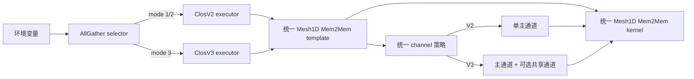

# CCU AllGather ClosV2/ClosV3 设计说明

## 1. 背景与目标

本设计为 CCU AllGather Mesh1D Mem2Mem 增加 ClosV2 和 ClosV3 调度能力，同时避免为每个版本复制一套 template、kernel 和 channel 源文件。

实现原则如下：

- 复用现有 `ccu_temp_all_gather_mesh_1D_mem2mem.*`。
- 复用现有 `ccu_kernel_all_gather_mesh1d_mem2mem.*`。
- 在现有 channel 接口中通过策略枚举区分 Original、ClosV2 和 ClosV3。
- 使用环境变量选择算法，不新增重复的 ClosV2/ClosV3 源文件。
- Original 和 ClosV2 继续使用单主通道；ClosV3 在满足条件时增加共享通道。

## 2. 适用范围

本设计作用于以下路径：

- 算子：AllGather
- 执行引擎：CCU
- 模板：Mesh1D Mem2Mem
- 拓扑：主要面向 `MESH_1D_CLOS`
- 算法入口：`InsV2AllGatherParallelExecutor`

对于非 `MESH_1D_CLOS` 拓扑，模板仍使用原有 FullMesh channel 申请逻辑。

## 3. 总体架构



ClosV2 和 ClosV3 通过轻量派生类覆盖策略开关，业务实现保留在原有模板和 kernel 中。

## 4. 环境变量

### 4.1 `CCU_SELECT_MODE`

| 值 | 含义 |
| --- | --- |
| `0` | 原有算法选择和 channel 策略 |
| `1` | ClosV2，按照优先拓扑选择主链路 |
| `2` | ClosV2，满足固定映射条件时选择固定物理链路 |
| `3` | ClosV3，固定主链路并在条件允许时增加共享链路 |

默认值为 `3`。非法值返回参数错误。

### 4.2 `CCU_MAIN_SHARED_RATIO`

- 用于设置 ClosV3 主通道承载的数据百分比。
- 合法范围为 `1` 到 `99`。
- 默认值为 `80`，表示主通道约承载 80%，共享通道约承载 20%。
- ClosV2 和 Original 不进行数据切分。

## 5. 算法选择与注册

在大数据量 AllGather 路径中：

- `CCU_SELECT_MODE=1/2` 选择 `CcuAllGatherParallelMesh1DMem2MemClosV2`。
- `CCU_SELECT_MODE=3` 选择 `CcuAllGatherParallelMesh1DMem2MemClosV3`。
- 小于等于 `SMALL_COUNT_512KB` 的数据仍选择原有 `CcuAllGatherMesh1DMem2Mem`。
- 满足并发算法优先条件时，并发算法分支先于 ClosV2/ClosV3 判断。

ClosV2 和 ClosV3 executor 均使用现有的双模板并行执行器：

- intra template：`CcuTempAllGatherMesh1DMem2Mem`
- inter template：ClosV2 或 ClosV3 轻量派生模板

派生模板只覆盖以下策略接口：

- `UseClosV2ChannelSelection()`
- `UseClosV3ChannelSelection()`

## 6. Template 设计

### 6.1 资源申请

统一模板根据策略选择 `CcuAllGatherChannelMode`：

- `ORIGINAL`
- `CLOS_V2`
- `CLOS_V3`

在 Clos 拓扑中调用统一的 `CalcChannelRequestMesh1DWithPriorityTopo()`。所有 Clos channel 必须使用 `COMM_PROTOCOL_UBC_CTP`，否则返回内部错误。

ClosV3 额外将以下映射写入 kernel 静态参数：

- `mainChannelIdxByRank`
- `sharedChannelIdxByRank`

ClosV2 不需要显式映射，kernel 根据 channel 顺序生成每个 peer 的主通道索引。

### 6.2 ClosV3 数据切分

设：

- `normalSliceSize` 为当前 slice 大小。
- `ratio` 为 `CCU_MAIN_SHARED_RATIO`。
- `alignSize = max(dataTypeSize, 4096)`。

初始计算为：

```text
mainSliceSize = floor(normalSliceSize * ratio / 100 / alignSize) * alignSize
sharedSliceSize = normalSliceSize - mainSliceSize
```

以下情况禁用双通道切分：

- `normalSliceSize < 2 * alignSize`
- `normalSliceSize` 未按 `alignSize` 对齐
- 主切片或共享切片为 0
- 共享切片未按 `alignSize` 对齐

禁用切分时：

```text
mainSliceSize = normalSliceSize
sharedSliceSize = 0
```

### 6.3 Task 参数 ABI

统一 template 和 kernel 使用 17 个 task 参数：

| 索引 | 参数 |
| --- | --- |
| 0 | input address |
| 1 | output address |
| 2 | token |
| 3 | current rank input offset |
| 4 | current rank output offset |
| 5 | encoded repeat number |
| 6 | input repeat stride |
| 7 | output repeat stride |
| 8 | normal slice size |
| 9 | last slice size |
| 10 | input/output equal flag |
| 11 | main slice size |
| 12 | shared slice size |
| 13-16 | GroupCopy goSize 参数 |

FastLaunch 缓存中的 input/output base offset 位于索引 17 和 18。

ClosV2 通过以下参数保持单通道语义：

```text
mainSliceSize = normalSliceSize
sharedSliceSize = 0
```

## 7. Channel 设计

### 7.1 通用策略接口

`CcuAllGatherChannelMode` 被添加到原有 channel 接口中。接口参数带有 `ORIGINAL` 默认值，因此其他已有调用方无需修改。

Clos 模式首先过滤链路，只保留目标端协议为 `COMM_PROTOCOL_UBC_CTP` 的链路，并保持过滤前的相对顺序。

### 7.2 固定链路映射

固定映射仅适用于 16 rank、每组 4 rank 的目标拓扑。设：

```text
lowRank = min(myRank, peerRank)
highRank = max(myRank, peerRank)
rankDiff = highRank - lowRank
```

满足以下条件时可以使用固定链路：

- `highRank < 16`
- `lowRank % 4 == highRank % 4`
- `rankDiff != 0`
- `rankDiff % 4 == 0`

物理链路索引为：

```text
fixedIdx = rankDiff / 4 - 1
```

因此可能得到的主链路索引为 0、1、2。

### 7.3 ClosV2

- mode 1：遍历候选链路，优先选择 `COMM_TOPO_1DMESH`；找不到时使用第一条链路。
- mode 2：固定映射有效且索引未越界时使用 `fixedIdx`；否则回退到优先拓扑选择。
- 每个 peer 只创建一个 channel。
- channel 顺序与 `subCommRanks` 中的 peer 顺序一致。

### 7.4 ClosV3

- mode 3 下，主通道使用与 ClosV2 相同的固定映射。
- 共享物理链路索引固定为 3。
- 只有主链路固定映射有效且候选链路数量大于 3 时，才创建共享 channel。
- `mainChannelIdxByRank` 和 `sharedChannelIdxByRank` 保存的是 kernel channel 数组索引，不是物理链路索引。
- 不满足共享链路条件时，`sharedChannelIdxByRank` 保持无效值。

## 8. Kernel 设计

### 8.1 Channel 索引初始化

kernel 首先校验 rank 和 channel 映射：

- 主/共享映射长度必须等于 `rankSize`。
- 非本 rank 的主 channel 索引必须有效。
- 共享 channel 可以为无效值；非无效值必须小于 `channelCount`。

当主映射为空时，kernel 按 peer 顺序生成连续主 channel 索引。该路径用于 Original、ClosV2 以及无显式映射的 FullMesh 场景。

### 8.2 地址计算

主数据地址：

```text
src = input + currentRankSliceInputOffset
dst[peer] = remoteOutput[peer] + currentRankSliceOutputOffset
```

共享数据地址：

```text
sharedSrc = src + mainSliceSize
sharedDst[peer] = remoteSharedOutput[peer]
                  + currentRankSliceOutputOffset
                  + mainSliceSize
```

每次 repeat 后，主/共享源地址增加 `inputRepeatStride`，主/共享目标地址增加 `outputRepeatStride`。

### 8.3 写入规则

对于存在共享 channel 的 peer：

- 主 channel 写入 `[0, mainSliceSize)`。
- 共享 channel 写入 `[mainSliceSize, normalSliceSize)`。

对于不存在共享 channel 的 peer：

- 主 channel 写入完整的 `normalSliceSize`。

当 `sharedSliceSize=0` 时，即使存在共享 channel，也只通过主 channel 写入完整 slice。

### 8.4 事件与同步

- 所有 channel 都参与 PreSync 和 PostSync。
- 主通道和共享通道使用独立事件数组。
- `sharedEventMasks` 只包含实际拥有共享 channel 的 peer。
- 本 rank 通过主事件执行 `EventRecord`，保证主事件掩码完整。
- input/output 不同地址时执行本地 GroupCopy。

### 8.5 三阶段调度

统一 kernel 保留现有三阶段优化：

1. 最多展开 16 次非阻塞远端写入，每次使用独立事件。
2. 使用 `CCU_WHILE` 完成本地 GroupCopy。
3. 批量等待主通道和共享通道事件。

`AG_UNROLL_NUM` 当前为 16，设计目标为最多 `8 * 16 = 128` rank。

## 9. 回退与异常处理

- 固定链路条件不满足：回退到优先拓扑选择。
- 共享链路不存在：只创建主 channel。
- 有些 peer 有共享 channel、有些 peer 没有：按 peer 分别执行切分或完整主通道传输。
- V3 切片不满足对齐要求：设置 `sharedSliceSize=0`，完整数据走主通道。
- channel 数量、索引或数据类型非法：返回错误，不继续执行 kernel。

## 10. 与独立文件实现的差异

当前实现与原独立 ClosV2/ClosV3 文件的核心数据语义一致，但存在以下设计差异：

1. 不再注册独立的 ClosV2/ClosV3 kernel 符号，而是复用 `CcuAllGatherMesh1DMem2MemKernel`。
2. `Describe()` 和 kernel 日志使用通用 Mesh1D 名称，不显示 ClosV2/ClosV3，仅影响可观测性。
3. 原独立 kernel 使用 `CCU_WHILE` 处理任意 repeat；统一 kernel 的远端写入最多展开 16 次。当前支持范围内行为一致，`repeatNum > 16` 时需要增加分批处理。
4. 原 ClosV3 channel 函数在 mode 2/3 都可以固定主链路；当前选择器在 mode 2 进入 ClosV2，只有 mode 3 进入 ClosV3。正常选择路径行为一致。

## 11. 修改文件

- `src/common/alg_env_config.cc`
- `src/common/alg_env_config.h`
- `src/ops/all_gather/selector/all_gather_auto_selector.cc`
- `src/ops/all_gather/executor/ins_v2_all_gather_parallel_executor.cc`
- `src/ops/all_gather/template/ccu/ccu_temp_all_gather_mesh_1D_mem2mem.cc`
- `src/ops/all_gather/template/ccu/ccu_temp_all_gather_mesh_1D_mem2mem.h`
- `src/ops/all_gather/template/ccu/kernel/ccu_kernel_all_gather_mesh1d_mem2mem.cc`
- `src/ops/all_gather/template/ccu/kernel/ccu_kernel_all_gather_mesh1d_mem2mem.h`
- `src/ops/op_common/executor/channel/channel.cc`
- `src/ops/op_common/executor/channel/channel.h`

## 12. 建议验证项

- 分别设置 `CCU_SELECT_MODE=0/1/2/3`，确认 selector 输出算法名符合预期。
- 验证 mode 2 在合法 rank pair 上选择固定链路 0、1、2。
- 验证 mode 3 在至少 4 条 UBC_CTP 链路时创建主/共享 channel。
- 验证共享链路不足时完整 slice 走主通道。
- 验证 `CCU_MAIN_SHARED_RATIO=1/80/99` 及各种对齐、非对齐数据量。
- 验证 input/output 相同和不同时的数据正确性。
- 验证 repeatNum 为 0、1、16 的行为。
- 验证 tail slice、零长度 slice 和非法数据类型。
- 对比 Original、ClosV2 和 ClosV3 的 AllGather 输出结果。

