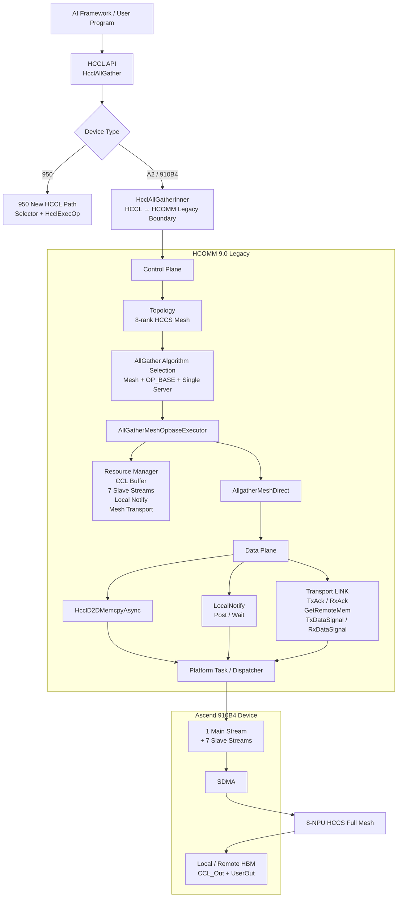
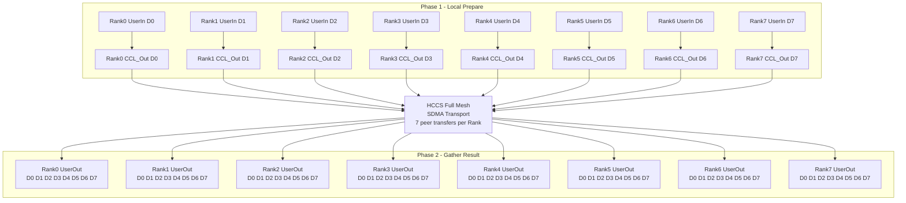
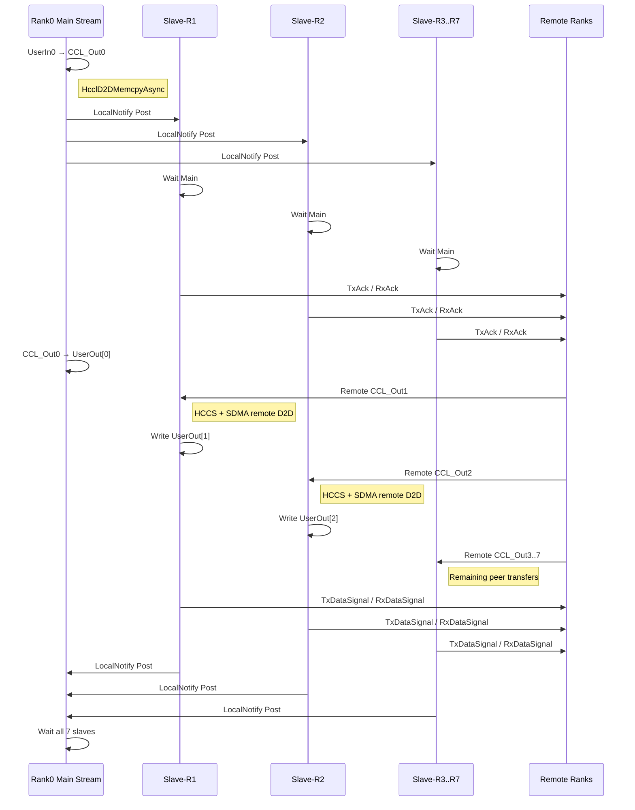

# HcclAllGather 源码分析总结（HCCL 9.0.0 / Atlas A2 910B4 / 单机 8 卡 HCCS）

> 分析范围：`10wvw01/hccl` 仓库 `9.0.0` tag，并结合配套 HCOMM 9.0.0 源码树与昇腾官方公开的 A2 AllGather Mesh 源码解析。
>
> 约束：只给出能够从源码或官方公开资料中建立证据链的结论；无法从公开源码继续确认的部分明确标注，不做推测。

## 结论摘要

对于 **单机 8 卡 Atlas A2 / Ascend 910B4、卡间 HCCS 全互联、单算子 OP_BASE 场景**，`HcclAllGather` 的核心算法属于 **Mesh**，更准确地说是：

```text
AllGatherMeshOpbaseExecutor
        ↓
TEMPLATE_ALL_GATHER_MESH_DIRECT
        ↓
AllgatherMeshDirect
```

它不是 Ring、Tree、Recursive Doubling、Bruck、Pairwise 或 Butterfly。

数据面不是基于 `HcommWriteOnThread/HcommReadOnThread` 这套新 Channel API，而是 legacy HCOMM/HCCL 算法平台中的：

```text
HcclD2DMemcpyAsync
+ LocalNotify::Post/Wait
+ Transport::TxAck/RxAck
+ Transport::GetRemoteMem
+ Transport::TxDataSignal/RxDataSignal
```

在 HCCS 场景下，对应的是 **SDMA Transport**。

当前能够核实到的公开源码中，**没有足够证据证明这条 AllGather Mesh 路径的数据搬运进一步经过 MTE**，因此不能把 MTE 作为确定调用链的一环。

---

# 一、先确认一个非常关键的 9.0.0 调用分支

`9.0.0` 中：

```text
src/ops/all_gather/all_gather_op.cc
```

入口：

```cpp
HcclResult HcclAllGather(
    void *sendBuf,
    void *recvBuf,
    uint64_t sendCount,
    HcclDataType dataType,
    HcclComm comm,
    aclrtStream stream)
```

实现中首先检查设备类型：

```cpp
DevType deviceType = DevType::DEV_TYPE_COUNT;
CHK_RET(hrtGetDeviceType(deviceType));

#ifdef MACRO_DEV_TYPE_NEW
if (deviceType != DevType::DEV_TYPE_950) {
#else
if (deviceType != DevType::DEV_TYPE_910_95) {
#endif
    return HcclAllGatherInner(
        sendBuf, recvBuf, sendCount,
        dataType, comm, stream);
}
```

所以实际分支是：

```text
Ascend 950
    ↓
HCCL 新独立算子路径
Selector → HcclExecOp

Ascend A2 / 910B4
    ↓
HcclAllGatherInner()
    ↓
HCOMM legacy 路径
```

因此分析 910B4 时，不能直接拿同一文件下面的：

```text
Selector()
  ↓
HcclExecOp()
```

作为 A2 的实际执行链。

对于 A2，`HcclAllGather()` 在入口就回退到了：

```text
HcclAllGatherInner()
```

HCCL 9.0.0 README 同时说明，HCCL 下层通过独立的 **HCOMM 通信基础库**提供通信能力。

相关源码：

```text
src/ops/all_gather/all_gather_op.cc
include/hccl.h
README.md
```

---

# 二、需求一：HcclAllGather 每个入参表达什么含义

接口定义：

```cpp
HcclResult HcclAllGather(
    void *sendBuf,
    void *recvBuf,
    uint64_t sendCount,
    HcclDataType dataType,
    HcclComm comm,
    aclrtStream stream);
```

源码位置：

```text
include/hccl.h
```

## 2.1 sendBuf

当前 Rank 的输入数据 Device Buffer。

例如：

```text
Rank0 sendBuf = D0
Rank1 sendBuf = D1
...
Rank7 sendBuf = D7
```

每张卡只提供自己这一份数据。

`include/hccl.h` 将其描述为：

```text
A pointer identifying the input data address of the operator.
```

---

## 2.2 recvBuf

当前 Rank 的 AllGather 输出 Device Buffer。

最终每张卡的输出逻辑上都是：

```text
recvBuf =
+---------+---------+---------+-----+---------+
| Rank0   | Rank1   | Rank2   | ... | Rank7   |
| data D0 | data D1 | data D2 |     | data D7 |
+---------+---------+---------+-----+---------+
```

也就是将所有 Rank 的输入按 Rank 顺序拼接到本 Rank 的接收 Buffer 中。

---

## 2.3 sendCount

`sendCount` 表示：

> 单个 Rank 输入的元素数量。

不是 8 张卡所有数据的总元素数。

`AllGatherOutPlace()` 中可以看到：

```cpp
u32 perDataSize = SIZE_TABLE[dataType];
u64 inputSize = sendCount * perDataSize;    // all gather 每个rank上一份数据
u64 outputSize = inputSize * userRankSize;  // 每个卡上结果为rankSize份数据
```

所以定义：

```text
S = sendCount × sizeof(dataType)
```

8 卡时：

```text
单 Rank 输入字节数 = S
单 Rank 输出字节数 = 8S
```

例如：

```text
sendCount = 1024
dataType = FP32
```

则：

```text
sendBuf 数据量 = 1024 × 4 = 4096 Bytes
recvBuf 数据量 = 8 × 4096 = 32768 Bytes
```

---

## 2.4 dataType

表示 `sendCount` 个元素的数据类型。

源码注释中 AllGather 支持的类型包括：

```text
int8
int16
int32
int64
uint8
uint16
uint32
uint64
float16
float32
float64
bfp16
```

算法层会先计算：

```cpp
unitSize = DataUnitSize(dataType_);
```

然后计算实际字节数：

```cpp
sdmaSize = count_ * unitSize;
```

因此实际搬运数据量为：

```text
sendCount × datatype 字节数
```

---

## 2.5 comm

`HcclComm` 是 HCCL 通信域 Handle。

它不是单纯的一条通信连接，而是当前集合通信参与者对应的通信上下文入口。

HCCL 会基于它查询：

```cpp
HcclGetRankSize(comm, &rankSize);
HcclGetRankId(comm, &userRank);
```

从整体软件架构上，通信域关联的信息包括：

```text
rankId
rankSize
拓扑信息
通信资源
CCL Buffer
Transport
其他通信上下文
```

---

## 2.6 stream

`stream` 是用户传入的 NPU 主 Stream：

```text
aclrtStream
```

它不是 CPU Thread。

Stream 是 Device Task 的有序执行序列，其中可以提交：

```text
DMA Task
Notify Post / Wait
NPU Kernel
其他 Runtime Task
```

对于 Mesh Direct AllGather，这条用户 Stream 作为 **主流 Main Stream**，算法还会根据 Rank 数量申请从流。

8 卡时：

```text
1 Main Stream
+ 7 Slave Streams
```

---

# 三、需求二：单机 8 卡 A2 到底使用哪类 AllGather 算法

## 3.1 结论

对当前场景：

```text
Atlas A2 / 910B4
单机
8 NPU
HCCS 全互联
OP_BASE 单算子
```

算法属于：

# Mesh Direct

具体执行器/模板名称：

```text
AllGatherMeshOpbaseExecutor
        ↓
TEMPLATE_ALL_GATHER_MESH_DIRECT
        ↓
AllgatherMeshDirect
```

因此不是：

```text
Ring                  ×
Tree                  ×
Recursive Doubling    ×
Recursive Halving-Doubling ×
Bruck                 ×
Pairwise              ×
Butterfly             ×
```

---

## 3.2 为什么能确定是 Mesh

官方公开的 A2 AllGather 源码解析中，算法选择条件为：

```cpp
if (isMeshTopo) {
    if (workflowMode_ ==
        HcclWorkflowMode::HCCL_WORKFLOW_MODE_OP_BASE) {

        if (isSingleMeshAggregation_) {
            algName = "AllGatherMeshOpbaseExecutor";
        }
    }
}
```

逻辑是：

```text
Server 内拓扑 = Mesh
        AND
workflow = OP_BASE
        AND
Single Mesh / Single Server
        ↓
AllGatherMeshOpbaseExecutor
```

当前 8 卡 A2 HCCS 全互联正符合该条件。

---

## 3.3 Executor 源码再次确认

在：

```text
CollAllGatherMeshOpbaseExecutor::CalcLevel0CommInfo()
```

中构造：

```cpp
CommParaInfo commParaLevel0(
    COMM_LEVEL0,
    CommType::COMM_TAG_MESH);
```

随后：

```cpp
CHK_RET(CalcCommPlaneInfo(
    tag_,
    commParaLevel0,
    opTransport[COMM_LEVEL0],
    inputType,
    outputType));
```

这里明确使用：

```text
COMM_TAG_MESH
```

执行阶段进一步获取：

```cpp
AlgTemplateRegistry::Instance().GetAlgTemplate(
    TemplateType::TEMPLATE_ALL_GATHER_MESH_DIRECT,
    dispatcher_);
```

因此可以建立三层证据：

```text
算法执行器：AllGatherMeshOpbaseExecutor
通信资源类型：COMM_TAG_MESH
算法模板：TEMPLATE_ALL_GATHER_MESH_DIRECT
```

这不是根据拓扑名称猜测，而是源码中的实际类型名。

---

# 四、为什么官方示例是 4 卡，而这里可以扩展到 8 卡

官方示例图为了便于说明通常使用 4 Rank，但实现并没有把算法固定在 4 卡。

资源数量由：

```text
rankSize
```

或者：

```text
topoAttr_.deviceNumPerAggregation
```

动态计算。

例如：

```cpp
u32 totalStreamNum = topoAttr_.deviceNumPerAggregation;
streamNum = totalStreamNum - 1U;
```

因此：

```text
4 Rank：
1 Main + 3 Slave

8 Rank：
1 Main + 7 Slave
```

实现中没有使用类似：

```cpp
if (rankSize == 4)
```

来限制 Mesh Direct 算法只能在 4 卡上运行。

所以 8 卡仍然是同一个算法，只是 peer 并发数量由 3 扩展为 7。

---

# 五、需求三：HcclAllGather 基于 HCOMM 哪些接口实现

首先需要区分两套接口体系。

## 5.1 不是 HcommWriteOnThread / HcommReadOnThread 这套新 Channel API

A2 legacy AllGather Mesh Direct 并不是直接使用：

```cpp
HcommWriteOnThread()
HcommReadOnThread()
HcommChannelNotifyRecordOnThread()
HcommChannelNotifyWaitOnThread()
```

这类 Channel/Thread 接口完成集合通信。

A2 legacy 路径使用的是更低一层的：

```text
Dispatcher
Transport
LocalNotify
DeviceMem
```

抽象。

---

## 5.2 第一组接口：数据搬运

核心接口：

```cpp
HcclD2DMemcpyAsync()
```

接口形式：

```cpp
HcclResult HcclD2DMemcpyAsync(
    HcclDispatcher dispatcher,
    DeviceMem &dst,
    const DeviceMem &src,
    Stream &stream,
    u32 remoteUserRank = INVALID_VALUE_RANKID,
    LinkType inLinkType = LINK_ONCHIP);
```

后两个参数很关键：

```text
remoteUserRank
inLinkType
```

它们区分本地 D2D copy 与跨 Rank 的远端 D2D copy。

Mesh Direct 中它被用于：

```text
UserIn → Local CCL_Out
Local CCL_Out → Local UserOut[本Rank]
Remote CCL_Out → Local UserOut[远端Rank槽位]
```

---

## 5.3 第二组接口：Rank 内 Stream 同步

核心：

```cpp
LocalNotify::Post()
LocalNotify::Wait()
```

用于：

```text
Main Stream → Slave Stream
Slave Stream → Main Stream
```

典型辅助函数包括：

```text
AllgatherMeshDirect::MainRecordSub()
AllgatherMeshDirect::SubWaitMain()

AllgatherMeshDirect::SubRecordMain()
AllgatherMeshDirect::MainWaitSub()
```

逻辑是：

```text
Main 准备好本地 CCL_Out
       ↓
Main Post
       ↓
Slave Wait
       ↓
Slave 开始 peer 通信
       ↓
Slave 完成
       ↓
Slave Post
       ↓
Main Wait
```

---

## 5.4 第三组接口：跨 Rank Transport 同步和远端内存

核心 Transport 接口包括：

```cpp
links[dstRank]->TxAck()
links[dstRank]->RxAck()

links[dstRank]->GetRemoteMem()

links[dstRank]->GetRemoteRank()
links[dstRank]->GetLinkType()

links[dstRank]->TxDataSignal()
links[dstRank]->RxDataSignal()
```

可以分成：

```text
开始通信前同步：TxAck / RxAck

远端 Buffer 定位：GetRemoteMem

实际远端 D2D copy：HcclD2DMemcpyAsync

完成同步：TxDataSignal / RxDataSignal
```

---

# 六、HCCS 为什么可以确认对应 SDMA

昇腾公开资料和 HCOMM/HCCL 代码体系中，HCCS / PCIe 与 SDMA Transport 对应，而 RoCE 对应 RDMA Transport。

概念上：

```text
HCCS / PCIe
      ↓
SDMA Transport

RoCE
      ↓
RDMA Transport
```

SDMA Transport 使用的典型同步事务为：

```text
TxAck / RxAck
      ↓
SDMA Data Movement
      ↓
TxDataSignal / RxDataSignal
```

在 `AllgatherMeshDirect::RunAsync()` 中，对应代码变量直接出现：

```cpp
u64 sdmaSize = count_ * unitSize;
```

语义即：

```text
当前一次 SDMA 通信字节数
```

所以对：

```text
A2 910B4 + HCCS Mesh Direct
```

可以确认：

> Rank 间数据搬运使用 SDMA Transport。

---

# 七、Host 侧做了哪些事情

传统 OP_BASE Mesh Direct 路径可以拆成：

```text
Host
 │
 ├─ 接收 HcclAllGather 参数
 │
 ├─ 参数检查
 │
 ├─ 查询通信域
 │    ├─ rankId
 │    └─ rankSize
 │
 ├─ 查询 Device / Topology
 │
 ├─ 算法选择
 │     ↓
 │   AllGatherMeshOpbaseExecutor
 │
 ├─ 资源计算
 │   ├─ CCL Buffer
 │   ├─ Slave Streams
 │   ├─ Local Notify
 │   └─ Mesh Transport
 │
 ├─ 获取算法模板
 │     ↓
 │   AllgatherMeshDirect
 │
 └─ 按算法编排向 NPU Stream 提交 Task
```

HCOMM 本身把职责拆成：

```text
Control Plane
  → Topology
  → Communication Resource Management

Data Plane
  → Local Operation
  → Synchronization
  → Communication Data Movement
```

因此 Host 更偏向：

```text
控制面
算法编排
资源准备
Task 生成 / 下发
```

---

# 八、Device 侧做了哪些事情

Device 上执行已经提交到 Stream 中的实际 Task。

对于 8 卡 Mesh Direct，单个 Rank 对应：

```text
1 条 Main Stream
+ 7 条 Slave Stream
```

资源公式：

```text
slaveStreamNum = rankSize - 1
```

所以：

```text
8 - 1 = 7
```

---

## 8.1 Main Stream 的职责

### 1）UserIn → 本地 CCL_Out

```cpp
HcclD2DMemcpyAsync(
    dispatcher_,
    dst,
    src,
    stream_);
```

逻辑：

```text
UserIn
  ↓
Local CCL_Out
```

---

### 2）唤醒 7 条从流

通过：

```text
LocalNotify::Post
LocalNotify::Wait
```

完成 Main/Slave 流间同步。

---

### 3）本地 CCL_Out → UserOut[本Rank]

例如 Rank3：

```text
CCL_Out3
   ↓
UserOut[3]
```

本 Rank 数据不需要经过 HCCS。

---

### 4）等待所有 Slave Stream 完成

```text
Slave Post
   ↓
Main Wait
```

只有所有远端 Rank 数据都已经完成后，整个 AllGather 才结束。

---

# 九、7 条 Slave Stream 做什么

对于 Rank0 来说，有 7 个远端 peer：

```text
Rank1
Rank2
Rank3
Rank4
Rank5
Rank6
Rank7
```

实现中 `dstRank` 的具体遍历顺序由类似：

```cpp
BackwardRank(rank, rankSize, round)
```

的函数生成，因此不应把物理执行顺序简单描述成固定的 1、2、3、4、5、6、7。

但本质上：

> 一条从流负责一个远端 Rank 的数据获取和同步。

每条 Slave Stream 的典型流程为：

```text
TxAck
 ↓
RxAck
 ↓
GetRemoteMem(remote CCL_Out)
 ↓
HcclD2DMemcpyAsync
 ↓
TxDataSignal
 ↓
RxDataSignal
```

---

# 十、从数据流看，它更接近 Remote Pull

代码逻辑会先：

```cpp
void *remMemPtr = nullptr;

links[dstRank]->GetRemoteMem(
    UserMemType::OUTPUT_MEM,
    &remMemPtr);
```

取得远端通信 Buffer 地址。

随后创建远端源 Buffer：

```cpp
src = DeviceMem::create(
    static_cast<char *>(remMemPtr) + remoteOffsetByte,
    sdmaSize);
```

创建本地目标 Buffer：

```cpp
dst = DeviceMem::create(
    curUserMemOutPtr + dstRank * sliceSize,
    sdmaSize);
```

最后调用：

```cpp
HcclD2DMemcpyAsync(
    dispatcher_,
    dst,
    src,
    subStream,
    links[dstRank]->GetRemoteRank(),
    links[dstRank]->GetLinkType());
```

数据方向表现为：

```text
Remote Rank CCL_Out
        │
        │ HCCS / SDMA remote D2D
        ▼
Local Rank UserOut
```

所以从 Rank0 视角：

```text
CCL_Out1 ──────┐
CCL_Out2 ──────┤
CCL_Out3 ──────┤
CCL_Out4 ──────┤
CCL_Out5 ──────┤── HCCS / SDMA ──> Rank0 UserOut
CCL_Out6 ──────┤
CCL_Out7 ──────┘
```

这和 Ring 的逐跳传播完全不同：

```text
Rank0 → Rank1 → Rank2 → Rank3 → ...
```

Mesh Direct 利用 HCCS 全互联，让每个 Rank 直接与其他 peer 通信。

---

# 十一、需求四：从 HcclAllGather 一直追到 SDMA/HCCS 的调用链

当前能够从公开源码建立证据链的调用路径如下：

```text
HcclAllGather()
│
│ HCCL 9.0.0
│ src/ops/all_gather/all_gather_op.cc
│
├─ InitEnvConfig()
├─ hrtGetDeviceType()
│
└─ A2 / 910B4 != 950
      │
      ▼
HcclAllGatherInner()
      │
      │ HCCL → HCOMM legacy 边界
      ▼
HCOMM legacy OP_BASE
      │
      ▼
AllGather Operator
      │
      │ topology = Mesh
      │ workflow = OP_BASE
      │ single server
      ▼
AllGatherMeshOpbaseExecutor
      │
      ▼
CollAllGatherMeshOpbaseExecutor
      │
      ├─ CalcStreamNum()
      │      └─ 7 slave streams
      │
      ├─ CalcCommInfo()
      │
      ├─ CalcTransportMemType()
      │      ├─ CCL_INPUT
      │      └─ CCL_OUTPUT
      │
      └─ CalcLevel0CommInfo()
             │
             └─ COMM_TAG_MESH
      │
      ▼
CollAllGatherMeshOpbaseExecutor::KernelRun()
      │
      ├─ ActiveSlaveStreams()
      │
      ├─ GetAlgTemplate()
      │     └─ TEMPLATE_ALL_GATHER_MESH_DIRECT
      │
      ├─ Prepare()
      │
      └─ RunTemplate()
              │
              ▼
AllgatherMeshDirect::RunAsync()
              │
              ├─ HcclD2DMemcpyAsync
              │     UserIn → Local CCL_Out
              │
              ├─ LocalNotify::Post/Wait
              │     Main ↔ Slave
              │
              ├─ TxAck / RxAck
              │
              ├─ HcclD2DMemcpyAsync
              │     Local CCL_Out → Local UserOut[rank]
              │
              ├─ GetRemoteMem
              │
              ├─ HcclD2DMemcpyAsync
              │     Remote CCL_Out
              │       → Local UserOut[remoteRank]
              │
              ├─ TxDataSignal / RxDataSignal
              │
              └─ LocalNotify::Post/Wait
                     Slave → Main
              │
              ▼
HCOMM Data Plane
              │
              ├─ comm_primitive
              ├─ task
              └─ resource
              │
              ▼
NPU Stream Task
              │
              ▼
SDMA Transport
              │
              ▼
HCCS
              │
              ▼
Remote HBM / CCL_Out
```

---

# 十二、为什么不能继续写成“SDMA → MTE”

目前能够确认：

```text
HCCS
 ↓
SDMA Transport
```

也能确认：

```text
AllgatherMeshDirect
 ↓
HcclD2DMemcpyAsync
 ↓
remoteRank + linkType
```

以及代码中明确存在：

```cpp
sdmaSize
```

但是当前公开 HCCL/HCOMM 代码证据不足以严谨建立：

```text
HcclD2DMemcpyAsync
 ↓
某个特定 Runtime API
 ↓
某种确定 SQE
 ↓
MTE Engine
```

所以本文不画：

```text
SDMA → MTE
```

也不把 MTE 作为已经确认的 AllGather 跨卡数据引擎。

当前能严格写出的结论为：

| 层级 | 结论 |
|---|---|
| 集合通信算法 | Mesh Direct |
| Executor | AllGatherMeshOpbaseExecutor |
| Template | AllgatherMeshDirect |
| Transport | SDMA |
| 物理互联 | HCCS |
| 数据原语 | HcclD2DMemcpyAsync |
| Rank 内同步 | LocalNotify Post/Wait |
| Rank 间同步 | TxAck/RxAck、TxDataSignal/RxDataSignal |
| 远端 Buffer | GetRemoteMem |
| MTE 是否参与 Rank 间 HCCS 搬运 | 公开源码证据不足，不能断言 |

---

# 十三、需求五：HcclAllGather 整体软件架构图



这里刻意没有把 MTE 画入确定路径。

---

# 十四、需求六：单机 8 卡执行一次 AllGather 的数据流

假设：

```text
Rank0 input = D0
Rank1 input = D1
Rank2 input = D2
Rank3 input = D3
Rank4 input = D4
Rank5 input = D5
Rank6 input = D6
Rank7 input = D7
```

## 14.1 Phase 1：每张卡先准备本地 CCL_Out

```text
Rank0 UserIn D0 → CCL_Out0
Rank1 UserIn D1 → CCL_Out1
Rank2 UserIn D2 → CCL_Out2
Rank3 UserIn D3 → CCL_Out3
Rank4 UserIn D4 → CCL_Out4
Rank5 UserIn D5 → CCL_Out5
Rank6 UserIn D6 → CCL_Out6
Rank7 UserIn D7 → CCL_Out7
```

主要数据原语：

```cpp
HcclD2DMemcpyAsync(...)
```

---

## 14.2 Phase 2：每个 Rank 直接获取其他 7 个 Rank 的数据

以 Rank0 为例：

```text
                         Rank0
                          │
       ┌──────────────────┼────────────────────┐
       │                  │                    │
Main Stream          Slave Streams        HCCS Mesh
       │              × 7                     │
       │                  │                    │
CCL_Out0 ────────> UserOut[0]                 │
                          │                    │
CCL_Out1 ── SDMA/HCCS ───> UserOut[1]          │
CCL_Out2 ── SDMA/HCCS ───> UserOut[2]          │
CCL_Out3 ── SDMA/HCCS ───> UserOut[3]          │
CCL_Out4 ── SDMA/HCCS ───> UserOut[4]          │
CCL_Out5 ── SDMA/HCCS ───> UserOut[5]          │
CCL_Out6 ── SDMA/HCCS ───> UserOut[6]          │
CCL_Out7 ── SDMA/HCCS ───> UserOut[7]          │
```

其他 Rank 完全对称。

---

## 14.3 Mermaid 数据流图



这个图为了可读性将 Mesh 网络抽象成单个节点。

真实源码语义不是“中心节点广播”，而是：

> 每个 Rank 利用多个 Slave Stream，与其余 Rank 直接进行 peer 传输。

---

# 十五、Rank0 的 Task 时间线



---

# 十六、8 卡时的资源数量

从源码计算公式可以得到：

## 16.1 Stream

每 Rank：

```text
Main Stream  = 1
Slave Stream = rankSize - 1 = 7
总 Stream    = 8
```

---

## 16.2 Local Notify

主从流双向同步通常需要：

```text
(rankSize - 1) × 2
```

8 卡时：

```text
7 × 2 = 14
```

分别对应：

```text
Main → Slave
Slave → Main
```

---

## 16.3 Peer Transport

每个 Rank 与另外 7 个 Rank 通信：

```text
7 peer transports / Rank
```

8 卡全连接中唯一 Rank Pair 数量：

```text
8 × 7 / 2 = 28
```

Mesh Direct 可以利用这些直接 peer 链路并行获取数据，而不需要像 Ring 那样进行 `rankSize - 1` 轮逐跳传播。

---

# 十七、源码清单

下面是分析 `HcclAllGather` 时最关键的源码清单。

| 层级 | 源码 | 函数/关键位置 | 作用 |
|---|---|---|---|
| HCCL API | `include/hccl.h` | `HcclAllGather` | API 与参数定义 |
| HCCL 入口 | `src/ops/all_gather/all_gather_op.cc` | `HcclAllGather()` | A2 设备分支路由到 `HcclAllGatherInner` |
| HCCL 新路径，仅作对照 | `src/ops/all_gather/all_gather_op.cc` | `AllGatherOutPlace()` | 950 新独立算子路径中的 Selector/HcclExecOp |
| HCCL/HCOMM 架构 | `README.md` / HCOMM `README.md` | Control/Data Plane | HCCL 与 HCOMM 分层 |
| HCOMM legacy | `src/legacy/` | framework/interface/service/unified_platform | A2 legacy 兼容实现 |
| AllGather 算法选择 | HCOMM/HCCL legacy algorithm operator | AllGather selector | 选择 `AllGatherMeshOpbaseExecutor` |
| Mesh Executor | `coll_all_gather_mesh_opbase_executor.cc` | `CalcStreamNum()` | 计算 Slave Stream 数 |
| Mesh Executor | 同上 | `CalcLevel0CommInfo()` | 构造 `COMM_TAG_MESH` |
| Mesh Executor | 同上 | `KernelRun()` | 获取 Mesh Direct Template |
| Mesh Template | `all_gather_mesh_direct.cc` | `RunAsync()` | 真正 AllGather 数据流 |
| Rank 内同步 | `all_gather_mesh_direct.cc` | `MainRecordSub/SubWaitMain/...` | LocalNotify 同步 |
| 数据搬运 | Dispatcher | `HcclD2DMemcpyAsync()` | 本地/远端 D2D 数据搬运 |
| Rank 间开始同步 | Transport Link | `TxAck/RxAck` | SDMA 事务前握手 |
| 远端内存 | Transport Link | `GetRemoteMem` | 获取远端 CCL Buffer 地址 |
| Rank 间完成同步 | Transport Link | `TxDataSignal/RxDataSignal` | 数据完成通知 |
| HCOMM Platform | `src/platform/comm_primitive` | 通信原语 | 数据面通信原语 |
| HCOMM Platform | `src/platform/task` | Task 管理 | Device Task 构造/提交 |
| HCOMM Platform | `src/platform/resource` | Resource 管理 | Stream/Notify/Transport 等资源 |

---

# 十八、HCCL 9.0.0 入口源码关键位置

## 18.1 API 定义

文件：

```text
include/hccl.h
```

关键定义：

```cpp
extern HcclResult HcclAllGather(
    void *sendBuf,
    void *recvBuf,
    uint64_t sendCount,
    HcclDataType dataType,
    HcclComm comm,
    aclrtStream stream);
```

---

## 18.2 API 实现

文件：

```text
src/ops/all_gather/all_gather_op.cc
```

关键入口：

```cpp
HcclResult HcclAllGather(...)
```

关键调用：

```text
InitEnvConfig()
hrtGetDeviceType()
HcclAllGatherInner()
```

对于非 950 设备：

```text
HcclAllGather
    ↓
HcclAllGatherInner
```

---

## 18.3 新独立算子路径，仅用于理解架构

同一个文件里的：

```cpp
AllGatherOutPlace(...)
```

构造：

```cpp
param.inputPtr = sendBuf;
param.inputSize = inputSize;
param.outputPtr = recvBuf;
param.outputSize = outputSize;
param.DataDes.count = sendCount;
param.DataDes.dataType = dataType;
param.opType = HcclCMDType::HCCL_CMD_ALLGATHER;
```

随后：

```cpp
Selector(comm, param, topoInfo, algName);
HcclExecOp(comm, param, topoInfo, algName);
```

但是需要再次强调：

> 这不是当前 A2 / 910B4 的实际入口执行路径，因为设备判断已经提前进入 `HcclAllGatherInner()`。

---

# 十九、最终完整链路总结

```text
HcclAllGather
     │
     │ Ascend A2 / 910B4
     ▼
HcclAllGatherInner
     │
     ▼
HCOMM Legacy
     │
     ▼
AllGather Operator
     │
     │ A2 + 单 Server + HCCS Mesh + OP_BASE
     ▼
AllGatherMeshOpbaseExecutor
     │
     │ COMM_TAG_MESH
     ▼
TEMPLATE_ALL_GATHER_MESH_DIRECT
     │
     ▼
AllgatherMeshDirect::RunAsync
     │
     ├─ UserIn → CCL_Out
     │      HcclD2DMemcpyAsync
     │
     ├─ Main ↔ 7 Slave Streams
     │      LocalNotify Post / Wait
     │
     ├─ Remote Rank Ready
     │      TxAck / RxAck
     │
     ├─ Remote CCL_Out → Local UserOut
     │      GetRemoteMem
     │      HcclD2DMemcpyAsync
     │
     └─ Transfer Complete
            TxDataSignal / RxDataSignal
             │
             ▼
          SDMA
             │
             ▼
           HCCS
```

---

# 二十、最终结论

对于：

```text
单机
8 × Ascend 910B4
Atlas A2
HCCS 全互联
HcclAllGather
OP_BASE
```

可以基于源码严格总结为：

> `HcclAllGather()` 在 A2/910B4 上进入 `HcclAllGatherInner()` 对应的 legacy 通信路径。对于单 Server HCCS Mesh 拓扑，AllGather 选择 `AllGatherMeshOpbaseExecutor`，进一步使用 `TEMPLATE_ALL_GATHER_MESH_DIRECT / AllgatherMeshDirect` 算法。每个 Rank 先将本地输入准备到 CCL_Out，再通过 1 条 Main Stream 和 `rankSize - 1` 条 Slave Stream 协同工作；8 卡时即 1 主流 + 7 从流。Rank 内流同步使用 `LocalNotify::Post/Wait`，Rank 间通过 Transport Link 的 `TxAck/RxAck`、`GetRemoteMem`、`TxDataSignal/RxDataSignal` 完成同步和远端 Buffer 管理，实际数据搬运由 `HcclD2DMemcpyAsync` 提交。HCCS 链路对应 SDMA Transport。当前公开源码不足以进一步证明此路径最终经过 MTE，因此不能把 MTE 写成已经确认的数据搬运引擎。

---

# 二十一、参考源码与公开资料

## HCCL 9.0.0

仓库：

```text
https://github.com/10wvw01/hccl
```

目标版本：

```text
9.0.0
```

重点文件：

```text
include/hccl.h
src/ops/all_gather/all_gather_op.cc
README.md
```

## HCOMM 9.0.0

```text
https://gitcode.com/cann/hcomm/tree/9.0.0
```

重点目录：

```text
src/legacy
src/algorithm/impl
src/platform/comm_primitive
src/platform/resource
src/platform/task
```

## 昇腾官方 A2 AllGather Mesh 源码解析

```text
https://www.hiascend.com/zh/developer/techArticles/20240903-1
```

## HcclD2DMemcpyAsync 公开说明

```text
https://gitee.com/ascend/cann-hccl/blob/e048c5face419f24486bf26712a426ded81402e7/docs/hccl_customized_dev/HcclD2DMemcpyAsync.md
```

---

> 注意：本文所有关于 A2 / 910B4 实际算法、资源和数据流的结论均按“有源码依据才写”的原则整理。对于无法继续从公开源码确认的 Runtime/硬件微架构细节，不做无依据延伸。
