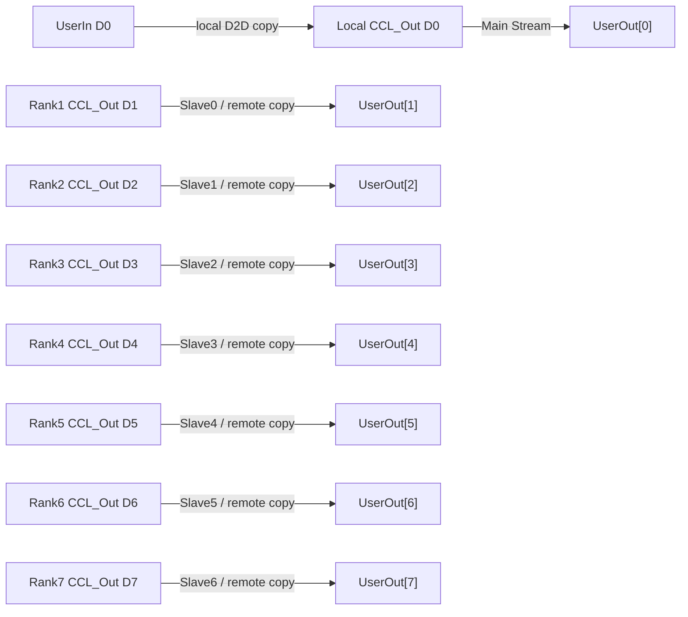

# HcclAllGather 实现代码串讲（小白友好版）

> 适用范围：`10wvw01/hccl` 仓库 `9.0.0` 代码基线，硬件场景为 **单机 8 卡 Atlas A2 / Ascend 910B4，卡间 HCCS 全互联，OP_BASE 单算子模式**。
>
> 这份文档不是单纯给结论，而是教你 **怎么自己沿着代码看懂 AllGather，并且能打开源码讲给别人听**。
>
> 原则：只讲能从源码或官方公开资料建立证据链的内容。没有源码依据的地方明确停住，不猜。

---

# 0. 先别看代码：先用一句人话搞懂 AllGather

假设有 8 张 NPU 卡，每张卡都有一份自己的数据：

```text
Rank0: D0
Rank1: D1
Rank2: D2
Rank3: D3
Rank4: D4
Rank5: D5
Rank6: D6
Rank7: D7
```

执行一次 AllGather 后，每张卡都拿到完整的 8 份数据：

```text
Rank0: [D0][D1][D2][D3][D4][D5][D6][D7]
Rank1: [D0][D1][D2][D3][D4][D5][D6][D7]
...
Rank7: [D0][D1][D2][D3][D4][D5][D6][D7]
```

所以你先记住：

> **AllGather = 每个人贡献自己的一份数据，最后每个人都拿到所有人的数据。**

后面所有源码，本质上都只是在回答两个问题：

1. **8 张卡之间采用什么方式把这 8 份数据汇聚起来？**
2. **这些数据最终是通过什么通信引擎搬过去的？**

---

# 1. 先认识 8 个词，不然后面会看懵

如果你是第一次看 HCCL/HCOMM，建议先把下面 8 个词弄懂。

## 1.1 Rank 是什么

`Rank` 可以先理解成参与集合通信的“成员编号”。

在我们的 8 卡场景里：

```text
Rank0 ≈ 第 0 张 NPU
Rank1 ≈ 第 1 张 NPU
...
Rank7 ≈ 第 7 张 NPU
```

严格来说 Rank 是通信域里的逻辑编号，不一定永远等于物理 Device ID；但在当前单机 8 卡讲解里，可以先这样理解。

---

## 1.2 sendBuf 是什么

`sendBuf` 是当前 Rank 准备贡献给大家的那一份输入数据。

例如：

```text
Rank0.sendBuf = D0
Rank1.sendBuf = D1
...
Rank7.sendBuf = D7
```

---

## 1.3 recvBuf 是什么

`recvBuf` 是 AllGather 的最终结果 Buffer。

Rank0 执行结束后：

```text
recvBuf = [D0][D1][D2][D3][D4][D5][D6][D7]
```

Rank1～Rank7 也一样。

---

## 1.4 comm 是什么

`comm` 是通信域 Handle。

不要把它理解成“一条连接”。更接近：

> “这一组 Rank 共同通信所需要的上下文入口。”

HCCL 会通过 `comm` 获取：

```text
rankId
rankSize
拓扑信息
通信资源
Transport
CCL Buffer
...
```

---

## 1.5 stream 是什么

`stream` 是 NPU 上的任务执行队列。

你可以先理解成：

> “我往这个队列里按顺序塞 Task，NPU 按顺序执行。”

里面可以出现：

```text
Memcpy Task
Notify Post
Notify Wait
Kernel Task
...
```

非常重要：

> `aclrtStream` 不是 CPU 线程。

---

## 1.6 CCL Buffer 是什么

可以把 CCL Buffer 理解成 **集合通信内部使用的中转/通信 Buffer**。

当前 Mesh Direct AllGather 里，一个非常关键的数据流是：

```text
UserIn
  ↓
CCL_Out
  ↓
被其他 Rank 访问
```

你可以先把它类比成“每张卡把自己的包裹先放到一个对端能访问的取件区”。

注意：这个类比只是帮助理解，实际实现仍然是 Device Memory 和通信资源。

---

## 1.7 Transport 是什么

Transport 可以理解成 Rank 与 Rank 之间的数据通信抽象。

它负责的事情包括：

```text
双方开始前同步
获取远端内存
数据搬运
完成后同步
```

在后面你会看到：

```cpp
TxAck()
RxAck()
GetRemoteMem()
TxDataSignal()
RxDataSignal()
```

这些都是 Transport 层的重要接口。

---

## 1.8 HCCS 和 SDMA 分别是什么

先用最简单的层次理解：

```text
HCCS = 卡与卡之间的高速物理互联/链路

SDMA = 负责设备之间数据搬运的 DMA 通信引擎/Transport
```

因此当前场景的大方向是：

```text
软件算法
  ↓
SDMA Transport
  ↓
HCCS
  ↓
另一张 NPU
```

后面会用源码把这个结论串起来。

---

# 2. 今天真正要追的主线

第一次看源码时，不要试图把整个 HCCL 仓库看懂。

你只需要抓住这一条主线：

```text
HcclAllGather
    ↓
判断设备类型
    ↓
A2 / 910B4 走 HcclAllGatherInner
    ↓
进入 HCOMM legacy 路径
    ↓
选择 AllGather Mesh 算法
    ↓
AllGatherMeshOpbaseExecutor
    ↓
COMM_TAG_MESH
    ↓
TEMPLATE_ALL_GATHER_MESH_DIRECT
    ↓
AllgatherMeshDirect::RunAsync
    ↓
HcclD2DMemcpyAsync + Notify + Transport
    ↓
SDMA
    ↓
HCCS
```

你讲给别人听时，也建议严格按这个顺序。

---

# 3. 第一站：API 到底长什么样

## 3.1 打开文件

在 HCCL 仓库根目录：

```bash
rg -n "HcclAllGather" include
```

打开：

```text
include/hccl.h
```

仓库内可以直接看：

```text
https://github.com/10wvw01/hccl/blob/9.0.0-allgather-analysis/include/hccl.h
```

找到：

```cpp
extern HcclResult HcclAllGather(
    void *sendBuf,
    void *recvBuf,
    uint64_t sendCount,
    HcclDataType dataType,
    HcclComm comm,
    aclrtStream stream);
```

## 3.2 小白应该怎么理解这 6 个参数

| 参数 | 最简单理解 |
|---|---|
| `sendBuf` | 当前卡自己的输入数据 |
| `recvBuf` | 当前卡最终接收完整 AllGather 结果的位置 |
| `sendCount` | 当前卡输入有多少个“元素” |
| `dataType` | 每个元素是什么类型，例如 FP32 |
| `comm` | 哪一组 Rank 一起通信 |
| `stream` | 这些通信 Task 挂到哪条 NPU Stream 上 |

### 最容易错的是 `sendCount`

`sendCount` 不是字节数，也不是 8 张卡总元素数。

例如：

```text
sendCount = 1024
dataType = FP32
```

FP32 每个元素 4 Byte，所以：

```text
每 Rank 输入数据 = 1024 × 4 = 4096 Byte
```

8 Rank AllGather 后，每 Rank 输出：

```text
4096 × 8 = 32768 Byte
```

## 3.3 这一站你讲给别人听的话术

> “先看 API。AllGather 每个 Rank 都传入自己的一份 `sendBuf`，`sendCount` 表示单 Rank 元素数量。执行完成后，`recvBuf` 里会按 Rank 顺序包含所有 Rank 的数据。`comm` 决定参与通信的是哪一组 Rank，`stream` 决定通信 Task 被提交到哪条 NPU Stream。”

## 3.4 自测

如果 `sendCount = 1000`、`dataType = FP16`、`rankSize = 8`：

你应该能回答：

```text
单 Rank 输入 = 1000 × 2 = 2000 Byte
单 Rank 输出 = 2000 × 8 = 16000 Byte
```

如果这一步还不熟，先不要往下。

---

# 4. 第二站：进入 HcclAllGather，先确认 910B4 到底走哪条代码

## 4.1 打开文件

```bash
rg -n "HcclResult HcclAllGather" src/ops/all_gather
```

打开：

```text
src/ops/all_gather/all_gather_op.cc
```

仓库链接：

```text
https://github.com/10wvw01/hccl/blob/9.0.0-allgather-analysis/src/ops/all_gather/all_gather_op.cc
```

入口：

```cpp
HcclResult HcclAllGather(
    void *sendBuf,
    void *recvBuf,
    uint64_t sendCount,
    HcclDataType dataType,
    HcclComm comm,
    aclrtStream stream)
{
    CHK_RET(InitEnvConfig());
    ...
}
```

这时先不要被下面一大堆逻辑吓到。

我们只看 **设备分流**。

---

## 4.2 找设备类型判断

代码：

```cpp
DevType deviceType = DevType::DEV_TYPE_COUNT;
CHK_RET(hrtGetDeviceType(deviceType));

#ifdef MACRO_DEV_TYPE_NEW
if (deviceType != DevType::DEV_TYPE_950) {
#else
if (deviceType != DevType::DEV_TYPE_910_95) {
#endif
    return HcclAllGatherInner(
        sendBuf,
        recvBuf,
        sendCount,
        dataType,
        comm,
        stream);
}
```

## 4.3 这几行到底告诉了我们什么

我们的设备是：

```text
Atlas A2 / Ascend 910B4
```

它不是 950。

所以当前场景会进入：

```text
HcclAllGather()
      ↓
HcclAllGatherInner()
```

这就是整次源码分析最重要的“路口”。

---

# 5. 一个非常容易讲错的地方：A2 不直接走下面的新 Selector 路径

继续往同一个文件下面看，你会看到：

```cpp
CHK_RET(Selector(comm, param, topoInfo, algName));
CHK_RET(HcclExecOp(comm, param, topoInfo, algName));
```

新手很容易看到这里就说：

```text
HcclAllGather
→ Selector
→ HcclExecOp
```

但是对于我们的 A2/910B4，这么讲是不准确的。

因为前面已经：

```cpp
return HcclAllGatherInner(...);
```

函数已经返回了。

所以当前硬件实际主线应该是：

```text
A2 / 910B4
    ↓
HcclAllGather
    ↓
HcclAllGatherInner
    ↓
HCOMM legacy
```

而不是直接把 950 的新路径当成 A2 的执行链。

## 你讲给别人听的话术

> “这里必须先做设备分流。虽然这个文件后面还有 `Selector → HcclExecOp`，但 910B4 在前面已经通过 `return HcclAllGatherInner()` 离开当前新路径了。所以分析 A2 时，后续必须切到 HCOMM legacy 代码，而不能继续拿 950 路径往下讲。”

## 自测

别人问你：

> “那为什么你不继续跟 `AllGatherOutPlace()` 下面的 `Selector()`？”

你应该回答：

> “因为 910B4 在设备判断处已经 `return HcclAllGatherInner()` 了，那一段在当前设备条件下不会执行。”

---

# 6. 第三站：顺手利用 AllGatherOutPlace 理解数据量

虽然 A2 实际不会走这里，但这个函数里的两行代码很适合帮助理解 AllGather 的数据规模：

```cpp
u32 perDataSize = SIZE_TABLE[dataType];
u64 inputSize = sendCount * perDataSize;    // all gather 每个rank上一份数据
u64 outputSize = inputSize * userRankSize;  // 每个卡上结果为rankSize份数据
```

把它翻译成人话：

```text
inputSize
= 每 Rank 自己贡献的数据字节数

outputSize
= 每 Rank 最终拿到的全部数据字节数
```

定义：

```text
S = sendCount × sizeof(dataType)
```

8 卡：

```text
每 Rank 输入 = S
每 Rank 输出 = 8S
```

这里我们只是借代码理解 API 语义，**不要说这是 A2 实际执行到的路径**。

---

# 7. 第四站：为什么后面要切到 HCOMM

HCCL 顶层负责暴露集合通信接口，例如：

```text
AllReduce
Broadcast
AllGather
ReduceScatter
AllToAll
```

真正具体的通信资源、算法执行和数据搬运，会进入下面的 HCOMM 体系。

可以先用这个分层理解：

```text
应用 / 框架
    ↓
HCCL API
    ↓
HCCL 算子入口
    ↓
HCOMM 控制面 / 算法层
    ↓
HCOMM 数据面
    ↓
SDMA / RDMA 等 Transport
    ↓
物理链路
```

当前场景：

```text
物理链路 = HCCS
Transport = SDMA
```

---

# 8. 第五站：进入 HCOMM 后，第一件事不是搬数据，而是“选算法”

如果你本地同时拉了 HCOMM 9.0.0，建议直接搜索：

```bash
rg -n \
"AllGatherMeshOpbaseExecutor|AllgatherMeshDirect|TEMPLATE_ALL_GATHER_MESH_DIRECT|COMM_TAG_MESH" \
src
```

不要一上来试图看懂 HCOMM 所有目录。

我们只关心三个名字：

```text
AllGatherMeshOpbaseExecutor
TEMPLATE_ALL_GATHER_MESH_DIRECT
AllgatherMeshDirect
```

---

# 9. 第六站：为什么确定算法是 Mesh

算法选择逻辑的核心条件可以归纳为：

```cpp
if (isMeshTopo) {
    if (workflowMode_ == HcclWorkflowMode::HCCL_WORKFLOW_MODE_OP_BASE) {
        if (isSingleMeshAggregation_) {
            algName = "AllGatherMeshOpbaseExecutor";
        }
    }
}
```

先逐个翻译：

### `isMeshTopo`

表示当前 Server 内拓扑是 Mesh。

我们的硬件：

```text
单机 8 卡 A2
HCCS 全互联
```

符合 Mesh 场景。

### `HCCL_WORKFLOW_MODE_OP_BASE`

表示单算子执行模式。

我们调用 `HcclAllGather()` 正是在分析这个 OP_BASE 场景。

### `isSingleMeshAggregation_`

当前是单 Server 内的一组 Mesh Rank。

所以最终：

```text
AllGatherMeshOpbaseExecutor
```

## 到这里能得出什么结论

可以明确说：

```text
算法大类 = Mesh
```

而不是：

```text
Ring
Tree
Recursive Doubling
Bruck
Butterfly
```

## 非常重要

不要这样讲：

> “因为 HCCS 是全互联，所以我猜它是 Mesh。”

应该这样讲：

> “硬件拓扑满足 Mesh 条件，而算法选择源码实际返回 `AllGatherMeshOpbaseExecutor`，所以这里是源码确认的 Mesh，不是根据拓扑名字猜的。”

---

# 10. 第七站：Executor 到底是干什么的

第一次看到：

```text
AllGatherMeshOpbaseExecutor
```

很容易以为它就是“真正搬数据的函数”。

其实更准确的理解是：

> Executor 主要负责准备这次算法需要的资源、通信域和算法模板，然后启动真正的算法执行。

可以先把它理解成“施工经理”：

```text
我要几条 Stream？
我要什么 Transport？
我要什么 Buffer？
我要用哪个算法模板？
```

而真正“每一份数据怎么搬”是在后面的：

```text
AllgatherMeshDirect::RunAsync()
```

---

# 11. 第八站：CalcStreamNum —— 为什么 8 卡会有 7 条从流

重点看类似：

```cpp
u32 totalStreamNum = topoAttr_.deviceNumPerAggregation;
streamNum = totalStreamNum - 1U;
```

8 卡时：

```text
totalStreamNum = 8
slave streamNum = 8 - 1 = 7
```

再加用户传入的主流：

```text
1 Main Stream
+ 7 Slave Streams
= 8 条 Stream / Rank
```

## 为什么刚好是 7 条 Slave

因为当前 Rank 总共需要拿到 8 份数据：

```text
1 份自己的
7 份别人的
```

实现上可以理解成：

```text
Main Stream
    → 处理自己的数据

7 Slave Streams
    → 分别处理其他 7 个 Rank 的数据
```

这就是 Mesh Direct 并发性的关键。

## 你讲给别人听的话术

> “8 卡时每个 Rank 除了用户主流，还申请 7 条从流。原因很直观：自己那份数据由主流处理，其余 7 个 peer 的数据可以由 7 条从流并行处理。”

---

# 12. 第九站：CalcLevel0CommInfo —— 第二个 Mesh 铁证

重点看：

```cpp
CommParaInfo commParaLevel0(
    COMM_LEVEL0,
    CommType::COMM_TAG_MESH);
```

最重要的是：

```cpp
COMM_TAG_MESH
```

随后再通过：

```cpp
CalcCommPlaneInfo(...)
```

为这一层计算通信 Plane/Transport 资源。

所以现在我们有第二份证据：

```text
算法执行器 = AllGatherMeshOpbaseExecutor
通信资源类型 = COMM_TAG_MESH
```

如果有人问：

> “你为什么说是 Mesh？”

你可以同时指给他看这两处代码。

---

# 13. 第十站：KernelRun —— 从 Executor 跳到真正的数据流算法

继续看 Executor 的执行部分。

重点找：

```cpp
AlgTemplateRegistry::Instance().GetAlgTemplate(
    TemplateType::TEMPLATE_ALL_GATHER_MESH_DIRECT,
    dispatcher_);
```

这里出现了第三个最关键名字：

```text
TEMPLATE_ALL_GATHER_MESH_DIRECT
```

所以完整证据链变成：

```text
AllGatherMeshOpbaseExecutor
        ↓
COMM_TAG_MESH
        ↓
TEMPLATE_ALL_GATHER_MESH_DIRECT
```

然后模板对应真正算法：

```text
AllgatherMeshDirect
```

现在可以把算法名称说完整了：

> **Mesh Direct AllGather**

---

# 14. 到这里先停一下：Mesh Direct 到底“Direct”在哪里

先不看代码，想象两种方式。

## Ring 风格

如果是 Ring，一份数据可能需要：

```text
Rank0 → Rank1 → Rank2 → Rank3 → ...
```

数据通过中间 Rank 一跳一跳传播。

## Mesh Direct 风格

Rank0 可以直接面对其他所有 Rank：

```text
           Rank1
             │
Rank2 ───── Rank0 ───── Rank3
             │
           Rank4
             ...
```

对于 8 卡 Rank0：

```text
Rank0 ↔ Rank1
Rank0 ↔ Rank2
Rank0 ↔ Rank3
Rank0 ↔ Rank4
Rank0 ↔ Rank5
Rank0 ↔ Rank6
Rank0 ↔ Rank7
```

后面 `GetRemoteMem + HcclD2DMemcpyAsync` 会进一步证明它确实是在直接访问各 peer 的通信 Buffer。

---

# 15. 第十一站：真正核心函数 AllgatherMeshDirect::RunAsync

本地 HCOMM 源码建议搜索：

```bash
rg -n "AllgatherMeshDirect::RunAsync" src
```

这个函数是整场串讲最值得花时间的地方。

前面的内容是在回答：

```text
为什么选这个算法？
需要什么资源？
```

而 `RunAsync()` 真正回答：

```text
数据究竟怎么流？
```

建议你把这个函数打印出来或者单独开一个编辑器窗口。

---

# 16. RunAsync 第一步：算一份数据到底多少字节

会看到类似：

```cpp
u32 unitSize = DataUnitSize(dataType_);
u64 sdmaSize = count_ * unitSize;
u64 sliceSize = opInfo_->count * unitSize;
```

先别被变量名吓到。

本质就是：

```text
unitSize
= 一个元素占多少 Byte

count_
= 有多少元素

sdmaSize
= 这次要搬多少 Byte
```

所以：

```text
sdmaSize = count × sizeof(dataType)
```

例如：

```text
count = 1024
dataType = FP32
```

那么：

```text
sdmaSize = 1024 × 4 = 4096 Byte
```

也就是每个 Rank 的一份数据大小。

---

# 17. RunAsync 第二步：先把自己的数据放到 CCL_Out

核心逻辑可以抽象成：

```cpp
src = DeviceMem::create(curUserMemInPtr, sdmaSize);

dst = DeviceMem::create(
    curCommMemOutPtr + localOffsetByte,
    sdmaSize);

HcclD2DMemcpyAsync(
    dispatcher_,
    dst,
    src,
    stream_);
```

先看 `src`：

```text
UserIn
```

再看 `dst`：

```text
CCL_Out
```

所以第一步的数据流就是：

```text
Rank0 UserIn D0 → Rank0 CCL_Out
Rank1 UserIn D1 → Rank1 CCL_Out
...
Rank7 UserIn D7 → Rank7 CCL_Out
```

## 为什么不直接让其他卡读 sendBuf

因为集合通信实现会准备自己的通信 Buffer 和 Transport 资源。

这里先把本地输入放到通信体系可使用的 `CCL_Out`，后续其他 Rank 再通过 Transport 访问这个远端通信 Buffer。

你可以先记成：

> “每张卡先把自己的货放到通信取件区。”

---

# 18. RunAsync 第三步：主流通知 7 条从流开始工作

会看到类似：

```text
MainRecordSub()
SubWaitMain()
```

其核心是：

```text
LocalNotify::Post
LocalNotify::Wait
```

这个 Notify 是 **Rank 内不同 Stream 之间的同步**。

不要把它和跨 Rank 数据搬运混在一起。

逻辑是：

```text
Main Stream
   │
   │ 已经准备好 CCL_Out
   ▼
Post Notify
   │
   ▼
Slave Stream Wait 完成
   │
   ▼
7 条 Slave 可以开始 peer 通信
```

## 一句话理解

> Main 告诉 Slave：“我这边前置准备已经做完，你们可以开始去拿其他卡的数据了。”

---

# 19. RunAsync 第四步：7 条从流分别面对 7 个 peer

通常会看到类似循环：

```cpp
for (u32 round = 1; round < rankSize; round++) {
    u32 dstRank = BackwardRank(rank, rankSize, round);
    Stream &subStream = meshStreams_[round - 1];
    ...
}
```

8 卡时：

```text
round = 1 ... 7
```

也就是说当前 Rank 需要处理 7 个 peer。

注意：

具体 `dstRank` 顺序可能由 `BackwardRank()` 决定，不一定简单就是 1、2、3、4、5、6、7。

但核心不变：

> `rankSize - 1` 条 peer 通信分别交给 `rankSize - 1` 条从流。

---

# 20. RunAsync 第五步：TxAck / RxAck —— 数据搬之前先确认双方状态

典型代码：

```cpp
links[dstRank]->TxAck(subStream);
links[dstRank]->RxAck(subStream);
```

小白先这样理解：

```text
“我要开始访问你的通信 Buffer 了。”
“好，我这边已经 Ready。”
```

但是要注意：

> 它不是 CPU 上普通的聊天消息，而是 Transport 层的同步操作/Task。

它解决的是：

```text
数据搬运开始前，双方状态要对齐。
```

所以可以记：

```text
Ack = 搬数据前的同步
```

---

# 21. 同一时间，Main Stream 处理自己的那一份

7 条 Slave 去处理远端 peer 时，Main Stream 不需要去“拿自己的数据”。

因为本地数据已经在本地 `CCL_Out`。

所以主流直接做：

```text
Local CCL_Out
      ↓
Local UserOut[本 Rank 槽位]
```

例如 Rank3：

```text
Rank3 CCL_Out
      ↓
Rank3 UserOut[3]
```

于是整个并发模型非常清楚：

```text
Main Stream
    → 自己的一份

Slave0
    → 一个远端 Rank

Slave1
    → 一个远端 Rank

...

Slave6
    → 第 7 个远端 Rank
```

这也是 1 Main + 7 Slave 很自然的原因。

---

# 22. 整个算法最关键的一步：GetRemoteMem

接下来你会看到：

```cpp
void *remMemPtr = nullptr;

links[dstRank]->GetRemoteMem(
    UserMemType::OUTPUT_MEM,
    &remMemPtr);
```

这一段非常关键。

翻译成人话：

> “通过和 `dstRank` 的 Transport Link，拿到对端通信 Buffer 的远端内存信息/映射地址。”

拿到之后，代码会用它构造 `src`：

```cpp
src = DeviceMem::create(
    static_cast<char *>(remMemPtr) + remoteOffsetByte,
    sdmaSize);
```

此时：

```text
src = Remote Rank 的 CCL_Out
```

然后本地目标：

```cpp
dst = DeviceMem::create(
    curUserMemOutPtr + dstRank * sliceSize,
    sdmaSize);
```

此时：

```text
dst = Local UserOut[dstRank]
```

所以这一刻已经可以画出真正的数据方向：

```text
Remote Rank CCL_Out
        ↓
Local Rank UserOut[remoteRank]
```

---

# 23. HcclD2DMemcpyAsync —— 真正的数据搬运

然后会看到最关键的数据操作：

```cpp
HcclD2DMemcpyAsync(
    dispatcher_,
    dst,
    src,
    subStream,
    links[dstRank]->GetRemoteRank(),
    links[dstRank]->GetLinkType());
```

和前面的本地 Copy 对比一下。

## 本地 Copy

类似：

```cpp
HcclD2DMemcpyAsync(
    dispatcher_,
    dst,
    src,
    stream_);
```

没有显式 remote rank。

## 远端 Copy

```cpp
HcclD2DMemcpyAsync(
    dispatcher_,
    dst,
    src,
    subStream,
    remoteRank,
    linkType);
```

这里明确带：

```text
remoteRank
linkType
```

这就是非常值得现场对比的两段代码。

---

# 24. 为什么可以把这个过程理解成“Pull”

看数据方向：

```text
src = Remote CCL_Out

dst = Local UserOut
```

因此站在 Rank0 视角：

```text
Rank1 CCL_Out ─────┐
Rank2 CCL_Out ─────┤
Rank3 CCL_Out ─────┤
Rank4 CCL_Out ─────┤
Rank5 CCL_Out ─────┤──> Rank0 UserOut
Rank6 CCL_Out ─────┤
Rank7 CCL_Out ─────┘
```

所以从算法的数据方向上，它更接近：

```text
当前 Rank 主动读取其他 Rank 的 CCL_Out
```

即一种 remote read / pull 视角。

注意这里说的是 **算法层的数据方向理解**，不要扩大解释成所有底层协议细节。

---

# 25. 为什么这不是 Ring

到这里已经不需要背定义了，直接看源码行为。

如果是 Ring，典型思想是：

```text
Rank0 → Rank1 → Rank2 → Rank3 → ...
```

一份数据可能经过中间 Rank 转发。

但当前源码行为是：

```text
Rank0 直接 GetRemoteMem(Rank1)
Rank0 直接 GetRemoteMem(Rank2)
Rank0 直接 GetRemoteMem(Rank3)
...
Rank0 直接 GetRemoteMem(Rank7)
```

再加：

```text
7 个 peer
7 条 Slave Stream
```

所以它明显是：

```text
直接面对各 peer
```

这就是 `Mesh Direct` 这个名字的实际含义。

---

# 26. 搬完以后为什么还有 TxDataSignal / RxDataSignal

典型：

```cpp
links[dstRank]->TxDataSignal(subStream);
links[dstRank]->RxDataSignal(subStream);
```

前面的：

```text
TxAck / RxAck
```

是通信开始前同步。

这里：

```text
TxDataSignal / RxDataSignal
```

是数据搬运后的完成同步。

所以可以把一次 peer 通信记成：

```text
TxAck / RxAck
      ↓
双方 Ready
      ↓
HcclD2DMemcpyAsync
      ↓
真正搬数据
      ↓
TxDataSignal / RxDataSignal
      ↓
本轮完成
```

## 最容易搞错的一点

```text
Notify / Ack / DataSignal
```

主要是在做同步。

真正的数据内容不是通过它们传输的。

真正的数据搬运核心是：

```text
HcclD2DMemcpyAsync
```

---

# 27. 最后 Slave 为什么还要通知 Main

最后还会看到类似：

```text
SubRecordMain()
MainWaitSub()
```

本质仍然是 LocalNotify：

```text
Slave Post
Main Wait
```

意思是：

```text
Slave0 完成 ─┐
Slave1 完成 ─┤
Slave2 完成 ─┤
...          ├→ Main
Slave6 完成 ─┘
```

只有等 7 条远端数据流全部完成，Main 才能确认：

```text
recvBuf = [D0][D1][D2][D3][D4][D5][D6][D7]
```

已经完整。

---

# 28. 现在把 Rank0 的全过程重新讲一遍

假设：

```text
Rank0 的本地输入 = D0
```

## Step 1：准备自己的通信数据

```text
Rank0 UserIn D0
      ↓
HcclD2DMemcpyAsync
      ↓
Rank0 CCL_Out D0
```

## Step 2：主流通知 7 条从流

```text
Main
  ↓ Post
7 个 Notify
  ↓ Wait
7 Slave Streams
```

## Step 3：7 条从流分别和 7 个 peer 做开始同步

```text
Slave0 ↔ Rank1
Slave1 ↔ Rank2
...
Slave6 ↔ Rank7
```

通过：

```text
TxAck / RxAck
```

## Step 4：Main 自己处理 D0

```text
Rank0 CCL_Out D0
      ↓
Rank0 UserOut[0]
```

## Step 5：7 条 Slave 拉回其他 7 份数据

```text
Rank1 CCL_Out D1 → Rank0 UserOut[1]
Rank2 CCL_Out D2 → Rank0 UserOut[2]
...
Rank7 CCL_Out D7 → Rank0 UserOut[7]
```

每一份都通过：

```text
GetRemoteMem
    ↓
HcclD2DMemcpyAsync
```

## Step 6：每条 peer 通信做完成同步

```text
TxDataSignal / RxDataSignal
```

## Step 7：7 条 Slave 通知 Main 已全部完成

```text
Slave Post
Main Wait
```

最终：

```text
Rank0.recvBuf
=
[D0][D1][D2][D3][D4][D5][D6][D7]
```

Rank1～Rank7 完全对称。

---

# 29. 用一张图理解单 Rank 的数据流



只要你能自己解释这张图，核心算法已经理解了 70%。

---

# 30. 再看整机 8 卡 AllGather

8 张卡都同时执行同样的逻辑：

```text
Rank0 最终：D0 D1 D2 D3 D4 D5 D6 D7
Rank1 最终：D0 D1 D2 D3 D4 D5 D6 D7
Rank2 最终：D0 D1 D2 D3 D4 D5 D6 D7
...
Rank7 最终：D0 D1 D2 D3 D4 D5 D6 D7
```

区别只是每个 Rank 的“本地 Rank”不同。

例如：

```text
Rank0 Main 处理 D0
Rank1 Main 处理 D1
Rank2 Main 处理 D2
...
```

其余 7 份都由 Slave 处理。

---

# 31. Host 和 Device 到底怎么分工

第一次看 HCCL 最容易混淆：

> “这些函数到底是在 CPU 上执行，还是 NPU 上执行？”

可以先按职责分。

## Host 侧主要负责“决定怎么做”

```text
HcclAllGather API
      ↓
设备/参数判断
      ↓
识别拓扑
      ↓
选择算法
      ↓
AllGatherMeshOpbaseExecutor
      ↓
计算资源
      ├─ CCL Buffer
      ├─ 7 Slave Streams
      ├─ Notify
      └─ Mesh Transport
      ↓
选择 AllgatherMeshDirect
      ↓
组织/下发 Task
```

## Device 侧主要负责“真正执行”

Device Stream 上会执行：

```text
Memcpy Task
Notify Post Task
Notify Wait Task
Transport Task
SDMA 数据搬运 Task
```

所以可以简单记：

```text
Host = 编排
Device = 执行
```

这不是说 Host 完全不参与所有运行时工作，而是用于理解当前算法执行职责的简化模型。

---

# 32. HCCS 和 SDMA 在整条链路里的位置

当前硬件是：

```text
A2 / 910B4
单机
HCCS 全互联
```

公开 HCCL/HCOMM 体系中，单机 HCCS/PCIe 对应 SDMA Transport；RoCE 场景对应 RDMA Transport。

因此我们能建立：

```text
AllgatherMeshDirect
      ↓
HcclD2DMemcpyAsync
      ↓
Transport
      ↓
SDMA
      ↓
HCCS
      ↓
Remote NPU Memory
```

从软件算法视角，当前 Rank 通过 SDMA/HCCS 完成远端 Device Memory 数据搬运。

---

# 33. MTE 到底要不要讲

这里建议你现场主动说明边界。

目前我们能够确认：

```text
Mesh Direct
  ↓
HcclD2DMemcpyAsync
  ↓
SDMA Transport
  ↓
HCCS
```

但是当前能核实到的公开源码证据，不足以严格证明：

```text
SDMA
  ↓
某个明确 MTE 调用
```

因此不要因为 MTE 也是数据搬运能力，就强行写成：

```text
SDMA → MTE
```

正确讲法：

> “当前公开源码证据链能确认到 SDMA/HCCS。是否继续落到某个具体 MTE 硬件执行单元，当前没有足够源码调用证据，所以这里不作推断。”

这会让你的分析显得更可信。

---

# 34. 最终完整调用链

```text
HcclAllGather()
│
├─ InitEnvConfig()
│
├─ hrtGetDeviceType()
│
└─ A2 / 910B4
      │
      ▼
HcclAllGatherInner()
      │
      ▼
HCOMM Legacy AllGather
      │
      ├─ Topology 判断
      │
      ├─ OP_BASE 判断
      │
      └─ Single Mesh 判断
      │
      ▼
AllGatherMeshOpbaseExecutor
      │
      ├─ CalcStreamNum
      │      └─ 7 Slave Streams
      │
      ├─ CalcCommInfo
      │
      ├─ CalcTransportMemType
      │
      └─ CalcLevel0CommInfo
             └─ COMM_TAG_MESH
      │
      ▼
KernelRun
      │
      ├─ ActiveSlaveStreams
      │
      └─ TEMPLATE_ALL_GATHER_MESH_DIRECT
      │
      ▼
AllgatherMeshDirect::RunAsync
      │
      ├─ UserIn → Local CCL_Out
      │      └─ HcclD2DMemcpyAsync
      │
      ├─ Main → Slave
      │      └─ LocalNotify Post / Wait
      │
      ├─ Peer Ready
      │      └─ TxAck / RxAck
      │
      ├─ Local CCL_Out → Local UserOut
      │
      ├─ GetRemoteMem
      │
      ├─ Remote CCL_Out → Local UserOut
      │      └─ HcclD2DMemcpyAsync
      │
      ├─ Peer Complete
      │      └─ TxDataSignal / RxDataSignal
      │
      └─ Slave → Main
             └─ LocalNotify Post / Wait
      │
      ▼
SDMA Transport
      │
      ▼
HCCS
```

---

# 35. 建议你现场真正打开的代码顺序

不要同时开十几个文件。

按下面顺序即可。

## 文件 1：API 定义

```text
include/hccl.h
```

搜索：

```bash
rg -n "HcclAllGather" include/hccl.h
```

你讲：

```text
6 个参数分别是什么
sendCount 是单 Rank 元素数量
```

---

## 文件 2：HCCL 入口

```text
src/ops/all_gather/all_gather_op.cc
```

搜索：

```bash
rg -n "HcclResult HcclAllGather|HcclAllGatherInner|hrtGetDeviceType" \
src/ops/all_gather/all_gather_op.cc
```

你讲：

```text
910B4 在哪里分流
为什么不能继续拿 950 路径分析
```

---

## 文件 3：HCOMM AllGather Selector

HCOMM 9.0.0 搜索：

```bash
rg -n "AllGatherMeshOpbaseExecutor" src
```

你讲：

```text
Mesh + OP_BASE + Single Server
→ AllGatherMeshOpbaseExecutor
```

---

## 文件 4：Mesh Executor

搜索：

```bash
rg -n "CollAllGatherMeshOpbaseExecutor" src
```

重点只看：

```text
CalcStreamNum
CalcTransportMemType
CalcLevel0CommInfo
KernelRun
```

你讲：

```text
7 Slave Streams
COMM_TAG_MESH
TEMPLATE_ALL_GATHER_MESH_DIRECT
```

---

## 文件 5：Mesh Direct 算法

搜索：

```bash
rg -n "AllgatherMeshDirect::RunAsync" src
```

这是全场最重点。

你按顺序讲：

```text
1. 计算 sdmaSize
2. UserIn → CCL_Out
3. MainRecordSub / SubWaitMain
4. TxAck / RxAck
5. Main 处理本地数据
6. GetRemoteMem
7. Remote CCL_Out → Local UserOut
8. TxDataSignal / RxDataSignal
9. SubRecordMain / MainWaitSub
```

---

## 文件 6：数据搬运与 Transport 接口

搜索：

```bash
rg -n "HcclD2DMemcpyAsync" src
```

以及：

```bash
rg -n "TxAck|RxAck|GetRemoteMem|TxDataSignal|RxDataSignal" src
```

你讲：

```text
HcclD2DMemcpyAsync = 真正数据搬运核心接口
Notify/Ack/DataSignal = 同步
GetRemoteMem = 定位远端通信内存
```

---

# 36. 如果现场时间只有 10 分钟，只讲这 5 段

## 第 1 段：A2 分流

```cpp
if (deviceType != DevType::DEV_TYPE_950) {
    return HcclAllGatherInner(...);
}
```

讲清：

```text
910B4 → HCOMM legacy
```

## 第 2 段：算法选择

```cpp
algName = "AllGatherMeshOpbaseExecutor";
```

讲清：

```text
算法大类 = Mesh
```

## 第 3 段：资源和模板

```text
streamNum = rankSize - 1
COMM_TAG_MESH
TEMPLATE_ALL_GATHER_MESH_DIRECT
```

讲清：

```text
8 卡 = 7 Slave
Mesh Direct
```

## 第 4 段：准备本地数据

```text
UserIn → CCL_Out
```

讲清：

```text
先把自己数据放进通信 Buffer
```

## 第 5 段：远端数据

```text
GetRemoteMem
      ↓
HcclD2DMemcpyAsync
      ↓
Remote CCL_Out → Local UserOut
```

讲清：

```text
每个 Rank 直接从各 peer 获取数据
所以不是 Ring，而是 Mesh Direct
```

---

# 37. 一份可以直接照着说的串讲稿

下面这段你可以先照着念，熟悉以后再用自己的话讲。

> “我们今天分析的是单机 8 卡 A2 910B4、HCCS 全互联场景下的 `HcclAllGather`。AllGather 的目标很简单：每张卡有自己的一份输入，执行结束后每张卡都拥有全部 8 份数据。
>
> 第一站先看 `include/hccl.h`。`sendBuf` 是当前 Rank 输入，`recvBuf` 是最终输出，`sendCount` 是单 Rank 的元素数，`dataType` 决定每个元素字节数，`comm` 表示通信域，`stream` 是 NPU 主 Stream。
>
> 第二站进入 `src/ops/all_gather/all_gather_op.cc`。这里最关键的不是后面的 Selector，而是前面的设备判断。对于 A2/910B4，代码直接 `return HcclAllGatherInner()`，说明当前硬件走的是 HCOMM legacy 路径，因此不能把后面主要面向新设备的 `Selector → HcclExecOp` 当成 910B4 实际执行链。
>
> 进入 HCOMM 后，算法选择逻辑会根据 Server 内 Mesh 拓扑、OP_BASE 模式和单 Server 条件选择 `AllGatherMeshOpbaseExecutor`。所以这里的 AllGather 算法大类是 Mesh，不是 Ring。
>
> 接着看 Mesh Executor。`CalcStreamNum` 使用 rankSize-1 条从流，所以 8 卡时每个 Rank 有 7 条 Slave Stream，再加用户的 1 条 Main Stream。`CalcLevel0CommInfo` 明确使用 `COMM_TAG_MESH`，而 `KernelRun` 获取 `TEMPLATE_ALL_GATHER_MESH_DIRECT`，所以完整算法可以确定为 Mesh Direct。
>
> 真正的数据流在 `AllgatherMeshDirect::RunAsync()`。第一步每个 Rank 先通过 `HcclD2DMemcpyAsync` 把自己的 UserIn 搬到本地 CCL_Out，之后 Main Stream 通过 LocalNotify 唤醒 7 条 Slave Stream。主流负责把自己的 CCL_Out 写到本地 UserOut 对应槽位，7 条从流分别处理其他 7 个 Rank。
>
> 对于一个远端 Rank，从流先通过 `TxAck/RxAck` 做开始前同步，再通过 `GetRemoteMem` 获取对端 CCL_Out 的远端内存信息，然后构造 `src=Remote CCL_Out`、`dst=Local UserOut[remoteRank]`，最后调用带 remoteRank 和 linkType 的 `HcclD2DMemcpyAsync` 完成跨 Rank 数据搬运。完成后再通过 `TxDataSignal/RxDataSignal` 做结束同步。
>
> 从这个数据方向可以看到，每个 Rank 是直接面对其他 7 个 peer 获取数据，不需要像 Ring 那样逐跳转发，所以它叫 Mesh Direct。对于单机 HCCS 场景，Rank 间 Transport 对应 SDMA，最终通过 HCCS 完成设备间数据搬运。公开源码证据能够确认到 SDMA/HCCS，但不能严谨继续证明一定经过 MTE，所以调用链在这里停止，不做猜测。”

---

# 38. 你讲完后，别人最可能问的 10 个问题

## Q1：为什么不是 Ring？

答：

```text
源码算法名是 AllGatherMeshOpbaseExecutor；
通信资源是 COMM_TAG_MESH；
模板是 TEMPLATE_ALL_GATHER_MESH_DIRECT；
并且每个 Rank 直接 GetRemoteMem 各 peer 的 CCL_Out。
```

不是靠猜。

---

## Q2：为什么是 7 条 Slave Stream？

答：

```text
streamNum = rankSize - 1
8 Rank → 7 Slave
```

Main 处理自己，7 Slave 处理 7 个 peer。

---

## Q3：为什么要先 UserIn → CCL_Out？

答：

为了先把当前 Rank 数据放入集合通信体系使用的通信 Buffer，供 peer Transport 后续访问。

---

## Q4：GetRemoteMem 是不是已经把数据读回来了？

不是。

`GetRemoteMem` 主要是获得远端内存信息/地址。

真正 Copy 是后面的：

```text
HcclD2DMemcpyAsync
```

---

## Q5：TxAck/RxAck 是不是传数据？

不是。

它们主要用于搬运前 Transport 同步。

---

## Q6：TxDataSignal/RxDataSignal 是不是传数据？

也不是。

它们主要用于搬运完成后的 Transport 同步。

---

## Q7：真正的数据搬运接口是什么？

核心是：

```text
HcclD2DMemcpyAsync
```

---

## Q8：为什么说是 Pull？

因为算法里构造的数据方向是：

```text
src = Remote CCL_Out
dst = Local UserOut
```

所以从当前 Rank 视角，更接近主动从 peer 读数据。

---

## Q9：Host 和 Device 谁在搬数据？

Host 负责算法选择、资源准备、Task 编排；Device Stream 上执行真正的 memcpy、Notify 和 Transport Task，SDMA 完成设备间数据搬运。

---

## Q10：MTE 在哪？

当前公开源码证据链不足以严谨证明这条 HCCS AllGather Mesh Direct 路径进一步落到某个明确的 MTE 调用，所以不把 MTE 写进确定调用链。

---

# 39. 最后自测：你能答出这 8 题，就基本可以去讲了

1. `sendCount` 是单 Rank 数量还是全局数量？
2. 为什么 910B4 不继续走 `AllGatherOutPlace → Selector → HcclExecOp`？
3. 哪三处源码名字共同证明算法是 Mesh Direct？
4. 为什么 8 卡是 7 条 Slave Stream？
5. `CCL_Out` 在这个算法里起什么作用？
6. `GetRemoteMem` 和 `HcclD2DMemcpyAsync` 分别负责什么？
7. `TxAck/RxAck` 与 `TxDataSignal/RxDataSignal` 的角色有什么区别？
8. 为什么当前能确认 SDMA/HCCS，却不能强行说 SDMA 后面就是 MTE？

参考答案：

```text
1. 单 Rank 元素数量。

2. 因为设备判断处 A2/910B4 已 return HcclAllGatherInner()。

3. AllGatherMeshOpbaseExecutor、COMM_TAG_MESH、TEMPLATE_ALL_GATHER_MESH_DIRECT。

4. rankSize - 1 = 7；Main 处理自己，7 Slave 处理其他 7 Rank。

5. 作为集合通信内部通信 Buffer，先存本 Rank 数据，再供其他 Rank 远端访问。

6. GetRemoteMem 获取远端通信内存信息；HcclD2DMemcpyAsync 真正执行数据 Copy。

7. Ack 是开始前同步；DataSignal 是数据搬运完成后的同步。

8. 公开源码调用证据只足够确认到 SDMA/HCCS，没有足够证据继续把具体 MTE 执行单元串进调用链。
```

---

# 40. 一句话最终总结

> **在单机 8 卡 A2/910B4 HCCS 全互联场景中，`HcclAllGather()` 对 A2 分流到 `HcclAllGatherInner()` 的 HCOMM legacy 路径，随后选择 `AllGatherMeshOpbaseExecutor`，使用 `COMM_TAG_MESH` 和 `TEMPLATE_ALL_GATHER_MESH_DIRECT`。每个 Rank 使用 1 条 Main Stream 和 7 条 Slave Stream，先把本地 UserIn 搬入 CCL_Out，再通过 `GetRemoteMem + HcclD2DMemcpyAsync` 直接从其余 7 个 Rank 的 CCL_Out 获取数据，期间使用 LocalNotify、Ack 和 DataSignal 完成流内/跨 Rank 同步；HCCS 场景下 Rank 间数据搬运对应 SDMA Transport。**

---

# 41. 源码/资料索引

## HCCL 9.0.0 当前仓库

### API

```text
include/hccl.h
```

### HcclAllGather 入口

```text
src/ops/all_gather/all_gather_op.cc
```

### 当前分析总结

```text
allgather分析总结.md
```

## HCOMM 9.0.0

后续算法/Transport 代码需要结合配套 HCOMM 9.0.0 源码树查看，重点搜索：

```text
AllGatherMeshOpbaseExecutor
CollAllGatherMeshOpbaseExecutor
AllgatherMeshDirect
TEMPLATE_ALL_GATHER_MESH_DIRECT
COMM_TAG_MESH
HcclD2DMemcpyAsync
LocalNotify::Post
LocalNotify::Wait
TxAck
RxAck
GetRemoteMem
TxDataSignal
RxDataSignal
```

## 阅读原则

不要靠目录名字猜调用链。

推荐始终使用：

```bash
rg -n "函数名或类名" src
```

找到 **定义 → 调用者 → 下一层函数**，一层一层追。

这也是以后分析 AllReduce、ReduceScatter、AllToAll 等集合通信源码最通用的方法。
