# InsBroadcastParallelMesh1DNHRUBX 算法详细分析

## 1. 注册信息

```cpp
REGISTER_EXECUTOR_BY_FOUR_TEMPS(
    HCCL_CMD_BROADCAST,
    InsBroadcastParallelMesh1DNHRUBX,     // 算法名
    InsBroadcastParallelExecutor,         // Executor类
    TopoMatchUBX,                         // 拓扑匹配: UB板统一交换
    InsTempScatterMesh1D,                 // Template0: 机内 Scatter (Mesh1D)
    InsTempScatterNHR,                    // Template1: 机间 Scatter (NHR)
    InsTempAllGatherMesh1D,               // Template2: 机内 AllGather (Mesh1D)
    InsTempAllGatherNHR                   // Template3: 机间 AllGather (NHR)
);
```

## 2. 算法目标

**Broadcast**: 将 root rank 上的完整数据复制到所有 rank 的 output buffer。

传统做法是串行执行：先机内 scatter+allgather，再机间 scatter+allgather（或反过来）。
本算法的核心创新是 **将数据二分，让机内和机间通信并行执行**，从而隐藏通信延迟。

## 3. 集群拓扑模型

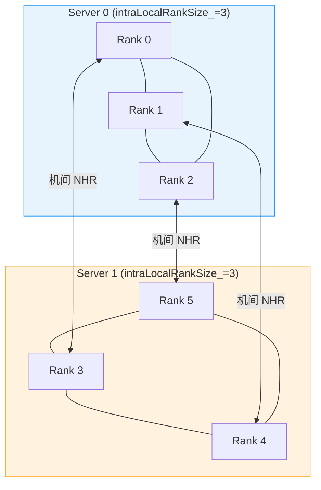

- **机内 (Intra)**: 同一 server 内的 rank 通过 Mesh1D 拓扑互联（共享 HCCS/PCIe 链路）
- **机间 (Inter)**: 不同 server 的同位置 rank 通过 NHR (Non-Halving Ring) 拓扑互联（跨机网络链路）

## 4. 四个算法模板详解

### 4.1 InsTempScatterMesh1D（机内 Scatter）

**功能**: Root rank 将数据切分为 N 份（N = 机内 rank 数），通过 Mesh1D 拓扑将每份发送到对应 rank。

**数据流**:

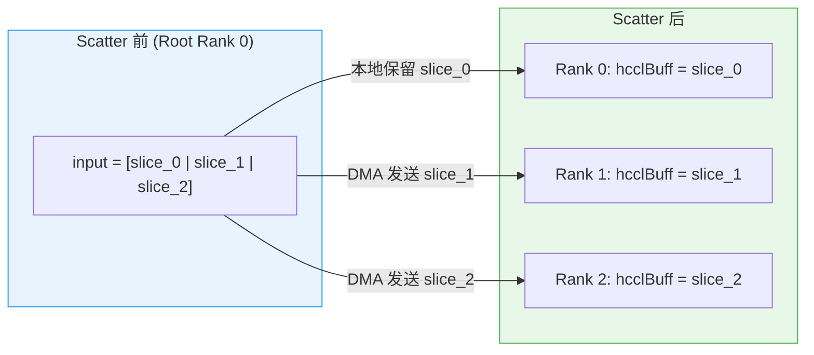

**实现细节** (`ins_temp_scatter_mesh_1D.cc`):
- `CalcScratchMultiple()` 返回 **1**（不需要额外 scratch 倍数）
- Root rank 的 `PreCopy`: 将自己的 slice 从 input 拷贝到 output（inplace 时跳过）
- Root rank 的 `RunMesh`: 遍历所有非 root 的 algRank，通过 DMA 将 `input[algRank * sliceStride]` 写入远端 rank 的 `hcclBuff[algRank * sliceStride]`
- 非 root rank 的 `PostCopy`: 将 `hcclBuff[myAlgRank * sliceStride]` 拷贝到 `output[myAlgRank * sliceStride]`
- 线程数 = `templateRankSize_ - 1`（每个非 root rank 一个线程并行发送）

### 4.2 InsTempScatterNHR（机间 Scatter）

**功能**: Root rank 将数据切分为 N 份（N = 机间 rank 数），通过 NHR 环状拓扑多步传递，使每个 rank 获得自己的一份。

**NHR 算法原理** (以 4 个 rank 为例, rankSize=4, root=rank0, nSteps=ceil(log2(4))=2):

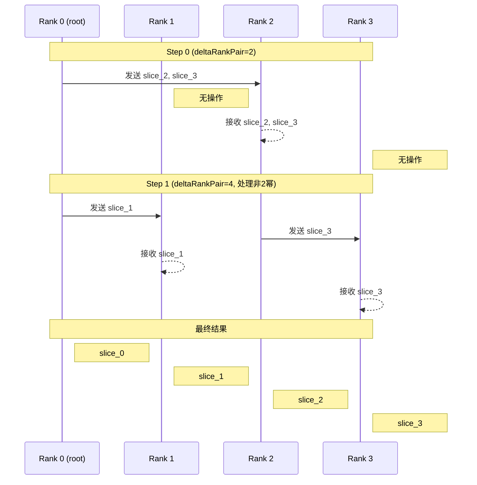

**实现细节** (`ins_temp_scatter_nhr.cc`):
- `CalcScratchMultiple()` 返回 **templateRankSize_**（scratch 需要 N 个 slice 的空间）
- `PreCopy`: Root rank 将 input 的 N 个 slice 拷贝到 scratch（`scratch[algRank * sliceSize]`）
- `RunNHR`: 多步通信，每步通过 `GetStepInfo` 计算发送/接收的 slice 索引和远端 rank
- `PostCopy`: 每个 rank 从 `scratch[myAlgRank * sliceSize]` 拷贝到自己的 output
- 支持多 channel 并行传输（`PreprareDataSplitForMultiChannel` 按 channel 切分数据）
- 线程数 = `channelsPerRank_`

### 4.3 InsTempAllGatherMesh1D（机内 AllGather）

**功能**: 每个 rank 持有自己的 slice，通过 Mesh1D 拓扑互相交换，最终每个 rank 获得所有 slice。

**数据流**:

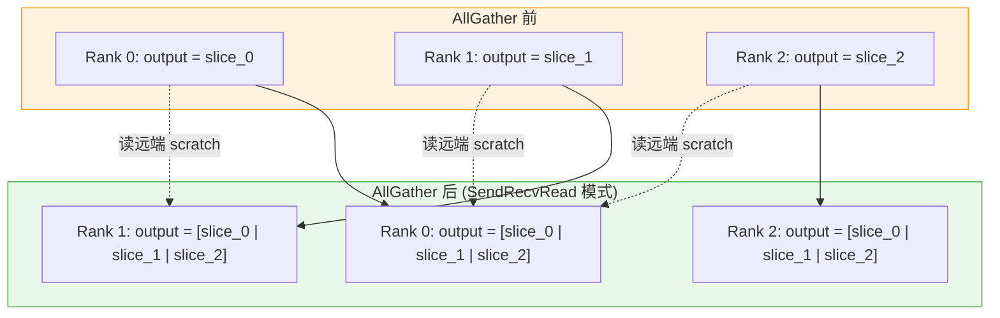

**实现细节** (`ins_temp_all_gather_mesh_1D.cc`):
- `CalcScratchMultiple()` 返回 **templateRankSize_**（OPBASE 模式下）
- `LocalDataCopy`: 每个 rank 将自己的 slice 从 input 拷贝到 output 和 scratch
- `RunAllGatherMesh`: 每个 rank 与 `rankSize-1` 个对端通信：
  - 发送: 从 `output[myAlgRank * sliceStride]` 写到远端 `scratch[myAlgRank * sliceSize]`
  - 接收: 从远端 `scratch[connectedAlgRank * sliceSize]` 读到本地 `output[connectedAlgRank * sliceStride]`
- 使用 `SendRecvRead` 模式（读远端数据）
- 线程数 = `templateRankSize_ - 1`

### 4.4 InsTempAllGatherNHR（机间 AllGather）

**功能**: 每个 rank 持有自己的 slice，通过 NHR 环状拓扑多步传递，最终每个 rank 获得所有 slice。

**实现细节** (`ins_temp_all_gather_nhr.cc`):
- `CalcScratchMultiple()` 返回 **templateRankSize_**
- `LocalDataCopy`: 将自己的 slice 从 input 拷贝到 scratch
- `RunAllGatherNHR`: NHR 多步通信，每步交换 slice
- 支持 `readLastStepToOutput` 优化：最后一步直接读到 output 而非 scratch，减少一次拷贝
- 额外申请一倍线程用于 `PostLocalCopy` 和 NHR 最后一步并行执行
- 线程数 = `channelsPerRank_ * 2`

## 5. 算法核心：4步流水线并行 Broadcast

### 5.1 数据切分

将 root rank 的完整数据按 `multipleDimensionSplitRatio_`（默认 0.5）切成两部分：

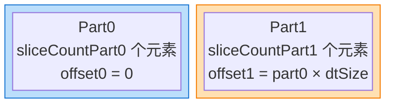

### 5.2 Scratch 内存布局

每个 rank 的 scratch buffer (hcclBuff) 被分为两个区域：

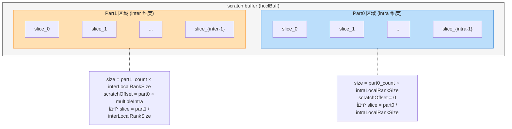

### 5.3 四步流水线详解

以 **2 server × 3 rank/server** 为例，root = Rank 0。

**集群配置**:
- `intraLocalRankSize_ = 3`（每 server 3 个 rank）
- `interLocalRankSize_ = 2`（2 个 server）
- Rank 0/1/2 在 Server0（intraLocalRankIdx = 0/1/2），Rank 3/4/5 在 Server1（intraLocalRankIdx = 0/1/2）
- Rank 0/1/2 的 interLocalRankIdx = 0，Rank 3/4/5 的 interLocalRankIdx = 1
- `intraLocalRoot_ = Rank 0`（intraLocalRankIdx=0 且 interLocalRankIdx=0）
- `interLocalRoot_ = Rank 0`（interLocalRankIdx=0 且 intraLocalRankIdx=0）

**数据切分**（假设 ratio=0.5）:
- Part0 = 前半数据，按 intraLocalRankSize_=3 切分为 `s0_p0, s1_p0, s2_p0`
- Part1 = 后半数据，按 interLocalRankSize_=2 切分为 `s0_p1, s1_p1`

**Scratch 布局**:
- Part0 区域: 3 个 slot（对应 intraLocalRankSize_=3），每个 slot = 1 个 Part0 切片
- Part1 区域: 2 个 slot（对应 interLocalRankSize_=2），每个 slot = 1 个 Part1 切片

#### Step 1: Scatter Phase A（机内散 Part0 + 机间散 Part1）

**并行执行两个模板**:

**RunTemplateIntra0 — ScatterMesh1D(Part0, 机内)**:
- 条件: `intraLocalRoot_ == root_`，只有 **Rank 0** 满足（Rank 0 是 Server0 的 intraRoot）
- Rank 3 虽然是 Server1 的 intraRoot，但 `intraLocalRoot_ ≠ root_`，不执行
- BufferType: `inBuffType=INPUT, outBuffType=HCCL_BUFFER`
- Rank 0 从 `inputPtr[offset0]` 读取 Part0，切为 3 份，DMA 发送到 Server0 内各 rank 的 scratch Part0 区域:
  - Rank 0 → Rank 0 scratch Part0 slot[0]: `s0_p0`（本地拷贝）
  - Rank 0 → Rank 1 scratch Part0 slot[0]: `s1_p0`（DMA 写远端）
  - Rank 0 → Rank 2 scratch Part0 slot[0]: `s2_p0`（DMA 写远端）

**RunTemplateInter1 — ScatterNHR(Part1, 机间)**:
- 条件: `interLocalRoot_ == root_`，只有 **Rank 0** 满足（Rank 0 的 interLocalRankIdx=0）
- BufferType: `inBuffType=INPUT, outBuffType=HCCL_BUFFER`
- Rank 0 从 `inputPtr[offset1]` 读取 Part1，切为 2 份，通过 NHR 发送到机间各 rank 的 scratch Part1 区域:
  - Rank 0 → Rank 0 scratch Part1 slot[0]: `s0_p1`（本地 PreCopy）
  - Rank 0 → Rank 3 scratch Part1 slot[0]: `s1_p1`（NHR 跨机发送）

**Step 1 后各 rank 的完整 buffer 状态**:

| Rank | Server | inputPtr | scratch Part0 (3 slots) | scratch Part1 (2 slots) | outputPtr |
|------|--------|----------|------------------------|------------------------|-----------|
| **Rank 0** | Server0 | 完整数据 | [s0_p0, -, -] | [s0_p1, -] | - |
| **Rank 1** | Server0 | - | [s1_p0, -, -] | [-, -] | - |
| **Rank 2** | Server0 | - | [s2_p0, -, -] | [-, -] | - |
| **Rank 3** | Server1 | - | [-, -, -] | [s1_p1, -] | - |
| **Rank 4** | Server1 | - | [-, -, -] | [-, -] | - |
| **Rank 5** | Server1 | - | [-, -, -] | [-, -] | - |

> `-` 表示该区域无有效数据。只有 Rank 0 持有 inputPtr（root）。

#### Step 2: Scatter Phase B（交叉：机间散 Part0 + 机内散 Part1）

**关键**: Step 1 后，Part0 只在 Server0 的机内 rank（0/1/2）有数据，Part1 只在 Rank 0 和 Rank 3（机间 root 对）有数据。Step 2 做 **交叉传播**。

**RunTemplateInter0 — ScatterNHR(Part0, 机间)**:
- **所有 6 个 rank 都参与**（NHR 是全员操作）
- BufferType: `inBuffType=HCCL_BUFFER, outBuffType=HCCL_BUFFER`
- 每个 rank 从自己的 `scratch Part0 slot[0]` 出发，通过 NHR 将自己的 Part0 切片散给机间对端:
  - Rank 0 (有 s0_p0) → Rank 3 scratch Part0 slot[1]: `s0_p0`
  - Rank 1 (有 s1_p0) → Rank 4 scratch Part0 slot[1]: `s1_p0`
  - Rank 2 (有 s2_p0) → Rank 5 scratch Part0 slot[1]: `s2_p0`
  - Rank 3/4/5 的 scratch Part0 为空 → 发送空数据到 Rank 0/1/2（NHR 双向，但对端收到的是无效数据，不影响 slot[0]）

**RunTemplateIntra1 — ScatterMesh1D(Part1, 机内)**:
- 条件: 每个 server 的 intraRoot 执行（Rank 0 在 Server0，Rank 3 在 Server1）
- BufferType: `inBuffType=HCCL_BUFFER, outBuffType=HCCL_BUFFER`
- Rank 0 从 `scratch Part1 slot[0]`（s0_p1）出发，DMA 发送到 Server0 内各 rank:
  - Rank 0 → Rank 1 scratch Part1 slot[1]: `s0_p1`
  - Rank 0 → Rank 2 scratch Part1 slot[1]: `s0_p1`
- Rank 3 从 `scratch Part1 slot[0]`（s1_p1）出发，DMA 发送到 Server1 内各 rank:
  - Rank 3 → Rank 4 scratch Part1 slot[1]: `s1_p1`
  - Rank 3 → Rank 5 scratch Part1 slot[1]: `s1_p1`

**Step 2 后各 rank 的完整 buffer 状态**:

| Rank | Server | inputPtr | scratch Part0 (3 slots) | scratch Part1 (2 slots) | outputPtr |
|------|--------|----------|------------------------|------------------------|-----------|
| **Rank 0** | Server0 | 完整数据 | [s0_p0, -, -] | [s0_p1, -] | - |
| **Rank 1** | Server0 | - | [s1_p0, -, -] | [s0_p1, -] | - |
| **Rank 2** | Server0 | - | [s2_p0, -, -] | [s0_p1, -] | - |
| **Rank 3** | Server1 | - | [s0_p0, s0_p0, -] | [s1_p1, -] | - |
| **Rank 4** | Server1 | - | [s1_p0, s1_p0, -] | [s1_p1, -] | - |
| **Rank 5** | Server1 | - | [s2_p0, s2_p0, -] | [s1_p1, -] | - |

> **注意**: Part0 的 slot[0] 和 slot[1] 现在分别持有来自 Server0 和 Server1 的同一份切片（NHR scatter 后两端都有）。Part1 的 slot[1] 现在每个 rank 都有数据（机内 scatter 完成）。

#### Step 3: AllGather Phase A（机间收 Part0 + 机内收 Part1）

**RunTemplateInter01 — AllGatherNHR(Part0, 机间)**:
- **所有 6 个 rank 都参与**
- BufferType: `inBuffType=HCCL_BUFFER, outBuffType=HCCL_BUFFER`
- 每个 rank 从自己的 `scratch Part0` 出发，通过 NHR 互相交换，收集所有机间 rank 的 Part0 切片:
  - Rank 0 从 Rank 3 的 scratch Part0 slot[1] 读取 `s0_p0` → 写入自己 scratch Part0 slot[1]
  - Rank 1 从 Rank 4 的 scratch Part0 slot[1] 读取 `s1_p0` → 写入自己 scratch Part0 slot[1]
  - Rank 2 从 Rank 5 的 scratch Part0 slot[1] 读取 `s2_p0` → 写入自己 scratch Part0 slot[1]
  - Rank 3 从 Rank 0 的 scratch Part0 slot[0] 读取 `s0_p0` → 写入自己 scratch Part0 slot[0]（已有，覆盖）
  - Rank 4 从 Rank 1 的 scratch Part0 slot[0] 读取 `s1_p0` → 写入自己 scratch Part0 slot[0]（已有，覆盖）
  - Rank 5 从 Rank 2 的 scratch Part0 slot[0] 读取 `s2_p0` → 写入自己 scratch Part0 slot[0]（已有，覆盖）
- **效果**: 每个 rank 的 scratch Part0 区域包含 **机间维度完整的 Part0**（slot[0] 和 slot[1] 都有数据），但机内维度仍散开（slot[2] 仍为空）

**RunTemplateIntra11 — AllGatherMesh1D(Part1, 机内)**:
- **所有 6 个 rank 都参与**
- BufferType: `inBuffType=HCCL_BUFFER, outBuffType=HCCL_BUFFER`
- Server0 内（Rank 0/1/2）互相交换 Part1:
  - Rank 0 从 Rank 1 读取 `s0_p1` → scratch Part1 slot[1]（已有，覆盖）
  - Rank 0 从 Rank 2 读取 `s0_p1` → scratch Part1 slot[1]（已有，覆盖）
  - Rank 1 从 Rank 0 读取 `s0_p1` → scratch Part1 slot[0]（已有，覆盖）
  - Rank 1 从 Rank 2 读取 `s0_p1` → scratch Part1 slot[1]
  - Rank 2 从 Rank 0 读取 `s0_p1` → scratch Part1 slot[0]
  - Rank 2 从 Rank 1 读取 `s0_p1` → scratch Part1 slot[1]（已有，覆盖）
- Server1 内（Rank 3/4/5）互相交换 Part1:
  - Rank 3 从 Rank 4 读取 `s1_p1` → scratch Part1 slot[1]
  - Rank 3 从 Rank 5 读取 `s1_p1` → scratch Part1 slot[1]（已有，覆盖）
  - Rank 4 从 Rank 3 读取 `s1_p1` → scratch Part1 slot[0]（已有，覆盖）
  - Rank 4 从 Rank 5 读取 `s1_p1` → scratch Part1 slot[1]（已有，覆盖）
  - Rank 5 从 Rank 3 读取 `s1_p1` → scratch Part1 slot[0]
  - Rank 5 从 Rank 4 读取 `s1_p1` → scratch Part1 slot[1]（已有，覆盖）
- **效果**: 每个 rank 的 scratch Part1 区域包含 **机内维度完整的 Part1**（slot[0] 和 slot[1] 都有数据），但机间维度仍散开

**Step 3 后各 rank 的完整 buffer 状态**:

| Rank | Server | inputPtr | scratch Part0 (3 slots) | scratch Part1 (2 slots) | outputPtr |
|------|--------|----------|------------------------|------------------------|-----------|
| **Rank 0** | Server0 | 完整数据 | [s0_p0, s0_p0, -] | [s0_p1, s0_p1] | - |
| **Rank 1** | Server0 | - | [s1_p0, s1_p0, -] | [s0_p1, s0_p1] | - |
| **Rank 2** | Server0 | - | [s2_p0, s2_p0, -] | [s0_p1, s0_p1] | - |
| **Rank 3** | Server1 | - | [s0_p0, s0_p0, -] | [s1_p1, s1_p1] | - |
| **Rank 4** | Server1 | - | [s1_p0, s1_p0, -] | [s1_p1, s1_p1] | - |
| **Rank 5** | Server1 | - | [s2_p0, s2_p0, -] | [s1_p1, s1_p1] | - |

> **Part0**: 机间维度已完整（slot[0] 和 slot[1] 都有数据），机内维度仍散开（每个 rank 只有自己的那一份 s{i}_p0）。
> **Part1**: 机内维度已完整（slot[0] 和 slot[1] 都有数据），机间维度仍散开（Server0 只有 s0_p1，Server1 只有 s1_p1）。

#### Step 4: AllGather Phase B（交叉：机内收 Part0 + 机间收 Part1）

**RunTemplateIntra01 — AllGatherMesh1D(Part0, 机内)**:
- **所有 6 个 rank 都参与**
- BufferType: `inBuffType=HCCL_BUFFER, outBuffType=INPUT`（**输出到 outputPtr**）
- Server0 内（Rank 0/1/2）互相交换 Part0:
  - Rank 0 从 Rank 1 的 scratch Part0 读取 `s1_p0` → 写入 `outputPtr[offset0 + 1*rankStride]`
  - Rank 0 从 Rank 2 的 scratch Part0 读取 `s2_p0` → 写入 `outputPtr[offset0 + 2*rankStride]`
  - Rank 0 本地拷贝 `s0_p0` → `outputPtr[offset0 + 0*rankStride]`
  - Rank 1 从 Rank 0 读取 `s0_p0` → `outputPtr[offset0 + 0*rankStride]`
  - Rank 1 从 Rank 2 读取 `s2_p0` → `outputPtr[offset0 + 2*rankStride]`
  - Rank 1 本地拷贝 `s1_p0` → `outputPtr[offset0 + 1*rankStride]`
  - Rank 2 从 Rank 0 读取 `s0_p0` → `outputPtr[offset0 + 0*rankStride]`
  - Rank 2 从 Rank 1 读取 `s1_p0` → `outputPtr[offset0 + 1*rankStride]`
  - Rank 2 本地拷贝 `s2_p0` → `outputPtr[offset0 + 2*rankStride]`
- Server1 内（Rank 3/4/5）同理，各自获得完整 Part0 到 outputPtr

**RunTemplateInter11 — AllGatherNHR(Part1, 机间)**:
- **所有 6 个 rank 都参与**
- BufferType: `inBuffType=HCCL_BUFFER, outBuffType=INPUT`（**输出到 outputPtr**）
- Rank 0 从 Rank 3 的 scratch Part1 读取 `s1_p1` → 写入 `outputPtr[offset1 + 1*rankStride]`
- Rank 0 本地拷贝 `s0_p1` → `outputPtr[offset1 + 0*rankStride]`
- Rank 3 从 Rank 0 的 scratch Part1 读取 `s0_p1` → `outputPtr[offset1 + 0*rankStride]`
- Rank 3 本地拷贝 `s1_p1` → `outputPtr[offset1 + 1*rankStride]`
- Rank 1/2/4/5 同理

**Step 4 后各 rank 的完整 buffer 状态（最终状态）**:

| Rank | Server | inputPtr | scratch Part0 | scratch Part1 | outputPtr |
|------|--------|----------|--------------|--------------|-----------|
| **Rank 0** | Server0 | 完整数据 | [s0_p0, s0_p0, -] | [s0_p1, s0_p1] | **[s0_p0, s1_p0, s2_p0, s0_p1, s1_p1]** |
| **Rank 1** | Server0 | - | [s1_p0, s1_p0, -] | [s0_p1, s0_p1] | **[s0_p0, s1_p0, s2_p0, s0_p1, s1_p1]** |
| **Rank 2** | Server0 | - | [s2_p0, s2_p0, -] | [s0_p1, s0_p1] | **[s0_p0, s1_p0, s2_p0, s0_p1, s1_p1]** |
| **Rank 3** | Server1 | - | [s0_p0, s0_p0, -] | [s1_p1, s1_p1] | **[s0_p0, s1_p0, s2_p0, s0_p1, s1_p1]** |
| **Rank 4** | Server1 | - | [s1_p0, s1_p0, -] | [s1_p1, s1_p1] | **[s0_p0, s1_p0, s2_p0, s0_p1, s1_p1]** |
| **Rank 5** | Server1 | - | [s2_p0, s2_p0, -] | [s1_p1, s1_p1] | **[s0_p0, s1_p0, s2_p0, s0_p1, s1_p1]** |

> **所有 rank 的 outputPtr 都包含完整数据** `[s0_p0, s1_p0, s2_p0, s0_p1, s1_p1] = [完整 Part0 | 完整 Part1]` ✓
> Broadcast 完成。

### 5.4 完整数据流图

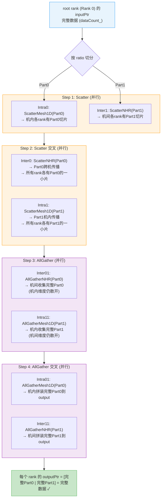

### 5.5 为什么这样设计？

**核心优势**: 机内和机间通信 **并行执行**。

```mermaid
gantt
    title 传统串行方式 vs 本算法并行方式
    dateFormat X
    axisFormat %s

    section 串行方式
    机内Scatter (T_intra)     :0, 1
    机间Scatter (T_inter)     :1, 2
    机间AllGather (T_inter)   :2, 3
    机内AllGather (T_intra)   :3, 4

    section 并行方式
    Step1: max(ScatterMesh1D_P0, ScatterNHR_P1)  :0, 1
    Step2: max(ScatterNHR_P0, ScatterMesh1D_P1)  :1, 2
    Step3: max(AllGatherNHR_P0, AllGatherMesh1D_P1) :2, 3
    Step4: max(AllGatherMesh1D_P0, AllGatherNHR_P1) :3, 4
```

> 当 ratio=0.5 时，每步的 intra 和 inter 通信量近似相等，并行效率接近 **2x**（相比串行）。

### 5.6 多轮循环

当数据量超过 scratch buffer 容量时，数据被切成多个 slice，通过 `loopTimes` 轮循环处理：

```cpp
u64 sliceCount = min(scratchCount / multiple, sliceCountUB0, dataCount_);
u32 loopTimes = ceil(dataCount_ / sliceCount);
```

每轮处理 `sliceCount` 个元素，最后一轮处理尾块 `finalSliceCount`。

## 6. 任务流（Thread）分配与同步机制

### 6.1 总体线程池结构

Executor 在 `CalcRes` 阶段向系统申请一个全局线程池 `threads_`，总线程数为：

```
totalThreads = 2 (mainThread + 2个templateMain) + slaveThreadNumIntra + slaveThreadNumInter + 4
```

其中 `slaveThreadNumIntra` 和 `slaveThreadNumInter` 分别取 Scatter 和 AllGather 两个阶段中 intra/inter 模板所需的最大从线程数。

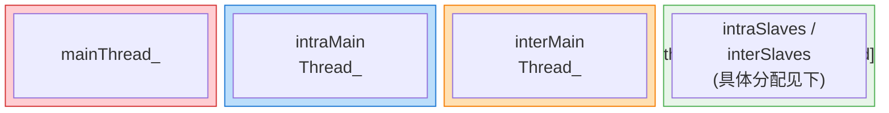

### 6.2 各模板的线程需求

| 模板 | 线程数公式 | 说明 |
|------|-----------|------|
| **ScatterMesh1D** | `intraLocalRankSize_ - 1` | Root 为每个非 root rank 分配一个线程并行 DMA 发送 |
| **ScatterNHR** | `channelsPerRank_` | 每个 channel 一个线程，多 channel 并行传输 |
| **AllGatherMesh1D** | `intraLocalRankSize_ - 1` | 每个 rank 与 `rankSize-1` 个对端通信，每对端一个线程 |
| **AllGatherNHR** | `channelsPerRank_ × 2` | 额外一倍线程用于 PostLocalCopy 与 NHR 最后一步并行 |

### 6.3 PrepareResForTemplate — Scatter 阶段线程分配

`PrepareResForTemplate` 负责为 Step 1/2 的 Scatter 阶段分配线程：

```cpp
// intra 线程组: threads_[1] 作为 intraMain, threads_[3..intraNum+1] 作为 intraSlaves
intraThreads_ = { threads_[1], threads_[3], threads_[4], ..., threads_[intraNum+1] }

// inter 线程组: threads_[intraFinal+2] 作为 interMain, threads_[intraFinal+4..end] 作为 interSlaves
interThreads_ = { threads_[intraFinal+2], threads_[intraFinal+4], ..., threads_[end] }
```

其中 `intraThreadsNumFinal = max(ScatterMesh1D线程数, AllGatherMesh1D线程数)`，取 Scatter 和 AllGather 两阶段 intra 模板的最大值，确保 intra 线程组足够两阶段复用。

**具体分配示例** (intraLocalRankSize_=3, channelsPerRank_=1):

| 模板 | 线程需求 |
|------|---------|
| ScatterMesh1D | 2 (rankSize-1=2) |
| AllGatherMesh1D | 2 (rankSize-1=2) |
| ScatterNHR | 1 (channelsPerRank_=1) |
| AllGatherNHR | 2 (channelsPerRank_*2=2) |

`intraFinal = max(2, 2) = 2`


### 6.4 PrepareResForTemplate23 — AllGather 阶段线程分配

`PrepareResForTemplate23` 负责为 Step 3/4 的 AllGather 阶段分配线程，逻辑类似但使用 AllGather 模板的线程需求：

```cpp
intraThreads_ = threads_[2 .. intraNum1+1]    // 从 threads_[2] 开始
interThreads_ = threads_[intraFinal+3 .. end]  // 从 intraFinal+3 开始
```

注意 AllGather 阶段的 intra 线程组起始偏移与 Scatter 阶段不同（从 `threads_[2]` 而非 `threads_[1]`），这是因为 AllGather 模板的 main thread 使用不同的线程。

### 6.5 两层同步机制

本算法使用 **两层同步**：Executor 层的 **跨模板同步** 和 Template 层的 **模板内同步**。

#### 6.5.1 Executor 层：跨模板同步（PreSyncInterThreads / PostSyncInterThreads）

每步流水线中，intra 和 inter 两个模板 **并行执行在不同的线程组上**。Executor 的 `mainThread_`（`threads_[0]`）负责协调两者的启动和汇合。

**PreSyncInterThreads**（步前同步 — 主流通知从流开始）:

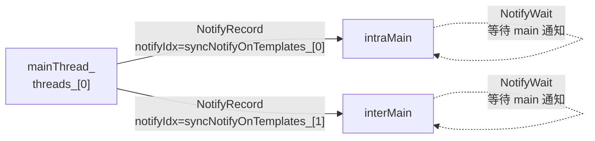

**PostSyncInterThreads**（步后同步 — 从流回报主流）:

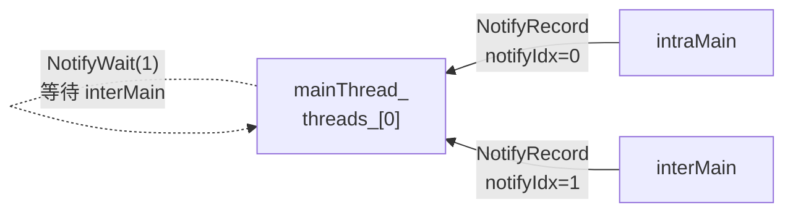

**时序图**:

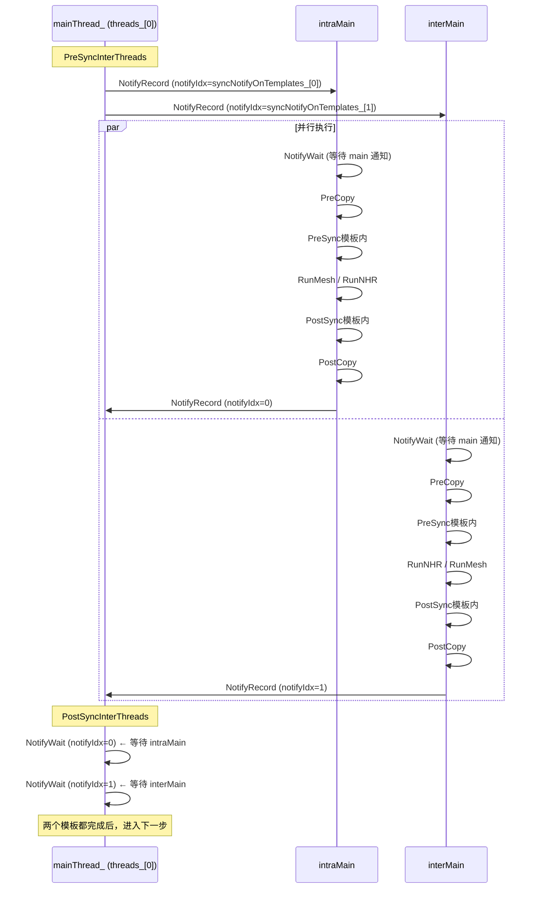

#### 6.5.2 Template 层：模板内同步

每个模板的 `KernelRun` 内部也有自己的 PreSync/PostSync，用于协调模板的 main thread 和 slave threads：

**以 ScatterMesh1D 为例** (线程数 = rankSize-1 = 2):

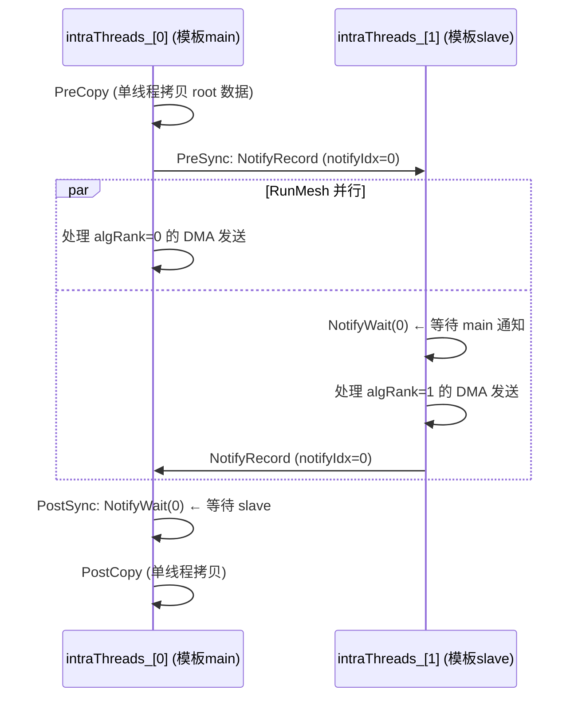

**以 ScatterNHR 为例** (线程数 = channelsPerRank_):

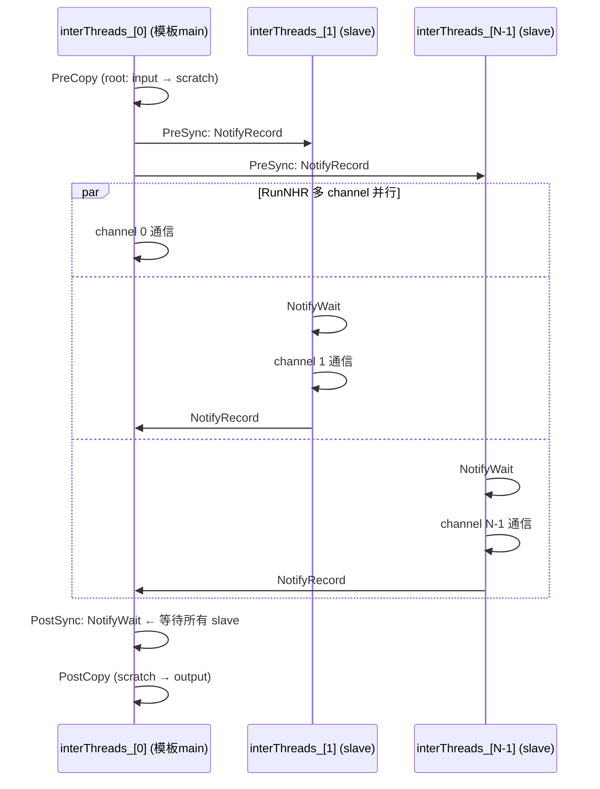

**以 AllGatherNHR 为例** (线程数 = channelsPerRank_ × 2):

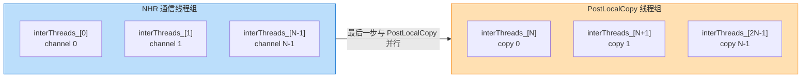

> **特殊设计**: 最后一步 NHR 通信可以与 PostLocalCopy 并行执行。使用额外的 notify 实现 PostLocalCopy 和 NHR 最后一步的前同步，`notifyNumPerThread = 2`（一个用于主从同步，一个用于 PostLocalCopy 并行）。

### 6.6 完整同步时序（单轮循环）

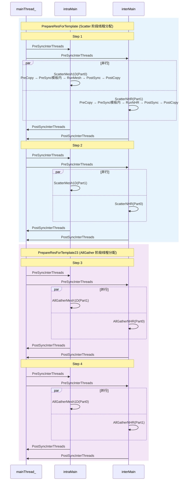

### 6.7 Notify 索引分配总结

| 角色 | notify 数量 | 用途 |
|------|------------|------|
| `mainThread_` (threads_[0]) | 2 | 等待 intraMain(idx=0) 和 interMain(idx=1) 完成 |
| intraMain | `max(ScatterMesh1D, AllGatherMesh1D) - 1` + 1 | 1个用于与 mainThread_ 同步 + N个用于模板内主从同步 |
| interMain | `max(ScatterNHR, AllGatherNHR) - 1` + 1 | 1个用于与 mainThread_ 同步 + N个用于模板内主从同步 |
| 每个 intraSlave | 1 | 与 intraMain 同步 |
| 每个 interSlave | 1~2 | 与 interMain 同步（AllGatherNHR 需要 2 个） |

## 7. 精度风险点

### 风险1：float截断导致Part0/Part1不对齐

```cpp
u64 sliceCountPart0 = static_cast<u64>(float(sliceCount) * dataSplitSize.at(0));
u64 sliceCountPart1 = sliceCount - sliceCountPart0;
```

当ratio≠0.5时（如0.8），`float(large_count) * 0.8f` 精度丢失 → `static_cast<u64>` 截断 → Part0少几个元素 → Part1吃掉余量 → **Step2/3/4的数据偏移错位**。

**举例**: `sliceCount=1000001`, ratio=0.8
- `float(1000001) * 0.8f` ≈ `800000.8f` → 截断为 `800000`
- 期望: `800001`，实际: `800000` → **差1个元素**
- 下游所有 `offset1 = offset0 + currCountPart0 * dtSize` 计算全部偏小 → 读写越界或数据重叠

### 风险2：尾块计算同样有截断问题

```cpp
u64 finalSliceCountPart0 = static_cast<u64>(float(finalSliceCount) * dataSplitSize.at(0));
```

尾块通常更小 → float精度影响更大 → 最后一次循环更容易出错。

### 风险3：dataSplitSize 非0.5时的Scratch偏移不对称

```cpp
u64 scratchOffsetCountInterStage0 = sliceCountPart0 * multipleIntra;
u64 scratchOffsetCountIntraStage1 = sliceCountPart0 * multipleInter;
```

Part0 ≠ Part1 时，Scratch中两个区域的size不对称。如果某个模板假设均匀切分（如硬编码 `count/rankSize`），会导致读写越界。

### 风险4：SetchannelsPerRank 覆盖NHR channelsPerRank_

```cpp
if (param.engine == CommEngine::COMM_ENGINE_AICPU_TS) {
    tempAlgInter.SetchannelsPerRank(interLinks_);
    tempAlgInter1.SetchannelsPerRank(interLinks_);
}
```

- NHR模板 `CalcRes` 自己算的 `channelsPerRank_` 被 `interLinks_` 覆盖
- → `RunNHR` 循环次数 vs `dataSplit_.size()` 不匹配 → OOB

## 7. 总结

| 维度 | 说明 |
|------|------|
| 算法名 | InsBroadcastParallelMesh1DNHRUBX |
| 本质 | Scatter + AllGather 流水线并行 Broadcast |
| 拓扑 | 机内 Mesh1D + 机间 NHR |
| 核心思想 | 数据二分 + 4步交叉通信，机内/机间并行 |
| 性能优势 | 相比串行方式，理论加速比接近 2x |
| 模板数 | 4个（ScatterMesh1D, ScatterNHR, AllGatherMesh1D, AllGatherNHR） |
| 精度风险 | float截断、Scratch不对称、SetchannelsPerRank覆盖 |
