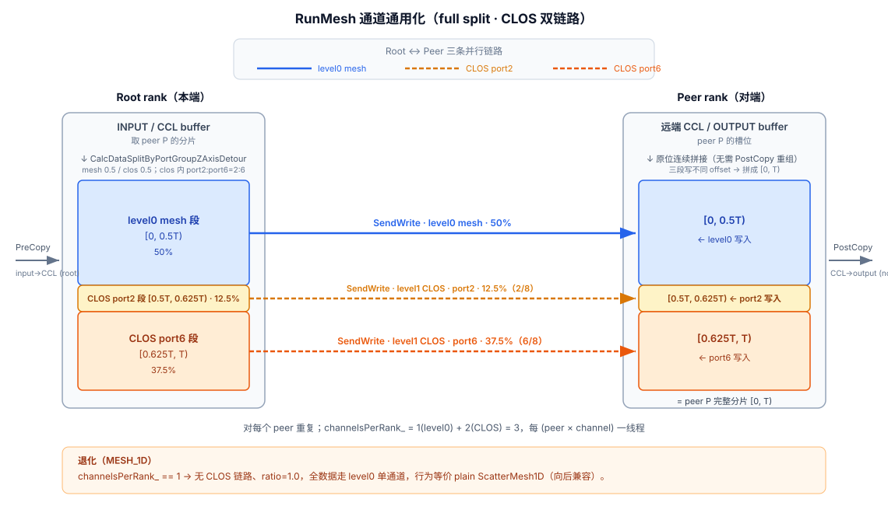

# HCCL Scatter Mesh1D Z 轴绕路 (ScatterMesh1DZAxisDetour) 需求与设计

> 模板尚未实现，以下为目标流程，对标 RS ZAxisDetour + Scatter 基类 root 驱动 mesh 推导。

**图 1：Scatter Z 轴绕路数据流（CLOS 双链路）**



## 1. 背景

ReduceScatter Mesh1D 已有 Z 轴绕路子类 `ReduceScatterMesh1DZAxisDetour`（合并 level0+level1 通道、跨通道切分），
Scatter Mesh1D 没有。plain `ScatterMesh1D` 的 `CalcRes` 只调 `CalcChannelRequestMesh1D`
（`src/ops/scatter/template/aicpu/ins_temp_scatter_mesh_1D.cc:54`），该函数每 peer 取首个可达层
（`src/ops/op_common/executor/channel/channel.cc:318`），CLOS 下每 peer 单通道，无法利用 level0+level1 并行带宽。

为 Scatter Mesh1D 新增 Z 轴绕路子类 `ScatterMesh1DZAxisDetour`，对标 RS：计算 level0+level1 合并通道并跨通道切分数据，
使 Scatter 在 CLOS level0 下用满并行带宽。通用可复用模板，本轮在 Broadcast 3 级 ScatterL0 注册使用
（`docs/brainstorms/broadcast-3-level-sequence-requirements.md:264` 已列为未来项）。

## 2. 设计原则

- **最大程度继承基类**：只覆盖因多链路需要调整的方法，其余继承
- **公共逻辑下沉**：两级数据切分复用 RS 已落地的 `CalcDataSplitByPortGroupZAxisDetour`（`template_utils.cc:82`），不新增
- **虚函数多态**：基类关键方法改为调用虚函数（`GetThreadNum`、`CalcDataSplitByPortGroup`），派生类覆盖后基类逻辑自动适配
- **Always ZAxisDetour（对标 RS）**：MESH_1D 退化为单通道，无需拓扑条件选模板
- **Full split（RS 全对称）而非仅合并通道**：每 peer 分片跨所有通道分发，使模板成完整可复用能力

## 3. 修改文件清单

### 3.1 基类修改

| 文件 | 修改内容 |
|------|---------|
| `ins_temp_scatter_mesh_1D.h` | `private:` 改为 `protected:`，使 `RunMesh`、`processSize_`、`count_` 等可被派生类访问 |
| `ins_temp_scatter_mesh_1D.cc` | `RunMesh`（`:209`）通道通用化改造：每 peer 分片跨 `channelsPerRank_` 通道分发，而非只用 `channels.at(peer)[0]`（见 §5） |

### 3.2 新增文件

| 文件 | 说明 |
|------|------|
| `ins_temp_scatter_mesh_1D_Z_axis_detour.h` | 派生类头文件 |
| `ins_temp_scatter_mesh_1D_Z_axis_detour.cc` | 派生类实现 |

### 3.3 公共层（复用，无新增）

| 文件 | 说明 |
|------|------|
| `template_utils.h` / `template_utils.cc` | `CalcDataSplitByPortGroupZAxisDetour` 已存在（`:82`），RS 落地，直接复用 |

### 3.4 构建与注册

| 文件 | 修改内容 |
|------|---------|
| `CMakeLists.txt` (aicpu) | 新增 `ins_temp_scatter_mesh_1D_Z_axis_detour.cc` |
| `ins_v2_broadcast_sequence_executor_3level.cc` | B3L ScatterL0 无条件注册 `ScatterMesh1DZAxisDetour`（always-ZAxisDetour，对标 RS），替换 plain `ScatterMesh1D` |

## 4. 派生类覆盖方法

派生类 `ScatterMesh1DZAxisDetour` 覆盖 **4 个方法**（通道/资源层，不动算法语义）：

### 4.1 CalcRes — 多链路资源获取

```cpp
HcclResult CalcRes(HcclComm comm, const OpParam& param,
    const TopoInfoWithNetLayerDetails* topoInfo,
    AlgResourceRequest& resourceRequest) override
{
    std::vector<HcclChannelDesc> level0Channels;
    CHK_RET(CalcChannelRequestMesh1DLevel0(comm, param, topoInfo, subCommRanks_, level0Channels));  // linkRequired=true
    std::vector<HcclChannelDesc> level1Channels;
    CHK_RET(CalcChannelRequestMesh1DLevel1(comm, param, topoInfo, subCommRanks_, level1Channels));  // linkRequired=false，无链路跳过

    std::vector<HcclChannelDesc> mergedChannels;
    mergedChannels.insert(mergedChannels.end(), level0Channels.begin(), level0Channels.end());
    mergedChannels.insert(mergedChannels.end(), level1Channels.begin(), level1Channels.end());
    resourceRequest.channels.push_back(mergedChannels);

    channelsPerRank_ = CalcChannelsPerRank(mergedChannels);
    SetchannelsPerRank();  // 设置 level0/level1 通道数与 ratio
    CHK_RET(GetRes(resourceRequest));
    return HCCL_SUCCESS;
}
```

**与 RS 差异**：RS 调 `CalcChannelRequestMesh1DLevel0/Level1` 后直接算 `level0ChannelNumPerRank_`；
Scatter 增设 `SetchannelsPerRank` 虚函数集中设置比例（因 Scatter 退化语义需显式 ratio=1.0 分支）。

### 4.2 SetchannelsPerRank — 比例与通道数设置

```cpp
void SetchannelsPerRank() override
{
    if (channelsPerRank_ > 1) {
        level0ChannelNumPerRank_ = MESH_CHANNELS_NUM;          // = 1
        level1ChannelNumPerRank_ = channelsPerRank_ - 1;
        level0DataRatio_ = 0.5f;
    } else {
        level0ChannelNumPerRank_ = 1;                          // MESH_1D 退化
        level1ChannelNumPerRank_ = 0;
        level0DataRatio_ = 1.0f;
    }
}
```

### 4.3 CalcDataSplitByPortGroup — 两级数据切分

```cpp
HcclResult CalcDataSplitByPortGroup(const u64 totalDataCount, const u64 dataTypeSize,
    const std::vector<ChannelInfo> &channels,
    std::vector<u64> &elemCountOut, std::vector<u64> &sizeOut,
    std::vector<u64> &elemOffset) override
{
    return CalcDataSplitByPortGroupZAxisDetour(totalDataCount, dataTypeSize, channels,
        elemCountOut, sizeOut, elemOffset,
        level0ChannelNumPerRank_, level1ChannelNumPerRank_, level0DataRatio_);
}
```

**与 RS 差异**：无。一行委托共享工具，与 RS 完全一致。

### 4.4 GetThreadNum — 多链路线程数

```cpp
u64 GetThreadNum() const override
{
    if (templateRankSize_ <= 1) {
        return 1;
    }
    return (templateRankSize_ - 1) * channelsPerRank_ + 1;
}
```

**与 RS 差异**：无。取 root 驱动视图的 max 线程数；non-root 实际只用 `channelsPerRank_`（见 §9）。

## 5. RunMesh 通道通用化（与 RS 的关键差异）

**这是 Scatter 与 RS 最大的不同**：RS 基类 `RunReduceScatter` 本就通道通用（循环 `channelsPerRank_`、用
`CalcDataSplitByPortGroup`）；Scatter 基类 `RunMesh`（`ins_temp_scatter_mesh_1D.cc:209`）只用
`channels.at(remoteRank)[0]`、无切分，**必须改造**。

**当前基线（单通道，root 驱动）**：root 对每 peer `SendWrite(input[peer 分片] → remote[peer 槽])` 走
`channels.at(peer)[0]`，每 peer 一线程；non-root `RecvWrite` 走 `channels.at(root)[0]`，thread[0]。

**目标（full split）**：root 对每 peer 先 `CalcDataSplitByPortGroup(peerSliceCount, ...)` 得 per-channel
`sizeOut_[]`/`elemOffset_[]`，再 `for channelIdx in 0..channelsPerRank_-1`：
`SendWrite(input[peer 分片][elemOffset_[ch] .. +size] → remote[peer 槽][elemOffset_[ch] ..])` 走
`channels.at(peer)[channelIdx]`，每 (peer,channel) 一线程；non-root `for channelIdx` `RecvWrite` 匹配分片。
PreCopy/PostCopy 不变（整片）。MESH_1D（`channelsPerRank_==1`）：`elemOffset_[0]=0`、整片 → 等价基线。

> 实现策略（基类 `RunMesh` 重构 vs 子类 override vs 共享 helper）见 §15 待决，建议避开发散。

## 6. 继承复用的方法

以下方法**不需要覆盖**（除非 §5 策略选基类重构）：

| 方法 | 复用原理 |
|------|---------|
| `PreCopy` / `PostCopy` | 对整片操作，与通道数无关；Scatter 无 RS 的 local reduce，仅搬运 |
| `GetRes` | 基类经 `GetThreadNum()` 虚函数适配 |
| `KernelRun` / 同步原语 | 复用基类 root 驱动框架 |
| `CalcScratchMultiple` | scratch 由 rank 数决定，与通道数无关（`=1`，`ins_temp_scatter_mesh_1D.cc:86` 无条件返回） |
| `RunMesh` | **需基类改造**（§5），非纯复用——此为与 RS 的关键差异 |

## 7. 两级数据切分设计

### 7.1 切分模型

```
总数据 peerSliceCount
├── level0 数据 (框内 mesh):  peerSliceCount * level0DataRatio    (CLOS 下 0.5)
│   └── level0_channel_0: 按 portGroupSize 比例切分
└── level1 数据 (出框 CLOS):  peerSliceCount * level1DataRatio    (CLOS 下 0.5)
    ├── level1_channel_0 (port2): 按 portGroupSize 比例切分
    └── level1_channel_1 (port6): 按 portGroupSize 比例切分
```

### 7.2 共享函数（已存在，复用）

```cpp
// template_utils.h（RS 已落地）
HcclResult CalcDataSplitByPortGroupZAxisDetour(
    const u64 totalDataCount, const u64 dataTypeSize,
    const std::vector<ChannelInfo> &channels,
    std::vector<u64> &elemCountOut, std::vector<u64> &sizeOut,
    std::vector<u64> &elemOffset,
    const u32 level0ChannelNumPerRank,
    const u32 level1ChannelNumPerRank,
    const float level0DataRatio = 0.5f);
```

### 7.3 实现逻辑

1. 按 `level0DataRatio` 切总量：`level0DataCount = totalDataCount * ratio`，`level1DataCount = total - level0DataCount`
2. level0 内调 `CalcDataSplitByPortGroupCommon` 按 portGroupSize 比例切分
3. level1 内调 `CalcDataSplitByPortGroupCommon` 按 portGroupSize 比例切分，offset 加上 level0 总数据大小
4. 合并结果到 `elemCountOut`/`sizeOut`/`elemOffset`

**切分语义**：按 ratio 0.5 切连续两段 level0 `[0, level0TotalSize)`、level1 `[level0TotalSize, total)`，
每通道一份 `sizeOut_`/`elemOffset_`。write 各通道写不同 offset → 目标 buffer 原位连续拼接，**无需 PostCopy 重组**。

### 7.4 channels 排列约定

`CalcRes` 合并时 level0 在前，level1 在后（与 RS 一致）：

```
curChannels = [level0_ch0, level1_ch0, level1_ch1, ...]
               ├─ level0ChannelNumPerRank_ ─┤├─ level1ChannelNumPerRank_ ─┤
```

### 7.5 tail 处理

`algRank==last` 时 `tailSize` 跨通道切分，root/non-root 确定性一致、counts 正确。Scatter 是 write 到 remote，
无同 buffer 自拷贝，`[400,404)` 自交叠类（G4）不直接适用；风险在切分确定性/count，须 `count%rankSize==1` 用例覆盖（G6）。

## 8. 新增成员变量

| 变量 | 类型 | 默认值 | 说明 |
|------|------|--------|------|
| `level0ChannelNumPerRank_` | `u32` | 0 | 每个 rank 的 level0（框内）通道数 |
| `level1ChannelNumPerRank_` | `u32` | 0 | 每个 rank 的 level1（出框 CLOS）通道数 |
| `level0DataRatio_` | `float` | 1.0f | level0 数据占比；CLOS 多通道时 0.5，MESH_1D 退化时 1.0 |

> `MESH_CHANNELS_NUM = 1`（`src/ops/op_common/inc/alg_param.h:75`）。

## 9. 线程分配模型

Scatter 是 root 驱动非对称（异于 RS 对称 all-to-all）：root 发、non-root 收。

假设 `templateRankSize_ = 4, channelsPerRank_ = 3`（1 level0 + 2 level1 CLOS）：

```
Root 端（发送）:
  线程 0 (主): 同步 + PreCopy/PostCopy
  线程 1:  peer=1, ch=0 (level0) → SendWrite
  线程 2:  peer=1, ch=1 (level1) → SendWrite
  线程 3:  peer=1, ch=2 (level1) → SendWrite
  线程 4:  peer=2, ch=0 → SendWrite
  ...
  线程 9:  peer=3, ch=2 → SendWrite
  root slave 线程数 = (N-1)*C = 3*3 = 9

Non-root 端（接收）:
  线程 0 (主): 同步 + PostCopy
  线程 1: ch=0 (level0) → RecvWrite
  线程 2: ch=1 (level1) → RecvWrite
  线程 3: ch=2 (level1) → RecvWrite
  non-root slave 线程数 = C = 3
```

`GetThreadNum()` 返回 root 视图 max `(N-1)*C + 1 = 10`；executor `slaveThreadNum` 取各级 max
（root `(N-1)*C` vs non-root `C`）。root 驱动非对称的线程映射细节待 §15 细化。

## 10. 数据流详述

```
输入: userIn[rankSize * sliceSize]   输出: userOut[peer 槽 = peerSliceSize]（对端）

Root 端（多链路并行 SendWrite）:
  对每个 peer P:
    CalcDataSplitByPortGroup(P 的分片) → per-channel sizeOut_[]/elemOffset_[]
    for channelIdx in 0..channelsPerRank_-1:
      SendWrite(userIn[P_slice + elemOffset_[ch] .. +size] → remote[peer 槽 + elemOffset_[ch] ..])
      走 channels.at(P)[channelIdx]   # level0 在前、level1 在后

Non-root 端（多链路并行 RecvWrite）:
  for channelIdx in 0..channelsPerRank_-1:
    RecvWrite(匹配分片 → OUTPUT[peer 槽 + elemOffset_[ch] ..])
    走 channels.at(root)[channelIdx]

主线程: PreCopy/PostCopy 对整片操作（不重组，各通道原位拼接）
```

## 11. 退化（MESH_1D）

`channelsPerRank_==1` → `level1ChannelNumPerRank_=0`、`level0DataRatio_=1.0`、全数据走 level0 单通道，
`elemOffset_[0]=0` 整片，行为等价 plain `ScatterMesh1D`（向后兼容）。

## 12. 需求清单

**模板与通道设置（对标 RS）**

- R1. 新增 `ScatterMesh1DZAxisDetour` 继承 `ScatterMesh1D`，镜像 RS 的 override 集（`CalcRes`/`SetchannelsPerRank`/`CalcDataSplitByPortGroup`/`GetThreadNum`）。
- R2. `CalcRes` 计算合并 level0（框内,required）+ level1（框间,optional）通道；CLOS 下每 peer 多通道，MESH_1D 下单通道。
- R3. 切分配置复用 RS 约定（`MESH_CHANNELS_NUM`、多通道时 `level0DataRatio_=0.5`）与共享 `CalcDataSplitByPortGroupZAxisDetour`。
- R4. `GetThreadNum` 随 (peer×channel) 扩展（`(templateRankSize_-1)*channelsPerRank_ + 1`）。

**RunMesh 通道通用化（full split）**

- R5. `RunMesh` 把每 peer 分片跨所有通道（level0+level1）分发，而非单通道——RS 基类本就通道通用，Scatter 基类不是，需改造。
- R6. root 与 non-root 切分确定性一致；write 各通道写不同 offset，分片在目标 buffer 原位连续拼接，无需 PostCopy 重组。
- R7. 尾块（`tailSize`）跨通道切分正确且 root/non-root 一致；`PreCopy`/`PostCopy` 对整片操作。
- R8. `enableRemoteMemAccess_`（图模式）支持在所有通道上一致保留。
- R9. `channelsPerRank_==1`（MESH_1D）时 `RunMesh` 与当前单通道路径完全等价（向后兼容）。

**通用性、注册、测试**

- R10. 模板自包含可复用，不耦合特定 executor 的 buffer/offset 假设。
- R11. 本轮在 B3L ScatterL0 无条件注册（always-ZAxisDetour，对标 RS），替换 plain `ScatterMesh1D`。
- R12. CLOS level0 用例（复用已有 CLOS 测试拓扑）+ 不可整除尾块用例（`count%rankSize==1`）覆盖；MESH_1D 退化等价回归。

## 13. 验收用例

- AE1. **Covers R2, R5.** Given CLOS level0，Scatter Z 轴绕路 `channelsPerRank_ > 1`，每 peer 分片跨 level0+level1 传输，结果正确。
- AE2. **Covers R9.** Given MESH_1D，`channelsPerRank_==1` 退化为单通道，行为与 plain 等价。
- AE3. **Covers R7.** Given `count%rankSize==1`（尾块），尾片跨通道切分 root/non-root 一致、counts 正确。

**成功标准**：Scatter 在 CLOS level0 下用满 level0+level1 并行带宽；MESH_1D 下干净退化单通道；尾块跨通道切分正确；
模板可复用（未来 Scatter 3 级可直接采用）；现有 scatter 回归无回归。

## 14. 依赖与假设

- `CalcDataSplitByPortGroupZAxisDetour` 已存在（`template_utils.cc:82`）。
- `MESH_CHANNELS_NUM = 1`（`src/ops/op_common/inc/alg_param.h:75`）。
- RS ZAxisDetour 为参考实现（`src/ops/reduce_scatter/template/aicpu/ins_temp_reduce_scatter_mesh_1D_Z_axis_detour.cc`）。
- ST 已有 CLOS level0 测试拓扑可复用。
- plain `ScatterMesh1D` 在 CLOS 下取首个可达层/peer（`channel.cc:318` 核实）→ 退化而非失败。

## 15. 范围边界与待决问题

**范围边界**

- 本轮仅 B3L ScatterL0 注册；独立 Scatter 与未来 Scatter 3 级采用延后。
- 切分比例调优延后（复用 0.5）。

**待决（Deferred to Planning）**

- [Affects R5][Needs research] 实现策略：基类 `RunMesh` 重构（向后兼容、回归面大）vs 子类 override（无回归、双份维护发散风险）vs 共享 helper。建议避开发散（G2）。
- [Affects R6][Needs research] root 驱动非对称多通道 scatter 线程模型（root 发 `(N-1)*C`、non-root 收 `C`）。
- [Affects R2][Needs research] 核实 CLOS 下各 peer `channelsPerRank_` 是否一致；不一致则需按 peer 处理。
- [Affects R2][Technical] `MESH_1D_CLOS && level0PcieMix` 是否需对齐 RS 基类特殊分支。
- [Affects R8][Needs research] level1（CLOS 框间）通道的 `ChannelInfo` 是否填了 `remoteOutputGraphMode.addr`——图模式下 level1 通道能否直写远端 OUTPUT，须核实。
- [Affects R12][Needs research] 共享 `RunMesh` 改动爆炸半径——哪些 executor 用 `ScatterMesh1D` 须进回归。
