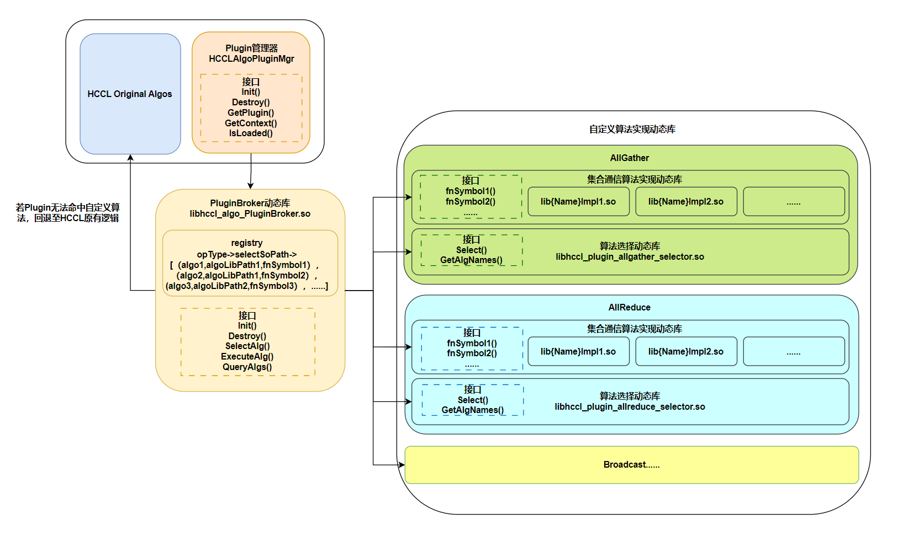
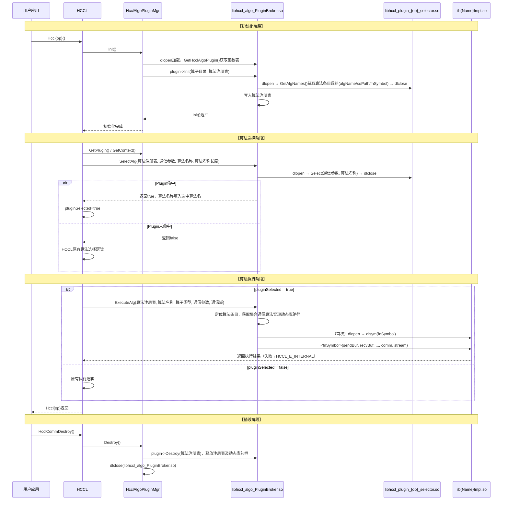

# RFC：HCCL-ALGO-Plugin —— HCCL自定义算法扩展框架

- 起始日期：2026-05-29
- RFC PR编号：1285
- 相关Issue：126

---

## 1. 概要

　　HCCL-ALGO-Plugin旨在为HCCL提供一个自定义算法扩展框架。其目标是允许用户在不修改HCCL核心代码的前提下，针对已有算子（如AllReduce、AllGather等）通过动态库形式添加自定义算法，使自定义算法能够无缝接入现有的算法选择和执行流程。

---

## 2. 背景与动机

### 2.1 背景

　　HCCL算子仓包含多种算子（AllReduce、AllGather、Broadcast、Reduce等），每个算子可包含多种算法实现。当前算法通过以下方式选择：

- **拓扑感知选择**：根据集群拓扑结构（1D Mesh、2D Mesh、CLOS等）自动选择最适合的算法。
- **数据大小阈值**：根据传输数据大小选择不同算法（如小数据用OneShot，大数据用TwoShot/NHR）。
- **硬件形态适配**：不同硬件形态（如950）需要不同算法实现。

　　当前添加新算法存在以下限制：

- **代码侵入**：需要修改HCCL源码，添加注册代码。
- **构建耦合**：新算法需要与HCCL源码一起编译。
- **发布依赖**：算法更新需要重新编译和发布整个HCCL。
- **选择逻辑封闭**：新算法难以接入现有的算法选择流程。

　　针对以上限制，HCCL-ALGO-Plugin的设计方案逐一予以解决：

- **解决代码侵入问题**：用户开发新算法只需实现标准接口并打包为动态库，**无需修改任何HCCL源码**。
- **解决构建耦合问题**：自定义算法以独立动态库（`.so`）形式交付，通过 `dlopen` 在运行时加载，**与HCCL主库完全解耦编译**，用户可使用独立的构建脚本单独编译算法包。
- **解决发布依赖问题**：PluginBroker动态库和自定义算法动态库均可独立安装到指定目录下，**更新算法只需替换对应`.so`文件**，无需重新编译或发布整个HCCL。
- **解决选择逻辑封闭问题**：HCCL-ALGO-Plugin在HCCL原有算法选择流程的入口处插入优先匹配逻辑，**自定义算法可无缝参与现有的选择流程**，未命中时自动回退到原有逻辑，两套机制互不干扰。

### 2.2 支持的场景

　　HCCL-ALGO-Plugin可支持以下扩展自定义算法的场景。
- **新算法实现**：用户希望添加自己设计的全新算法（如优化的Ring、Tree算法变体） 。
- **新硬件支持**：支持新硬件形态或新拓扑结构，需要添加对应的算法实现。
- **定制化优化**：针对特定业务场景（如特定网络环境、特定数据模式）进行算法定制。
- **实验性算法**：在生产环境外验证新算法性能。

---

## 3. HCCL通信库代码结构及算子执行流程解读

### 3.1 HCCL通信库代码结构

　　HCCL通信库的关键目录如下所示：
```
│── src                          # HCCL算子源码目录
|    ├── common                  # 通用逻辑，包括类型定义、日志模块等
|    └── ops                     # HCCL算子实现
|        ├── all_gather          # AllGather算子实现
|        ├── all_reduce          # AllReduce算子实现
|        ├── broadcast           # Broadcast算子实现
|        |   ├── executor        # Broadcast算子执行器
|        |   ├── selector        # Broadcast算法选择器
|        |   ├── template        # Broadcast算法模板
|        |   └── broadcast_op.cc # Broadcast算子对外提供的API实现
|        ├── ......              # 其他算子实现
|        └──  op_common          # 算子通用组件
|            ├── executor        # 执行器
|            ├── selector        # 算法选择器
|            ├── template        # 算法模板
|            ├── topo            # 通信域拓扑信息获取和转换 
|            └── op_common.cc    # 算子通用函数文件
├── include                      # HCCL对外头文件
├── test                         # 测试代码目录
├── examples                     # 样例代码目录
├── build.sh                     # 编译构建脚本
└── .......                      # 其他目录

```
　　`/ops`目录定义了HCCL算子实现，包含`all_gather`、`all_reduce`等常见集合通信算子，每个算子实现其执行器（`executor`）、算法选择器（`selector`）、算法模板（`template`）和对外提供的API文件（`XX_op.cc`）。  

　　`/ops`目录下的`/op_common`目录定义了算子通用组件，包括算子执行器基类、算法选择器公共逻辑、算法模板基类、通信域拓扑处理等各算子共用的基础设施。

### 3.2 HCCL通信库算子执行流程

　　以`Broadcast`算子的执行流程为例，当应用调用`HcclBroadcast()`后，首先判断是否为910_95或950设备，若非910_95或950设备则回退至旧逻辑，即调用`HcclBroadcastInner()`，按照旧逻辑实现`Broadcast`算子，不再执行以下流程。  
　　否则，主要通过 **算法选择** 和 **算法执行** 两步骤完成`Broadcast`操作，具体流程如下：  
　　（1）调用`Selector()`函数进行算法选择：  
　　　　1) `Selector()`函数位于`src/ops/op_common/op_common.cc`文件中，其主要逻辑为：  
　　　　　　创建算法选择执行器实例`collAlgSelector`（ExecuteSelector 类），调用`collAlgSelector->Run()`。  
　　　　2) `Run()`函数位于`src/ops/op_common/selector/execute_selector.cc`文件中，其主要逻辑为：  
　　　　　　① 从全局选择器注册表获取所有已注册的选择器；  
　　　　　　　　　　　　② 若算子为Mc2模式（Multi-Channel v2），则将其选择器集合置为仅含优先级为18的选择器；若算子为非Mc2模式，按操作类型获取选择器集合；  
　　　　　　　　　　　　③ 按照优先级从高到低遍历选择器集合，调用选择器的`Select()`方法检查是否匹配；  
　　　　　　　　　　　　④ 若`Select()`返回`SelectorStatus::MATCH`，则说明已选定执行算法，退出遍历；否则继续遍历下一选择器。  
　　　　3) `Select()`函数位于`src/ops/op_common/selector/auto_selector_base.cc`文件中，其主要逻辑为：  
　　　　　　根据运行模式（DPU、CCU_MS、AIV、AICPU等）调用对应的选择函数，例如当为AICPU模式时，调用`SelectAicpuAlgo()`函数进行算法选择。  
　　　　4) `Broadcast`算子的`SelectAicpuAlgo()`函数位于`src/ops/broadcast/selector/broadcast_auto_selector.cc`文件下，其主要逻辑为：  
　　　　　　根据拓扑信息（如Level0Topo的具体形状、层级数目等）选定算法名称，例如多层级下若Level0Topo形状为Mesh，选择`ParallelMesh1DNHR`算法。  
　　　　　　　　（2）调用`HcclExecOp()`函数执行`Selector()`函数选中的算法。  
　　　　1) `HcclExecOp()`函数位于`src/ops/op_common/op_common.cc`文件中，其主要逻辑为：  
　　　　　　① 根据操作类型和选定的算法名称(以下都假定选中`ParallelMesh1DNHR`算法)，获取对应的`executor`实例。  
　　　　　　　　　　　　② 创建线程、计算通信所需资源等。  
　　　　　　　　　　　　③ 算法执行：调用`executor`的算法编排，即调用`executor->Orchestrate()`函数。  
　　　　2) `executor`的`Orchestrate()`函数位于`src/ops/broadcast/executor/ins_v2_broadcast_sole_executor.cc`中，主要逻辑为：  
　　　　　　① 进一步计算资源、进行数据分片等步骤。  
　　　　　　　　　　　　② 调用`ParallelMesh1DNHR`算法模板的`KernelRun`函数，完成该次通信操作，即`algTemplate->KernelRun()`。  
　　　　3) `ParallelMesh1DNHR`算法的`KernelRun`函数位于`src/ops/broadcast/template/aicpu/ins_temp_broadcast_nhr.cc`中，其主要逻辑为：  
　　　　　　根据NHR算法逻辑执行远端读、远端写、本地线程同步、本地数据拷贝等操作来完成该次通信。

---

## 4. 总体设计

### 4.1 总体架构

#### 4.1.1 Plugin系统组成

　　HCCL-ALGO-Plugin的总体架构如图1所示：
<div style="text-align: center;">
  
  <p><b>图1 总体架构图</b></p>
</div>

　　HCCL-ALGO-Plugin系统由三部分组成：

　　**(1) Plugin管理器**

　　Plugin管理器(`HcclAlgoPluginMgr`)内嵌在HCCL代码仓中，其作用是：获取并保存PluginBroker动态库的句柄，在HCCL代码仓中进行PluginBroker生命周期的管理以及自定义算法的选择和执行调用。

　　**(2) PluginBroker动态库**

　　PluginBroker动态库（`libhccl_algo_PluginBroker.so`）为独立于HCCL的模块，作为HCCL与自定义算法之间的桥梁，它定义并实现`HcclAlgoPlugin_t`函数表中的全部接口：

- **`Init()`接口**：负责扫描自定义算法根目录、构建自定义算法注册表；

- **`Destroy()`接口**：负责释放注册表及所有已加载的集合通信算法实现动态库（`lib{Name}Impl.so`）句柄；

- **`SelectAlg()`接口**：负责加载对应算子的自定义算法选择动态库（`libhccl_plugin_{op}_selector.so`）进行选择决策；

- **`ExecuteAlg()`接口**：负责根据自定义算法名定位集合通信算法实现动态库（`lib{Name}Impl.so`），懒加载后调用其对应算法执行函数完成通信；

- **`QueryAlgs()`接口**：负责查询已注册的自定义算法列表。

　　**(3) 自定义算法实现动态库**

- **自定义算法选择动态库（`libhccl_plugin_{op}_selector.so`）**：每个算子对应一个独立的算法选择库，须导出两个标准C接口：
  
  - `GetAlgNames()`：返回该算子下所有自定义算法的名称、其集合通信算法实现动态库路径及执行函数符号名，供PluginBroker初始化时注册算法使用。

  - `Select()`：根据传入的本次通信操作的参数，结合内部策略逻辑（如拓扑信息、数据量、Rank规模等）动态决策，选中算法后将算法名返回。
  
- **自定义集合通信算法实现动态库（`lib{Name}Impl.so`）**：每个算子目录下的集合通信算法实现.so数量由用户自行决定，一个算子的所有算法可以打包为一个so，也可以将一个算子的所有算法分组，每组算法打包进一个so，还可以每个算法各自独占一个so。每个算法须在其所在的.so中导出一个算法执行函数，执行函数符号名由用户自定义，通过GetAlgNames()返回的的fnSymbol字段告知PluginBroker；执行函数签名须与该算子对应的标准签名严格一致（参数列表与返回类型固定，见4.2.3节）。

#### 4.1.2 自定义算法调用时序

　　如图2所示，自定义算法的调用时序分为四个阶段：

- **初始化阶段**：HCCL在初始化集合通信操作环境时触发`HcclAlgoPluginMgr::Init()`，加载PluginBroker动态库并调用PluginBroker动态库的plugin->Init()，PluginBroker动态库扫描算子目录，调用各算子算法选择动态库提供的`GetAlgNames()`接口构建算法注册表。

- **算法选择阶段**：每次集合通信调用时，HCCL优先调用`plugin->SelectAlg()`进行算法选择，PluginBroker加载对应算子的算法选择动态库并调用其`Select()`接口进行决策。命中则返回算法名并设置Plugin算法选中即`pluginSelected=true`；未命中则回退到原有HCCL算法选择逻辑。

- **算法执行阶段**：若Plugin算法选中，HCCL调用`plugin->ExecuteAlg()`执行自定义集合通信算法，PluginBroker从算法注册表定位集合通信算法实现动态库，首次执行时懒加载并通过dlsym解析算法执行函数指针，然后调用对应算法执行函数完成通信；调用失败或执行出错时返回HCCL_E_INTERNAL，不回退至HCCL原有算法执行逻辑。若Plugin算法未选中则执行HCCL原有逻辑。

- **销毁阶段**：通信域销毁函数`HcclCommDestroy()`触发`HcclAlgoPluginMgr::Destroy()`，通过调用PluginBroker动态库的plugin->Destroy()释放所有已加载的集合通信算法实现动态库句柄及注册表，最后卸载PluginBroker动态库本身。


<div style="text-align: center;">
  <b>图2 自定义算法调用时序图</b>
</div>

#### 4.1.3 目录组织

　　HCCL-ALGO-Plugin系统的三部分分别组织在不同的目录位置：

　　**(1) HcclAlgoPluginMgr（HCCL代码仓内）**

　　`HcclAlgoPluginMgr`是内嵌在HCCL代码仓中的组件，其源码可设计位于HCCL代码仓的`src/`目录下，随HCCL主库`libhccl.so`一同编译与发布。

　　**(2) PluginBroker动态库（libhccl_algo_PluginBroker.so）**

　　PluginBroker动态库是独立于HCCL主库的模块，通过环境变量`HCCL_PLUGIN_PATH`指定PluginBroker动态库路径，HCCL在初始化时通过`dlopen`动态加载，不配置则不加载，HCCL行为与原有完全一致。可部署在CANN安装目录下：
```
${ASCEND_HOME}/
└── opp/
    └── vendors/
        └── cust/
            └── lib64/
                └── libhccl_algo_PluginBroker.so   ← PluginBroker动态库
```

　　**(3) 自定义算法实现动态库**

　　自定义算法实现动态库由用户独立编译后安装，部署在`HCCL_PLUGIN_ALG_DIR`环境变量指定的算法根目录下，每个算子一个目录，每个算子目录下，算法的.so文件数量和分组方式由用户自行决定——多个算法可以打包进同一个so，也可以每个算法独占一个so；PluginBroker通过算法选择动态库的`GetAlgNames()`获取每个算法的so路径和对应的执行函数符号名，无需感知打包方式：

```
${HCCL_PLUGIN_ALG_DIR}/                               ← 根目录
├── AllReduce/                                        ← 算子子目录（按算子类型命名）
│   ├── libhccl_plugin_allreduce_selector.so          ← AllReduce自定义算法选择动态库
│   ├── libRingAndTreeAlgsImpl.so                     ← 自定义集合通信算法实现动态库，可将多个算法打包进同一so
│   └── libMeshAlgImpl.so                             ← 自定义集合通信算法实现动态库，也可使每个算法独占一个so
├── AllGather/
│   ├── libhccl_plugin_allgather_selector.so
│   └── libGatherAlgsImpl.so
└── Broadcast/
    ├── libhccl_plugin_broadcast_selector.so
    └── libBroadcastAlgsImpl.so
```

　　每个算子目录下有且只有一个算法选择动态库（`libhccl_plugin_{op}_selector.so`），负责存储该算子所有自定义算法的名称、集合通信算法实现动态库的路径和执行函数符号名，并负责该算子所有自定义算法的选择决策；算法.so文件与目录结构无强制约束，PluginBroker依赖`GetAlgNames()`返回的`soPath`和`fnSymbol`定位和调用每个算法，用户只需确保.so文件在`GetAlgNames()`返回的路径下可访问。

　　以AICPU算法开发为例，其算法实现的源码目录结构示例如下：

```
MyRingAlg/
├── CMakeLists.txt
├── op_host/
│   └── my_ring_alg.cc          ← Host侧算法编排，须导出算法执行函数，例如HcclAlgoPluginMyRingAllReduce()
├── op_kernel_aicpu/
│   ├── my_ring_alg_kernel.cc   ← Device侧Kernel
│   └── libmy_ring_alg.json     ← AICPU Kernel算子描述文件
└── inc/
    └── my_ring_alg.h
```
　　`op_host/my_ring_alg.cc`实现host侧算法编排逻辑，负责任务下发和资源调度；`op_kernel_aicpu/my_ring_alg_kernel.cc`实现device侧Kernel，完成实际的数据通信操作。`op_host/my_ring_alg.cc`须导出与选择动态库存储的执行函数符号名一致的算法执行函数，例如`HcclAlgoPluginMyRingAllReduce()`。

### 4.2 接口设计

#### 4.2.1 HcclAlgoPluginMgr（集成于HCCL内部）

　　`HcclAlgoPluginMgr`以单例模式实现，负责PluginBroker动态库的生命周期管理和其函数表指针的持有。HCCL在算法选择与执行路径中通过`HcclAlgoPluginMgr`获取HcclAlgoPlugin_t函数表，直接调用其`SelectAlg()`和`ExecuteAlg()`等接口与PluginBroker动态库交互。`HcclAlgoPluginMgr`中主要包含以下接口：
- `Init()`：加载PluginBroker动态库，获取函数表指针，并调用PluginBroker动态库的初始化；多次调用安全。
- `Destroy()`：调用PluginBroker动态库的销毁，释放PluginBroker动态库句柄。
- `GetPlugin()`：返回`HcclAlgoPlugin_t`函数表指针，供HCCL调用PluginBroker动态库提供的接口。
- `GetContext()`：返回初始化时注册的算法注册表。
- `IsLoaded()`：检查PluginBroker动态库是否已成功加载。

```cpp
class HcclAlgoPluginMgr {
public:
    static HcclAlgoPluginMgr& Instance();

    /** 初始化阶段调用，多次调用安全 */
    HcclResult Init();
    
    /** 通信域销毁时调用，销毁PluginBroker动态库，释放PluginBroker动态库句柄 */
    void Destroy();

    /** 获取HcclAlgoPlugin_t函数表指针 */
    HcclAlgoPlugin_t* GetPlugin();

    /** 获取PluginBroker动态库的算法注册表 */
    void* GetContext();
    
    /** 查询Plugin是否已成功加载，调用GetPlugin()前须先检查 */
    bool IsLoaded() const;

    ~HcclAlgoPluginMgr();
};
```

#### 4.2.2 PluginBroker动态库接口（`HcclAlgoPlugin_t`）

　　PluginBroker动态库通过`HcclAlgoPlugin_t`函数表对外暴露C接口，由`HcclAlgoPluginMgr::GetPlugin()`获取后直接调用。PluginBroker动态库包含的接口如下：
- `Init()`：接收算法根目录路径，完成PluginBroker侧的算法注册表构建。
- `Destroy()`：释放算法注册表，关闭所有已加载的算法动态库句柄。
- `SelectAlg()`：调用对应算子的选择动态库，命中时填入算法名并返回`true`，未命中返回`false`。
- `ExecuteAlg()`：根据算法名定位注册条目，懒加载集合通信算法实现动态库并调用其算法执行函数执行自定义算法。
- `QueryAlgs()`：查询已注册的算法列表。

```cpp
/*  HCCL侧期望的PluginBroker版本号，用于校验PluginBroker合法性 */
#define HCCL_PLUGIN_API_VERSION  1U

struct HcclAlgoPlugin_t {
    uint32_t version; /*  PluginBroker版本号 */

    /*
    * `HcclAlgoPluginParam`是自定义算法选择与执行所需的参数，由HCCL从内部的`OpParam`和
    * `TopoInfoWithNetLayerDetails`结构体中提取，随后以`const`指针形式传入Plugin侧。
    */
    typedef struct {
        uint32_t     structSize;    /* sizeof(HcclAlgoPluginParam) */
        int          opType;        /* 算子类型 */
        uint64_t     count;         /* 元素个数 */
        uint32_t     root;          /* 根节点Rank（仅Broadcast/Reduce等算子有效） */
        int          topoType;      /* 拓扑类型 */
        uint32_t     rankNum;       /* 通信域总Rank数 */
        uint32_t     serverNum;     /* server数量 */
        void*        sendBuf;       /* 发送缓冲区 */
        void*        recvBuf;       /* 接收缓冲区 */
        aclrtStream  stream;        /* 执行流 */
        /* ...... 此处省略其余相关参数*/
    } HcclAlgoPluginParam;

    /* 初始化：扫描algDir下的算子子目录，构建算法注册表context */
    int (*Init)(const char* algDir, void** context);

    /* 销毁PluginBroker：释放注册表，关闭所有已加载的算法动态库句柄 */
    int (*Destroy)(void* ctx);

    /*
     * 算法选择：调用对应算子的选择动态库Select()，返回true表示命中，algName填入选中算法名；返回false表示未命中，HCCL走原有逻辑。param为从HCCL侧提取的算法选择所需关键参数
     */
    bool (*SelectAlg)(void*                   ctx,
                      const HcclAlgoPluginParam*  param,
                      char*                   algName,
                      size_t                  algNameLen);

    /*
     * 算法执行：根据algName定位集合通信算法实现动态库，调用对应算子的算法执行函数
     */
    int (*ExecuteAlg)(void*                   ctx,
                      const char*             algName,
                      int                     opType,
                      const HcclAlgoPluginParam*  param,
                      void*                   comm); 
    
    /* 算法查询：查询已注册的算法名列表，输出写入buf */
    int (*QueryAlgs)(void* ctx, int opType, char* buf, size_t bufLen);
};

// libhccl_algo_PluginBroker.so 须导出此符号
extern "C" HcclAlgoPlugin_t* GetHcclAlgoPlugin(void);

```

#### 4.2.3 自定义算法实现动态库接口

　　每个算子对应一个独立的算法选择动态库（`libhccl_plugin_{op}_selector.so`），须导出以下两个C接口：

```cpp
/*
 * 算法选择入口：根据param中的通信参数和拓扑信息选择合适的算法名。返回true表示命中，algName填入选中算法名
 */
extern "C" bool Select(const HcclAlgoPluginParam*  param,
                        char*                  algName,
                        size_t                 algNameLen);

/*
 * 获取该算法选择动态库管理的所有自定义算法条目，供PluginBroker初始化时注册使用。
 * 调用方传入algEntries数组和容量maxCount，函数填充每个条目，返回实际条目数。
 *
 * 算法条目：描述一个自定义算法的.so路径和执行函数符号名。
 * - soPath：集合通信算法实现动态库路径
 * - fnSymbol：该算法在soPath对应的.so中导出的执行函数符号名，PluginBroker通过dlsym(fnSymbol)解析
 * - algName：算法名，用于SelectAlg()命中时填入algName字段，也用于ExecuteAlg()定位条目
 * 
 * typedef struct {
 *   char algName[128];
 *   char soPath[512];
 *   char fnSymbol[128];
 * } HcclAlgoPluginAlgEntry;
 */
extern "C" int GetAlgNames(HcclAlgoPluginAlgEntry* algEntries, int maxCount);
```

　　每个集合通信算法的实现中须导出`GetAlgNames()`中`fnSymbol`字段对应的**算法执行函数**。**执行函数符号名（即`fnSymbol`）由用户自定义，但执行函数签名（参数列表与返回类型）须与该算子的标准签名严格一致**，PluginBroker通过`dlsym(handle, fnSymbol)`解析后按标准签名调用。一个.so中可同时导出多个算法的**算法执行函数**，自定义算法各自在`GetAlgNames()`中以不同的`fnSymbol`和`algName`注册即可。
　　
　　各算子的标准签名定义如下(本文档仅列举出AllReduce、AllGather、Broadcast和Reduce算子的标准签名定义，其余算子类似，实现时需给出所有算子的标准签名定义)：

```cpp
/* AllReduce */
extern "C" HcclResult <fnSymbol>(void*        sendBuf,
                                 void*        recvBuf,
                                 uint64_t     count,
                                 HcclDataType dataType,
                                 HcclReduceOp op,
                                 HcclComm     comm,
                                 aclrtStream  stream);

/* AllGather */
extern "C" HcclResult <fnSymbol>(void*        sendBuf,
                                 void*        recvBuf,
                                 uint64_t     sendCount,
                                 HcclDataType dataType,
                                 HcclComm     comm,
                                 aclrtStream  stream);

/* Broadcast */
extern "C" HcclResult <fnSymbol>(void*        buf,
                                 uint64_t     count,
                                 HcclDataType dataType,
                                 uint32_t     root,
                                 HcclComm     comm,
                                 aclrtStream  stream);

/* Reduce */
extern "C" HcclResult <fnSymbol>(void*        sendBuf,
                                 void*        recvBuf,
                                 uint64_t     count,
                                 HcclDataType dataType,
                                 HcclReduceOp op,
                                 uint32_t     root,
                                 HcclComm     comm,
                                 aclrtStream  stream);

/* 其余算子标准签名定义类似，实现时需给出所有算子的标准签名定义 */
```
---


## 5. 兼容性考虑

- **向后兼容性**：本方案仅在HCCL原有算法选择与执行流程中新增可选分支。当`HCCL_PLUGIN_PATH`未配置时，`HcclAlgoPluginMgr::IsLoaded()`返回false，所有新增分支直接跳过，HCCL行为与原有完全一致。

- **接口版本管理**：`HcclAlgoPlugin_t`函数表设计`version`字段，用于HCCL侧校验所加载的PluginBroker是否合法,若拒绝加载，则降级为原有选择逻辑，防止加载到非法或损坏的PluginBroker动态库。

- **数据结构兼容性**：HCCL从内部的`OpParam`和`TopoInfoWithNetLayerDetails`中提取并填充本次通信参数，HCCL-ALGO-Plugin不直接依赖HCCL内部结构体。

- **线程模型假设**：本方案假设不存在'通信域正在执行通信操作的同时，另一线程销毁该PluginBroker'的场景，这是由HCCL上层调用约定保证的（HcclCommDestroy需要等待该通信域所有通信操作完成后才能调用）。

## 6. 测试场景

　　**(1) 单元测试**： 
- `HcclAlgoPluginMgr` 初始化、销毁的幂等性测试（多次Init/Destroy，含并发场景）
- Plugin加载失败（文件不存在、符号解析失败、version不匹配）时的降级行为测试
- `PluginRegisterAlg()` 对合法/非法`GetAlgNames()`输出的解析正确性测试
- `PluginSelectAlg()` 的选择动态库命中/未命中路径正确性测试
- `PluginExecuteAlg()` 懒加载路径的正确性测试（含`loadFailed`标记的重试拦截）
- `PluginGetAlgNames()` 的输出正确性测试（单算子查询、全量查询、bufLen边界）

　　**(2) 集成测试**：
- 正常场景：配置Plugin后`Hccl{Op}()`能选中并执行自定义算法
- 回退场景：Plugin算法未命中时回退到原有HCCL算法，结果和HCCL原有算法执行一致
- 禁用场景：不设置`HCCL_PLUGIN_PATH`时，HCCL行为与原有完全相同
- Plugin执行失败测试：`ExecuteAlg`返回错误时，验证HCCL返回`HCCL_E_INTERNAL`，不再回退到原有执行逻辑，执行退出

　　**(3) 端到端验证**：
- 算法执行正确性验证：编译示例自定义算法（如 MyRingAlg），按完整流程安装并执行，验证通信结果正确性
- 算法选择逻辑验证：多个自定义算法并存时的选择逻辑验证
- 算法安全校验测试：HCCL_PLUGIN_ALG_DIR指向符号链接或不受信任目录时，PluginBroker安全拒绝加载

---