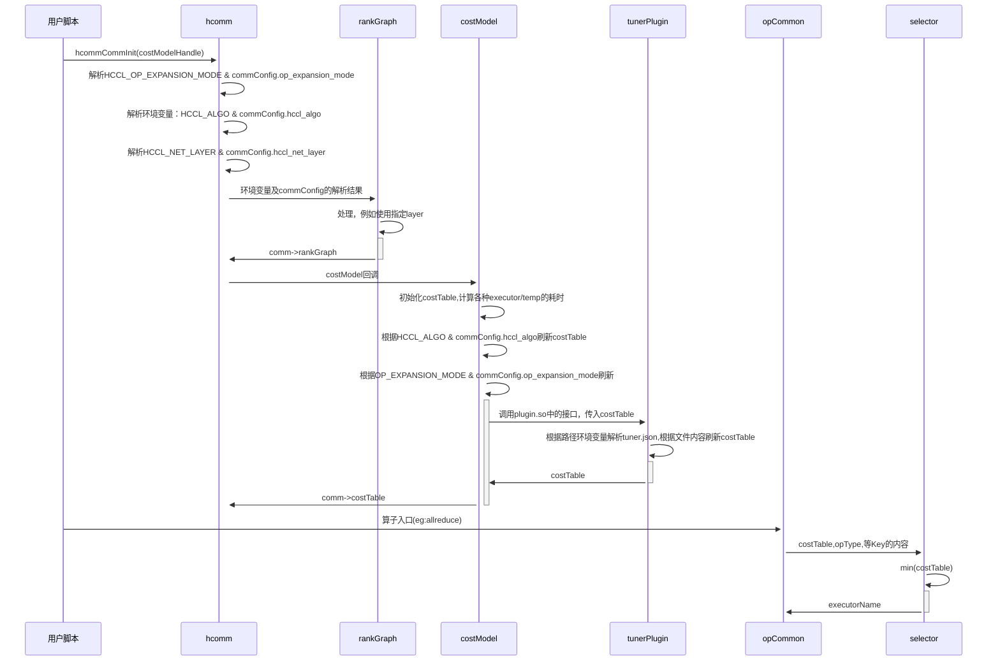

# 重构后的代码流程
## 初始化通信域
1. 解析HCCL_NET_LAYER环境变量
2. 获取本通信域的rankGraph时，根据HCCL_NET_LAYER的配置删减一些netlayer
3. 使用costModel模块生成初始化的costTable[opType][engine][algType]
4. 解析HCCL_EXPANSION_MODE及HcclCommConfig中的expansionMode字段，修正对应的costTable值
5. 解析HCCL_ALGO环境变量，根据内容修改costTable中的相关表项，例如：
    - 指定了某种算法，则把该算法对应的cost值改成0
    - 不选某种算法，则把算法对应的cost值改成-1
6. 解析HcclCommConfig中的算法配置，根据内容修改costTable中的值

## 运行过程
1. 拿到opType，opParams
2. 根据tuner plugin中的规则，update costTable
2. 从costTable[opType]中选取cost>=0的引擎和算法，候选集
3. 第一优先级的引擎，候选集中存在算法，则选择；如果没有，则引擎回退，再看候选集中是否存在算法

## 流程图
涉及以下部分的交互
- 用户脚本
- rankGraph
- hcomm
- opCommon
- costModel
- tunerPlugin
- selector
- executor
- tuner.json\
交互流程如下：

# 外部配置方式
## 涉及到的环境变量小结
- HCCL_ALGO， 指定算法
- HCCL_OP_EXPANSION_MODE， 指定引擎
- HCCL_NET_LAYER， 指定使用的网络层（链路）
- HCCL_TUNER_PLUGIN， 指定使用的plugin.so的路径
- HCCL_TUNER_CONFIG_FILE, 指定调优配置文件的路径
- HCCL_USE_NEW_SELECTOR, 灰度开关

## 支持通过HCCL_ALGO配置算法
### HCCL_ALGO的配置符号说明
- ;  分号表示多段配置，比如多个算子的配置，使用分号隔开
- ， 逗号，表示并列的配置，比如同时配置可使用ring和hd算法，则表示为ring，hd
- ： 冒号，用于一个配置的多个配置段的分隔，例如
    - 算子:算法
    - executor:temp
    - executor:temp1:temp2
    - 算子:executor:temp1:temp2
- ^  取非，表示禁用某种算法

### HCCL_ALGO支持的配置方式
配置方式举例
1. 算法
- HCCL_ALGO=mesh
2. 算法1，算法2
- HCCL_ALGO=mesh,ring
3. 禁用算法
- HCCL_ALGO=^hd
4. 算子A:算法1;算子B:算法2
- HCCL_ALGO=allreduce:mesh;allgather:ring
5. 算子A：禁用算法1；算子B：算法2,算法3
- HCCL_ALGO=allreduce:^mesh;allgather:ring,hd
6. executor:temp1:temp2
- HCCL_ALGO=parallel:mesh:nhr
7. 算子A:executor:temp1:temp2;算子B:executor:temp3:temp4
- HCCL_ALGO=reducescatter:sole:mesh;allgather:parallel:nhr:nhr
8. 算子A:executor:temp1:temp2,temp3
- HCCL_ALGO=allgather:sequence:mesh:mesh,nhr;alltoall:mesh

executor类型可以配置：
enum executorType{
    sole,
    parallel,
    sequence,
    concurrent,
    sequence3
}

template类型可以配置：
enum templateType{
    mesh,
    nhr,
    ring,
    hd
}

### 配置说明
1. 如果配置的算法在代码中可以支持，一定走该算法。不根据性能预期进行回退
2. 如果配置的算法代码中未支持，不报错，继续运行，按照costModel中的逻辑选择性能较优的可运行算法

## 支持通过HcclCommConfig按通信域配置合适的算法
在hcclCommConfig中新增hcclAlgo字段，改字段的配置方法与HCCL_ALGO相同，只是作用范围是本通信域。

## 支持Tuner Plugin配置算法
### tuner plugin需要包含的文件
1. tuner.h, tuner.cc 等c++文件
- 提供GetTunerConfig接口，这个接口在hccl代码中调用
- GetTunerConfig中具体做的事情，可定制；例如，可以是读取解析tuner.conf文件中的每一行，并根据一行中的内容设置HCCL中costTable中的值
2. makefile 
- 把tuner.cc .h编译成hccl_tuner_plugin.so
3. 生成原始文件csv的脚本(建议是torch)，非hccl仓代码交付件
- 不同的HCCL_ALGO或者hcclCommConfig.hccl_algo配置，统计算法带宽数据，并存入csv文件
4. optimize_config.py
- 从csv文件生成最优配置文件tuner.conf

### tuner plugin的使用流程
#### 采集原始数据
- 采用python脚本，不在hccl c++代码中
- 通过配置HCCL_ALGO，或者hcclCommConfig，运行hcclTest或者pytorch代码，在对应的集群机器上采集原始数据；指定固定一种算法，从小遍历到大；
- 采集多种算法在各个数据点的性能数据
- 这步的输出是一个承载原始数据的csv文件

#### 使用脚本（optimize_config.py）按数据段选择最优算法，并生成最优配置
- 采用python脚本，不在hccl c++代码中
- input: 原始数据的csv文件，输出文件为csv格式
- output：最优的config文件, 假设叫tuner.conf；输出文件，可以考虑使用json格式

##### input的原始数据cvs文件格式
需要包含的字段有：
- opType
- size_bytes
- engine
- protocal (预留)
- channels （预留）
- algorithm
  - executorType
  - templateType
- hcclBufferSize
- ranks
  - nodes
  - servers
  - pods
  - superPods
- bandwidth
- latency

##### output tuner.conf文件的格式
需要包含的字段：
- commName(optional)
- opType
- min_bytes
- max_bytes
- engine
- algorithm
  - executorType
  - templateType
- hcclBufferSize
- min_nodes
- max_nodes
- min_servers
- max_servers
- min_pods
- max_pods
- min_superPods
- max_superPods
- args (optional)
  - 算法中需要使用的配置（例如，all2all并发度，splitRatio等，可扩展）

#### 运行tuner plugin，加载最优配置文件，就可以得到调优后的最优曲线
- plugin的代码，在hccl代码中
- plugin 获取 config文件中的每一行，按照config中指定的算法选择运行

#### 视实际情况，看看是否要调整内置cost model的系数
- 人工调整，不用代码

### 除了使用脚本统计生成tuner.conf,也支持手工填写一行
这种场景，额外支持使用commName指定通信域名字（该名字需要与torch脚本中创建通信域的名字相同）
以及一些特殊只有某些算子才有的args

### 环境变量
1. HCCL_TUNER_PLUGIN， 指定hccl_tuner_plugin.so的位置
2. HCCL_TUNER_CONFIG_FILE，指定最优配置文件tuner.conf的文件位置；不配置在当前路径下找

### tuner.conf（json）文件说明
#### 多机型考虑
每种机型，采用一个独立的json文件

#### 演进考虑
tuner.conf相当于是一个知识库
我们可以在gitcode上给出我们在server,pod,UBX,大禹等机型的最优配置文件，
但最优配置文件不随CANN版本发布，用户可以下载我们的使用，也可以自己在自己的环境上调出最优

## 支持通过HCCL_NET_LAYER配置使用的链路
### HCCL_NET_LAYER支持的配置方式
指定使用哪层netLayer进行通信
- 使用数字指定哪层netlayer
- 如果使用多层，使用逗号隔开
- 支持使用取非的符号

例如：
- HCCL_NET_LAYER=1
- HCCL_NET_LAYER=1,2
- HCCL_NET_LAYER=^0
- HCCL_NET_LAYER=^0,^1

# 关键功能点设计
## 算法选择设计
- 现有代码思路
根据ranktable送进来的rankGraph，采用很多分支判断的方式，选择合适的算法，例如：
    if layer0.type=mesh and layer1.type=clos and dataSize < xxx：
        executor = ccuParallelMeshNhr
- 优点
    - 初始代码容易写
    - 切换有规则，而不是乱切

- 缺点
    - 无法综合考虑aicpu，ccu，比如ccu的本地Reduce带来的影响
    - 无法自适应RankSize的变化，例如rankSize=2，ccu的本地拷贝影响很大

## CostModel耗时计算模块
- 输入是候选算法，使用AlgAttr表示
    struct {
        opType,
        executorType,
        templateType,
        templateType,
        engine
    } AlgAttr

- 拓扑类型的带宽和时延
    - 依据rankGraph查到的信息，得到每种拓扑的带宽
    - 例如出框的是8端口，框内是7端口等

- 算法耗时计算公式
    - mesh temp的计算公式
    - nhr temp的计算公式

- 根据AlgAttr计算耗时
- 初始化通信域的时候，就可以知道拓扑，rankSize，走哪层net等条件，就可以计算所有所有算子类型的耗时，形成初始化的costTable

- costTable[opType][engine][algType]
    - executorName为根据executorType和组成该executor的Temp的标识
    - enum algType{
        - sole_mesh
        - sole_nhr
        - parallel_mesh_nhr
        - parallel_mesh_mesh
        - parallel_nhr_nhr
        - sequence_mesh_nhr
        - sequence_mesh_mesh
        - sequence_nhr_nhr
        - concurrent_mesh_nhr
        - concurrent_mesh_mesh
        - concurrent_nhr_nhr
        - sequence3_mesh_nhr_nhr
        - sequence3_nhr_nhr_nhr
        }

- 专门给出修正系数
    内置的costTable，需要乘以后期联调过程中的参数；比如clos的带宽利用率低一些，则进行修正

### costModel注册回调机制
hcomm: 提供init注册回调；调用costModel初始化函数
hccl：使用注册机制，注册costModel初始化函数

## HCCL_NET_LAYER链路选择
通过环境变量和commConfig中的对应配置，在comm->rankGraph中，删除相关的layer，这个通信域就不使用这层layer

# 期望解决的问题及实施的优先级
## HcclTest算法带宽曲线掉坑问题（算法痛点）
由于不同算法，不同展开模式，不同数据量性能差异较大，当前的算法选择采用的if-else分支方式，没有办法精准调试出同时满足8P，16P，32P，64P，不同数据量均最优性能的参数配置。
为了解决之一问题，需要实现
1. tuner_plugin
2. HCCL_ALGO及commConfig.hccl_algo可配置

最简实现：
- 保留现有的selector逻辑不变。在selector前面，增加HCCL_ALGO的配置
- 不支持非或者列表的操作，需要明确指明 executor:temp1:temp2，返回executorName，选择到唯一的算法

## 多机型的算法选择逻辑复杂的问题（生态提的痛点）
解决生态痛点，目前代码腐化，比如有UBX专门的if-else分支等。
按照topo类型的组合走不同的分支。整改方案: 使用costModel进行重构。需要实现：
- costModel
    - 只需要给出mesh, nhr 2个template的计算公式
    - 这两个公式的耗时进行组合，形成sole,parallel,sequence的耗时
    - mesh_topo上只跑mesh算法，clos_topo上可以跑mesh或者nhr算法
    - 每种链路的带宽比例信息从rankGraph中获取

基于costModel的内置算法选择思路完全不同于现有代码中的if-else思路。
需要做好兼容和全量性能测试

## 解决链路可选择问题（G项目需求 730）-- 框架
- hccl_net_layer环境变量，UBG/UBOE  DFX需求

rankTable：netLayer1\2\3\4:port1，clos, ubmem
topo: port1 peer2net，[UBTP,UBCTP,UBMEM]
            peer2peer

