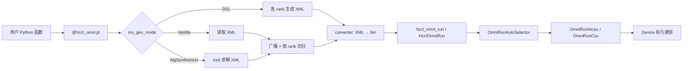

# HCCL Omni 使用说明

HCCL Omni（`hccl_omni`）是 HCCL 实验性特性，提供**可编程集合通信**能力：用户通过 XML 描述通信算法指令，由 Host 侧 `HcclOmniRun` 入口调度，Device 侧 AICPU/CCU 执行具体通信步骤。Python 包 `hccl_omni` 在此基础上提供 JIT 装饰器，完成 XML 生成/切分、二进制转换与算子调用的一站式封装。

---

## 1. 功能概述

| 层级 | 组件 | 作用 |
|------|------|------|
| Python 前端 | `hccl_omni.jit` | 包装用户函数，管理 XML 生成、缓存、按 rank 切分 |
| Python 中端 | `converter` / `splitter` / `cache` | XML → bin 转换、rank 切片、本地缓存 |
| Python 后端 | `hccl_omni_run` | 通过 `torch.ops.npu.hccl_omni_run` 调用 C++ 扩展 |
| C++ Host | `HcclOmniRun` | 校验参数，走 OmniRun 专用调度链路 |
| C++ Device | `OmniRunAicpu` / `OmniRunCcu` | 解析 XML/bin，在 AICPU 或 CCU 上执行指令 |

当前 `HcclOmniRun` 对外以 **AlltoAllV** 语义接入（`HCCL_CMD_ALLTOALLV`），`send_counts` / `recv_counts` / `sdispls` / `rdispls` 通过 `opParam` 二进制块传入，不再单独传张量。

---

## 2. 环境与硬件要求

### 2.1 硬件与 CANN

- **NPU 型号**：Ascend 910_95 / 950 系列（`HcclOmniRun` 内会做设备类型校验）
- **hcomm 版本**：≥ 90000000
- **CANN**：已安装 Ascend Toolkit，并 `source set_env.sh`
- **HDK**：自编译 AICPU 包部署时，需 HDK 25.5.T2.B001 及以上以支持关闭客户自定义验签嗯可以

### 2.2 Python 环境（使用 `hccl-omni-py` 时）

- Python 3.10+
- PyTorch 2.9.0+（Ascend v7.3.1 配套）
- `torch_npu`
- 分布式：`torch.distributed` + `hccl` backend

### 2.3 网络（多卡/多机）

```bash
export HCCL_SOCKET_IFNAME=eth0    # 按实际网卡修改
export HCCL_IF_BASE_PORT=50033    # 通信端口基址，避免冲突
```

---

## 3. 编译与安装

### 3.1 推荐：主工程全量构建

在 `hccl-master` 根目录执行（需已安装 CANN、第三方依赖）：

```bash
export PIP_NO_BUILD_ISOLATION=1
pip3 install "setuptools>=40.8.0" wheel

bash build.sh --experimental --full --pkg \
  --cann_3rd_lib_path=../open_source/ \
  --sign-script ../vendor/hisi/build/scripts/sign_and_add_header.sh \
  -p /usr/local/Ascend/cann
```

说明：

| 参数 | 含义 |
|------|------|
| `--experimental` | 启用 `experimental/eco_system`，编译 `HcclOmniRun` 及 Omni AICPU 源码 |
| `--full` | 显式构建 `hccl_device`，生成 `aicpu_hccl.tar.gz` |
| `--pkg` | 打 `cann-hccl_*.run` 安装包 |

构建产物关键路径：

```
build/device_build/aicpu_hccl.tar.gz          # 未签名包（调试用）
build/device_build/signatures/aicpu_hccl.tar.gz # 签名后包（打入 run 包）
```

`aicpu_hccl.tar.gz` 解压后结构：

```
aicpu_kernels_device/
├── libscatter_aicpu_kernel.so    # 含 Omni AICPU 内核与 omni_parser
├── libhccl_kernel_compat.so      # HCCL 兼容符号库
└── bin_hash.cfg
```

### 3.2 安装 run 包

```bash
./output/cann-hccl_<version>_linux-<arch>.run --install
source /usr/local/Ascend/ascend-toolkit/set_env.sh
```

安装后 AICPU 相关文件位于：

```
<ASCEND_HOME>/opp/built-in/op_impl/aicpu/kernel/aicpu_hccl.tar.gz
<ASCEND_HOME>/opp/built-in/op_impl/aicpu/config/libscatter_aicpu_kernel.json
```

### 3.3 关闭 AICPU 客户自定义验签（自编译必做）

源码编译的 `aicpu_hccl.tar.gz` 不含厂商签名头，需关闭验签后 Device 才能加载。以 device 0 为例（root 执行）：

```bash
npu-smi set -t custom-op-secverify-enable -i 0 -d 1
npu-smi set -t custom-op-secverify-mode -i 0 -d 0
```

修改后需**重启使用该 NPU 的业务进程**（或重启 NPU 相关服务）。详见仓库 `docs/zh/build/build.md`「关闭验签」章节。

### 3.4 安装 Python 包 `hccl_omni`

```bash
cd experimental/eco_system/hccl_omni/omni_test/hccl-omni-py
python -m build --wheel
pip install dist/hccl_omni-0.1.0-py3-none-any.whl
```

---

## 4. C API：`HcclOmniRun`

头文件：`experimental/eco_system/op_common/inc/hccl.h`

```c
HcclResult HcclOmniRun(
    const void *sendBuf, const void *recvBuf,
    HcclDataType sendType, HcclDataType recvType,
    const char *xmlPath,
    const void *opParam, uint64_t opParamSize,
    HcclComm comm, aclrtStream stream);
```

### 4.1 参数说明

| 参数 | 说明 |
|------|------|
| `sendBuf` / `recvBuf` | 输入/输出设备内存指针 |
| `sendType` / `recvType` | HCCL 数据类型枚举 |
| `xmlPath` | 算法 XML 配置文件路径；可为 rank 切分后的 XML 或完整 XML（由实现解析） |
| `opParam` | 4104 字节二进制块，见下节 |
| `opParamSize` | 必须 ≥ 4104 |
| `comm` | HCCL 通信域 |
| `stream` | ACL 流 |

### 4.2 `opParam` 二进制布局（4104 字节，小端）

| 字段 | 偏移（字节） | 大小 | 说明 |
|------|-------------|------|------|
| op_name + reduce_op | 0 | 1 | 低 4 bit：算子类型；高 4 bit：归约类型 |
| reserved | 1–3 | 3 | 保留，填 0 |
| data_count | 4–7 | 4 | uint32，数据量相关计数 |
| send_counts | 8–1031 | 1024 | int64[128] |
| recv_counts | 1032–2055 | 1024 | int64[128] |
| sdispls | 2056–3079 | 1024 | int64[128] |
| rdispls | 3080–4103 | 1024 | int64[128] |

**算子类型（op_name）**：Allgather=0, ReduceScatter=1, Allreduce=2, Alltoall=3, **Alltoallv=4**

**归约类型（reduce_op）**：SUM=0, MAX=1, MIN=2, PROD=3

Python 侧可用 `hccl_omni.op_param.serialize_op_param()` 生成该块。

### 4.3 调度逻辑摘要

1. `HcclOmniRun` 为通信域构造 tag：`OMNIRUN_<commName>`
2. `OmniRunAutoSelector`（优先级 17）匹配 `OMNIRUN_` 前缀，选择 `OmniRunAicpu` 或 `OmniRunCcu`
3. AICPU 路径依赖已部署的 `libscatter_aicpu_kernel.so` 中的 `HcclLaunchAicpuKernel`

---

## 5. Python 高级 API

### 5.1 快速上手（Vanilla 模式）

Vanilla 模式：直接读取已有 XML，root rank 广播后各 rank 切分，再转 bin 并调用后端。

```python
import os
import torch
import torch.distributed as dist
import torch_npu
import hccl_omni
from hccl_omni import HcclOmniConfig, OpName

os.environ["HCCL_OP_EXPANSION_MODE"] = "AI_CPU"

dist.init_process_group(backend="hccl")
rank = dist.get_rank()
world_size = dist.get_world_size()
torch.npu.set_device(rank)

xml_path = "/path/to/2pfullmesh.xml"
cfg = HcclOmniConfig(ins_file_path=xml_path, ins_gen_mode="Vanilla")

@hccl_omni.jit(version=2, hccl_omni_cfg=cfg, debug=True)
def alltoallv_op(cluster_config, op_param):
    pass

data_count = 1024 * world_size
per_rank = data_count // world_size

op_param = {
    "op_name": OpName.Alltoallv,
    "reduce_op": 0,
    "data_count": data_count,
    "send_counts": [per_rank] * world_size,
    "recv_counts": [per_rank] * world_size,
    "sdispls": [i * per_rank for i in range(world_size)],
    "rdispls": [i * per_rank for i in range(world_size)],
}

result = alltoallv_op[{}]({}, op_param)
dist.destroy_process_group()
```

### 5.2 `HcclOmniConfig`

| 字段 | 类型 | 说明 |
|------|------|------|
| `op_key` | str | 算子缓存键前缀，设为 `my_op` 时缓存名为 `my_op.<rank>` |
| `ins_file_path` | str | Vanilla 模式下的 XML 源文件路径 |
| `ins_gen_mode` | str | `AlgSynthesizer` / `DSL` / `Vanilla` |

### 5.3 指令生成模式

| 模式 | XML 来源 | 是否需要广播 |
|------|----------|--------------|
| AlgSynthesizer | root rank 调用求解器生成 | 是 |
| DSL | 各 rank 独立由 DSL 转换 | 否 |
| Vanilla | 读取 `ins_file_path` 指定文件 | 是 |

### 5.4 缓存

缓存目录由拓扑配置解析：

1. 读取环境变量 `HCCL_TOPO_FILE_PATH` 下的 `hccl_rootinfo.json`
2. 若未设置，尝试 `/etc/hccl_rootinfo.json`
3. 取 JSON 中 `topo_file_path` 的父目录作为缓存根路径

未配置有效路径时会抛出 `RuntimeError`。

### 5.5 底层 Python 调用（不经 JIT）

```python
from hccl_omni.op_param import serialize_op_param
from hccl_omni.hccl.ops.hccl_omni_run import hccl_omni_run
from hccl_omni.hccl.ops.comm_context import create_comm_context

# send_type/recv_type = -1 表示由 C++ 扩展根据 tensor dtype 自动推断
serialized = serialize_op_param(op_param_dict)
op_param_tensor = torch.tensor(list(serialized), dtype=torch.uint8)

mgr = create_comm_context(dist.group.WORLD)
mgr.create_context()

hccl_omni_run(
    send_buf, recv_buf,
    -1, -1,
    xml_or_bin_path,
    op_param_tensor,
    mgr.comm_handle,
    synchronize=True,
    world_size=world_size,
)
```

---

## 6. XML 指令格式

XML 根节点为 `<root>`，每个 rank 对应一个 `<NPU rankId="N">` 子树，内含若干 `<instruction>`。

示例（2 卡 fullmesh AlltoAllV 片段）见：

`experimental/eco_system/hccl_omni/omni_test/omni_opbase_test/xml_example/2pfullmesh.xml`

常见 `opCode`：`ResRequest`、`PreSyncInterThreads`、`LocalCopy`、`SendRecvWrite`、`PostSyncInterThreads` 等。

属性命名使用 **camelCase**（如 `rankId`、`netLayerId`、`bufferType`）。Python `converter` 模块负责将 XML 转为 Device 可消费的 bin 格式。

---

## 7. 运行测试

### 7.1 Python 单元测试（无需真实 NPU）

```bash
cd experimental/eco_system/hccl_omni/omni_test/hccl-omni-py
pip install pytest
pytest tests/fake_torch/ -v
```

XML → bin 流程：

```bash
python tests/fake_torch/test_xml_to_bin.py \
  --input-file xml_example/4pfullmesh.xml \
  --output-dir /tmp/omni_out
```

### 7.2 真机 JIT 集成测试

```bash
cd experimental/eco_system/hccl_omni/omni_test/omni_opbase_test

# 按环境修改 env.sh 中 CANN 路径、LD_LIBRARY_PATH
source env.sh

export HCCL_SOCKET_IFNAME=lo
export HCCL_IF_BASE_PORT=50033
export HCCL_OP_EXPANSION_MODE=AI_CPU

torchrun --nproc_per_node=2 test_jit_api.py
```

`run.sh` 封装：

```bash
./run.sh 1   # 运行 test_jit_api.py
```

### 7.3 符号与依赖自检（编译后）

```bash
tar -xzf build/device_build/aicpu_hccl.tar.gz -C /tmp/aicpu_check
cd /tmp/aicpu_check/aicpu_kernels_device

# omni_parser 应已编入 scatter 内核
nm -C libscatter_aicpu_kernel.so | grep XmlInfo::DeSerialize

# compat 库应提供 HCCL 通道符号
nm -C libhccl_kernel_compat.so | grep HcclChannelNotifyWaitOnThreadDefault

LD_LIBRARY_PATH=. ldd -r libscatter_aicpu_kernel.so
```

说明：`libscatter_aicpu_kernel.so` 对 `libhccl_kernel_compat.so` 为动态链接，`nm -u` 显示 `U`（未定义）属正常；运行时两个 so 需同目录加载。

---

## 8. 常用环境变量

| 变量 | 建议值 | 说明 |
|------|--------|------|
| `HCCL_OP_EXPANSION_MODE` | `AI_CPU` | 走 AICPU 展开执行路径 |
| `HCCL_BUFFSIZE` | `200` | 通信 buffer 配置（示例测试使用） |
| `ASCEND_MODULE_LOG_LEVEL` | `HCCL=1` | 打开 HCCL 模块日志 |
| `HCCL_TOPO_FILE_PATH` | 拓扑 JSON 目录 | JIT 缓存路径解析 |
| `HCCL_SOCKET_IFNAME` | 实际网卡名 | 多机通信 |
| `HCCL_IF_BASE_PORT` | 未占用端口 | 多机通信 |

---

## 9. 常见问题

### 9.1 `HcclOmniRun` / `hccl_omni_run` 符号未定义

- 确认使用 `--experimental` 重新编译并安装 HCCL run 包
- Python 扩展首次 import 会 JIT 编译 `csrc/hccl_omni_run.cpp`，需可找到新版 `libhccl.so`

### 9.2 `HcclLaunchAicpuKernel` 未定义

- 确认 `--full` 构建且已安装 `aicpu_hccl.tar.gz`
- 确认已关闭 AICPU 客户自定义验签并重启 NPU 进程

### 9.3 `XmlInfo::DeSerialize` 未定义

- 确认 `experimental/eco_system/op_common/omni_parser.cc` 已编入 `scatter_aicpu_kernel`（`ENABLE_EXPERIMENTAL=ON` 构建）

### 9.4 `ldd` 报 `libccl_kernel.so` not found

- 单独检查 scatter so 时常见；完整运行时由 CANN `devlib/device` 提供
- 验签环境下应通过 CANN 安装路径加载，而非仅 `LD_LIBRARY_PATH=.`

### 9.5 设备类型不支持

- `HcclOmniRun` 仅支持 910_95 / 950；其他型号会返回 `HCCL_E_PARA`

### 9.6 缓存路径错误

- 配置 `HCCL_TOPO_FILE_PATH` 或 `/etc/hccl_rootinfo.json`，确保含有效 `topo_file_path`

---

## 10. 目录结构速查

```
experimental/eco_system/
├── hccl_omni/
│   ├── omni_run_op.cc          # HcclOmniRun Host 入口
│   ├── omni_run_op.h
│   ├── selector/               # OmniRunAutoSelector
│   ├── executor/               # AICPU / CCU 执行器
│   ├── template/               # AICPU / CCU / AIV 模板
│   └── omni_test/
│       ├── hccl-omni-py/       # Python 框架与测试
│       └── omni_opbase_test/   # 真机 JIT 示例
├── op_common/
│   ├── inc/hccl.h              # HcclOmniRun 对外声明
│   ├── inc/alg_param.h         # eco 侧 alg_param 覆盖
│   └── omni_parser.cc          # XML 反序列化（编入 AICPU 内核）
└── CMakeLists.txt              # eco_system 构建逻辑
```

---

## 11. 典型端到端流程



1. **编译**：`build.sh --experimental --full --pkg`
2. **部署**：安装 run 包 → 关闭 AICPU 验签 → 重启业务
3. **准备 XML**：编写或复用 `xml_example/*.xml`
4. **安装 Python 包**：`pip install hccl_omni-*.whl`
5. **运行**：`torchrun` 启动 JIT 测试或集成到训练脚本

---

## 12. 参考

- Python 框架细节：`experimental/eco_system/hccl_omni/omni_test/hccl-omni-py/README.md`
- 构建与验签：`docs/zh/build/build.md`
- C API 注释：`experimental/eco_system/op_common/inc/hccl.h`
